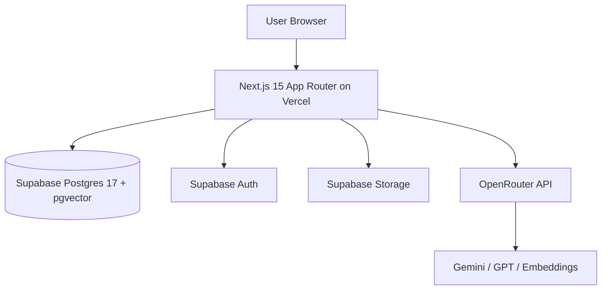

# Feature Requirements Document: FRD 0 -- Setup Document (v1.0)

| Field | Value |
|---|---|
| **Project** | UW Wiki |
| **Parent Document** | [PRD v0.1](../PRD.md) |
| **FRD Order** | [FRD Order](../FRD-order.md) |
| **PRD Sections** | 9 (Identity and Authentication), 10 (Technical Architecture), 11 (High-Level File Structure), 12 (UX and UI Design) |
| **Type** | Infrastructure scaffold (not a feature) |
| **Depends On** | -- (no prior FRDs) |
| **Delivers** | Project scaffolding, Supabase setup, schema baseline, auth baseline, AI SDK baseline, local infra workflow |
| **Created** | 2026-04-06 |

---

## Summary

FRD 0 establishes the complete technical foundation for UW Wiki so FRDs 1-3 can be implemented without rework. It defines the baseline architecture, exact dependency compatibility strategy, local and cloud environment setup, Supabase schema and migration strategy, auth/authorization baseline, and app shell scaffolding. It also includes explicit Docker and secret handling guidance so onboarding and CI are reproducible.

This document intentionally includes a **forward-compatible schema baseline** for FRDs 1-3 (including comments voting/reporting and proposal moderation fields) to avoid migration churn during early implementation.

---

## Given Context (Preconditions)

The following assumptions apply before FRD 0 execution:

| Item | Assumption |
|---|---|
| Repository | `UW-Wiki/` directory exists in the monorepo |
| Deployment target | Vercel (app) + Supabase (Postgres/Auth/Storage/Realtime) |
| Team size | 2-4 engineers, fast iteration, low ops overhead |
| Product posture | Public read, account-gated contribution flows |
| Launch scope | University of Waterloo first, multi-university schema-ready |

### Terms

| Term | Definition |
|---|---|
| App Router | Next.js server-first routing model under `src/app/` |
| Supabase SSR Client | Cookie-aware client from `@supabase/ssr` used in server code and middleware |
| Publishable key | Public Supabase API key allowed in browser client |
| Service role key | Privileged Supabase key for trusted server-only operations |
| RLS | Row Level Security policy enforcement inside Postgres |
| Data Stream Protocol | Streaming response protocol used by Vercel AI SDK UI helpers |

---

## Executive Summary (Gherkin-Style)

```gherkin
Feature: UW Wiki foundational setup

  Background:
    Given Node.js and npm are installed
    And Docker Desktop is installed for local Supabase workflows
    And a Supabase project exists (or local Supabase is started)

  Scenario: Bootstrap app scaffold
    When the developer initializes the app scaffold for Next.js App Router + TypeScript
    Then the app starts with npm run dev on port 3000
    And the root layout and global providers render

  Scenario: Configure environment and secrets
    When the developer copies .env.example to .env.local and fills required keys
    Then browser code only reads public keys
    And server code can read privileged keys
    And missing required keys fail fast on startup

  Scenario: Apply database schema baseline
    Given Supabase is linked
    When migrations are applied
    Then core UW Wiki tables exist
    And FRD 1 chunks infrastructure exists
    And FRD 2/3 forward-compatible additions exist

  Scenario: Verify auth baseline
    When a user signs in with Google OAuth or email/password
    Then session cookies are available in middleware, route handlers, and server components
    And protected actions require authenticated users
    And reviewer/admin actions require role checks

  Scenario: Verify AI foundation
    Given OpenRouter API key is configured
    When the server calls the AI provider wrapper
    Then model calls succeed through OpenRouter
    And streaming responses are supported via Vercel AI SDK
```

---

## Table of Contents

1. [0. Foundational Systems Architecture](#0-foundational-systems-architecture)
2. [1. Project Scaffold and File Structure](#1-project-scaffold-and-file-structure)
3. [2. Environment Variables and Secret Management](#2-environment-variables-and-secret-management)
4. [3. Docker and Local Development Workflow](#3-docker-and-local-development-workflow)
5. [4. Supabase Setup and Schema Baseline](#4-supabase-setup-and-schema-baseline)
6. [5. App Foundation Implementation](#5-app-foundation-implementation)
7. [6. AI Foundation (Vercel AI SDK + OpenRouter)](#6-ai-foundation-vercel-ai-sdk--openrouter)
8. [7. Auth and Authorization Baseline](#7-auth-and-authorization-baseline)
9. [8. Quality Gates and Developer Workflow](#8-quality-gates-and-developer-workflow)
10. [9. Exit Criteria](#9-exit-criteria)
11. [Appendix A: Dependency Baseline](#appendix-a-dependency-baseline)
12. [Appendix B: Environment Template](#appendix-b-environment-template)
13. [Design Decisions Log](#design-decisions-log)

---

## 0. Foundational Systems Architecture

UW Wiki uses a serverless web architecture optimized for fast product iteration, SEO, and RAG retrieval quality.



### 0a. Docker and Keys and Stuff

**Docker role in UW Wiki:**

1. Docker is required for local Supabase workflows (`supabase start`) and optional app containerization.
2. Production deployment remains Vercel + Supabase managed services (no Kubernetes requirement for MVP).

**Secrets model:**

1. Browser-safe vars use `NEXT_PUBLIC_*` naming.
2. Privileged keys (`SUPABASE_SERVICE_ROLE_KEY`, `OPENROUTER_API_KEY`) are server-only.
3. No secrets are committed to Git.
4. `.env.example` contains placeholders only.
5. Runtime config validation fails startup if critical keys are missing.

### 0a. Tech Stack

This stack is selected for compatibility with PRD goals, FRD 1-3 dependencies, and current library guidance.

| Layer | Technology | Version Policy | Why |
|---|---|---|---|
| Runtime | Node.js | `>=20` LTS (Next 15 supports `>=18.18`) | Stable baseline for Next.js 15 and tooling |
| Frontend framework | Next.js App Router | `15.x` pinned | Aligns with FRD 1-3 and SEO SSR needs |
| Language | TypeScript | strict mode, `5.x` | Strong type safety across app/API/data contracts |
| UI styling | Tailwind CSS | `4.x` | Matches PRD + modern CSS-first setup |
| Component system | shadcn/ui + Radix primitives | latest compatible | Consistent accessible UI base |
| Editor | Tiptap + ProseMirror | `3.x` | Structured rich text (`content_json`) |
| DB/Auth/Storage | Supabase | managed Postgres 17 + Auth + Storage | Single platform, lower ops cost |
| Vector search | pgvector | extension `vector` enabled | Native semantic retrieval in Postgres |
| AI SDK | Vercel AI SDK | `ai@5.x` line | Stable SDK with tool calling + streaming |
| AI provider | OpenAI-compatible provider via OpenRouter | `@ai-sdk/openai` | One gateway for Gemini/GPT/embeddings |
| Animation | Framer Motion | `12.x` line | PRD motion requirements |
| Icons | Lucide React | latest compatible | PRD icon consistency |

### 0b. Auth Stuff

**Authentication providers (MVP):**

1. Google OAuth via Supabase Auth.
2. Email/password via Supabase Auth.

**Authorization model:**

1. Public (no auth): browse directory/pages, use RAG search.
2. Authenticated user: comments, edit proposals, bookmarks.
3. Reviewer: proposal review actions, moderation queue.
4. Admin: claim approvals and admin-level actions.

**Session architecture:**

1. Cookie-based auth session with `@supabase/ssr`.
2. Middleware refresh path calls `auth.getUser()` immediately after client creation.
3. Browser and server stay in sync via middleware-set cookies.

---

## 1. Project Scaffold and File Structure

FRD 0 creates the baseline file structure from PRD Section 11, with setup-critical files implemented and feature files stubbed.

```text
UW-Wiki/
  src/
    app/
      layout.tsx
      page.tsx
      search/page.tsx
      wiki/[slug]/page.tsx
      auth/sign-in/page.tsx
      admin/page.tsx
      api/
        health/route.ts
        search/route.ts
        proposals/route.ts
        pulse/route.ts
        comments/route.ts
    components/
      ui/
      layout/
      search/
      wiki/
      editor/
      pulse/
      admin/
    lib/
      config/env.ts
      supabase/
        client.ts
        server.ts
        admin.ts
        middleware.ts
      auth/
        guards.ts
      ai/
        provider.ts
        rag.ts
        embeddings.ts
    types/
      database.ts
      domain.ts
  supabase/
    migrations/
      001_init_foundation.sql
    seed.sql
  Dockerfile
  docker-compose.yml
  .env.example
  package.json
  README.md
```

**Minimum implementation requirement:**

1. `npm run dev` renders the layout shell.
2. `/api/health` returns status JSON.
3. Supabase clients compile and can run a test query.

---

## 2. Environment Variables and Secret Management

### 2.1 Required Variables

| Variable | Scope | Required | Purpose |
|---|---|---|---|
| `NEXT_PUBLIC_APP_URL` | Browser/Server | Yes | Canonical app URL |
| `NEXT_PUBLIC_SUPABASE_URL` | Browser/Server | Yes | Supabase project URL |
| `NEXT_PUBLIC_SUPABASE_PUBLISHABLE_KEY` | Browser/Server | Yes (preferred) | Public Supabase key |
| `NEXT_PUBLIC_SUPABASE_ANON_KEY` | Browser/Server | Optional fallback | Backward compatibility alias |
| `SUPABASE_SERVICE_ROLE_KEY` | Server only | Yes | Privileged server operations |
| `OPENROUTER_API_KEY` | Server only | Yes | LLM/embedding access |
| `OPENROUTER_BASE_URL` | Server only | Yes | OpenRouter base URL |
| `OPENROUTER_HTTP_REFERER` | Server only | Yes | OpenRouter request header |
| `OPENROUTER_X_TITLE` | Server only | Yes | OpenRouter request header |

### 2.2 Optional Variables

| Variable | Default | Purpose |
|---|---|---|
| `POSTHOG_KEY` | empty | Analytics |
| `POSTHOG_HOST` | empty | Analytics endpoint |
| `LOG_LEVEL` | `info` | Structured logging level |
| `FEATURE_FLAG_LOCAL_SUPABASE` | `false` | Toggle local infra assumptions |

### 2.3 Secret Handling Rules

1. Never expose service role key to the client.
2. Never import server-only env module into client components.
3. Fail startup if required vars are absent.
4. Rotate keys on compromise; no hardcoded fallback secrets.

---

## 3. Docker and Local Development Workflow

### 3.1 Local Infra Strategy

UW Wiki supports two local modes:

1. **Managed-cloud mode (default):** Next.js local app + remote Supabase project.
2. **Local-full mode (optional):** Supabase CLI local stack (Docker-backed) + local Next.js app.

### 3.2 Supabase CLI + Docker (recommended local full mode)

```bash
# Install Supabase CLI first
supabase init
supabase start
supabase db reset
```

Expected outcome:

1. Local Postgres + Auth + Storage + Studio start via Docker.
2. Local connection details are output for `.env.local`.
3. Migrations under `supabase/migrations/` are applied.

### 3.3 Optional App Containerization

`Dockerfile` requirements:

1. Base image: `node:20-alpine`.
2. Multi-stage build for production image.
3. Expose port `3000`.
4. Run `next start` in production mode.

`docker-compose.yml` (dev) requirements:

1. `web` service for Next.js app.
2. Mount source for hot reload in dev profile.
3. Read `.env.local` via env file.

---

## 4. Supabase Setup and Schema Baseline

### 4.1 Extensions and Foundations

Migration `001_init_foundation.sql` shall include:

```sql
create extension if not exists pgcrypto;
create extension if not exists vector with schema extensions;
```

### 4.2 Core Tables (PRD baseline)

FRD 0 shall create baseline tables required by PRD Section 10 and FRD order:

1. `universities`
2. `organizations`
3. `pages`
4. `page_versions`
5. `edit_proposals`
6. `comments`
7. `pulse_ratings`
8. `pulse_aggregates`
9. `external_links`
10. `users`
11. `bookmarks`
12. `notifications`
13. `lifecycle_config`

### 4.3 FRD 1 Baseline Table

FRD 0 shall also create `chunks` in initial schema so FRD 1 is implementation-only, not infra-blocked.

Required `chunks` fields:

1. IDs and foreign keys (`university_id`, `org_id`, `page_id`, `page_version_id`, `source_comment_id`)
2. Retrieval metadata (`chunk_type`, `org_name`, `org_slug`, `category`, `section_title`, `section_slug`, `anchored_section`, `chunk_index`, `references_previous_version`)
3. Search fields (`content_text`, generated `content_tsvector`, `embedding vector(512)`)
4. Timestamp (`created_at`)

Required indexes:

1. HNSW on `embedding` with cosine ops.
2. GIN on `content_tsvector`.
3. B-tree indexes on lifecycle query fields (`org_id`, `page_id`, `source_comment_id`, `chunk_type`).

### 4.4 Forward-Compatible Additions for FRD 2 and FRD 3

To avoid repeated early migrations, FRD 0 includes these up front:

**FRD 2-related:**

1. `organizations.tagline`
2. `organizations.official_content_json`
3. `edit_proposals.is_anonymous`
4. `edit_proposals.reviewer_comment`
5. `edit_proposals.contributor_id`
6. `page_versions.is_anonymous`
7. `claim_requests` table
8. `user_affiliations` table

**FRD 3-related:**

1. `comments.section_slug`
2. `comments.is_edited`
3. `comments.upvotes`
4. `comments.downvotes`
5. `comments.updated_at`
6. `comment_votes` table
7. `comment_reports` table
8. `increment_comment_vote` SQL function

### 4.5 Seed Data Requirements

`supabase/seed.sql` shall insert:

1. University row for Waterloo.
2. Initial lifecycle thresholds per category.
3. Optional starter categories enum/constraints if modeled separately.

### 4.6 RLS Baseline

RLS must be enabled for user-scoped tables.

Policy baseline:

1. Public read on directory/page content tables.
2. Auth-only inserts for `edit_proposals`, `comments`, `bookmarks`.
3. Author-only update/delete for own comments/proposals where applicable.
4. Reviewer/admin operations enforced by role checks in server route handlers and mirrored with restrictive policies where practical.

---

## 5. App Foundation Implementation

### 5.1 Next.js and TypeScript Baseline

1. Initialize with `create-next-app` using App Router + TypeScript.
2. Enable strict TypeScript mode.
3. Use absolute imports via path alias (`@/*`).

### 5.2 Supabase Client Files

Implement the following:

1. `src/lib/supabase/client.ts` for browser client (`createBrowserClient`).
2. `src/lib/supabase/server.ts` for server-side client (`createServerClient`).
3. `src/lib/supabase/admin.ts` for service-role client (server only).
4. `src/lib/supabase/middleware.ts` for cookie refresh in middleware.

### 5.3 Layout and Providers

`src/app/layout.tsx` must include:

1. Global styles and typography baseline.
2. Theme provider (dark UW look from PRD).
3. App-level providers required for future chat/editor state.

### 5.4 Design System Baseline

1. Tailwind CSS v4 configured.
2. shadcn/ui initialized.
3. Color tokens include UW dark background + gold accent from PRD.
4. Lucide icons and Framer Motion are installed and available.

### 5.5 Editor Baseline

Install Tiptap core packages and create editor bootstrap module with:

1. StarterKit
2. Underline
3. Link
4. Image
5. Placeholder
6. TextAlign
7. Table support

No feature behavior is implemented in FRD 0; only baseline wiring and compile-ready setup.

---

## 6. AI Foundation (Vercel AI SDK + OpenRouter)

### 6.1 Package Baseline

FRD 0 shall install Vercel AI SDK baseline packages:

1. `ai`
2. `@ai-sdk/react`
3. `@ai-sdk/openai`
4. `zod`

### 6.2 Provider Setup

Create a provider factory in `src/lib/ai/provider.ts`:

```typescript
import { createOpenAI } from "@ai-sdk/openai";

export const openrouter = createOpenAI({
  baseURL: process.env.OPENROUTER_BASE_URL,
  apiKey: process.env.OPENROUTER_API_KEY,
  headers: {
    "HTTP-Referer": process.env.OPENROUTER_HTTP_REFERER ?? "",
    "X-Title": process.env.OPENROUTER_X_TITLE ?? "UW Wiki",
  },
});
```

### 6.3 Streaming Route Baseline

Create a stub streaming route (`src/app/api/search/route.ts`) using `streamText` and returning a UI message stream response. This confirms SDK and transport wiring before FRD 1 retrieval logic is added.

### 6.4 Compatibility Note

AI SDK v5 uses `@ai-sdk/react` for hooks (not `ai/react`). Any legacy snippets in downstream FRDs should be interpreted accordingly during implementation.

---

## 7. Auth and Authorization Baseline

### 7.1 Supabase Auth Configuration

Enable in Supabase dashboard:

1. Google provider.
2. Email/password provider.
3. Redirect URLs for local and production domains.

### 7.2 Middleware Session Refresh

Middleware must:

1. Construct server client from request cookies.
2. Call `supabase.auth.getUser()` immediately.
3. Return the same response object with updated cookies.

### 7.3 Role and Guard Utilities

Implement guard helpers in `src/lib/auth/guards.ts`:

1. `requireUser()`
2. `requireReviewer()`
3. `requireAdmin()`

Roles are sourced from public `users.role` (`user`, `reviewer`, `admin`).

### 7.4 User Profile Sync

Create DB function + trigger to create public `users` rows when a new `auth.users` account is created.

Minimum synced fields:

1. `id`
2. `email`
3. `display_name`
4. `avatar_url`
5. `role` default `user`

---

## 8. Quality Gates and Developer Workflow

### 8.1 Required Scripts

`package.json` scripts:

1. `dev`
2. `build`
3. `start`
4. `lint`
5. `typecheck`
6. `test` (placeholder accepted if tests are not yet authored)

### 8.2 CI Baseline

PR checks must run:

1. dependency install
2. `npm run lint`
3. `npm run typecheck`
4. `npm run build`

### 8.3 Definition of Done for Foundation Changes

Any FRD 0 change is complete only when:

1. App boots locally.
2. Supabase connectivity check passes.
3. Migrations apply cleanly from scratch.
4. Auth sign-in round trip works.

---

## 9. Exit Criteria

FRD 0 is complete when ALL of the following are satisfied:

| # | Criterion | Verification |
|---|---|---|
| 1 | Next.js App Router scaffold runs | `npm run dev` boots app on port 3000 |
| 2 | TypeScript strict mode enforced | `npm run typecheck` succeeds |
| 3 | Tailwind v4 + shadcn/ui initialized | Layout renders themed UI primitives |
| 4 | Supabase browser client works | Client-side read query succeeds |
| 5 | Supabase server client works | Server component or route query succeeds |
| 6 | Supabase admin client is server-only | Service key never appears in client bundle |
| 7 | Environment validation is active | Missing required vars fail startup |
| 8 | `.env.example` is complete | New developer can configure all required keys |
| 9 | Migration creates PRD baseline tables | All listed core tables exist |
| 10 | `chunks` table exists with indexes | HNSW + GIN indexes present |
| 11 | FRD 2 forward fields/tables exist | Claim and affiliation schema present |
| 12 | FRD 3 comment vote/report schema exists | Vote/report tables and function present |
| 13 | Seed data loads | Waterloo university + lifecycle config rows inserted |
| 14 | Google OAuth sign-in works | Successful login and session cookie set |
| 15 | Email/password sign-in works | User can register/login with email flow |
| 16 | Middleware refresh path is working | Session persists across route transitions |
| 17 | Role guards compile and run | Protected route checks enforce role rules |
| 18 | AI provider wrapper compiles | OpenRouter factory loads with env config |
| 19 | Streaming route stub responds | `/api/search` returns stream response format |
| 20 | Health route returns OK | `/api/health` returns JSON status |

---

## Appendix A: Dependency Baseline

Use this compatibility matrix when generating `package.json`.

| Package | Baseline |
|---|---|
| `next` | `15.x` |
| `react` | `19.x` |
| `react-dom` | `19.x` |
| `typescript` | `5.x` |
| `tailwindcss` | `4.x` |
| `@tailwindcss/postcss` | `4.x` |
| `@supabase/supabase-js` | `2.x` |
| `@supabase/ssr` | `0.x` |
| `ai` | `5.x` |
| `@ai-sdk/react` | `2.x` |
| `@ai-sdk/openai` | `2.x` |
| `zod` | `3.x` or `4.x` (AI SDK v5-compatible) |
| `@tiptap/react` | `3.x` |
| `@tiptap/starter-kit` | `3.x` |
| `@tiptap/pm` | `3.x` |
| `framer-motion` | `12.x` |
| `lucide-react` | latest compatible |

---

## Appendix B: Environment Template

```env
# App
NEXT_PUBLIC_APP_URL=http://localhost:3000

# Supabase (public)
NEXT_PUBLIC_SUPABASE_URL=
NEXT_PUBLIC_SUPABASE_PUBLISHABLE_KEY=
# Optional fallback for older code paths:
NEXT_PUBLIC_SUPABASE_ANON_KEY=

# Supabase (server only)
SUPABASE_SERVICE_ROLE_KEY=

# OpenRouter (server only)
OPENROUTER_API_KEY=
OPENROUTER_BASE_URL=https://openrouter.ai/api/v1
OPENROUTER_HTTP_REFERER=http://localhost:3000
OPENROUTER_X_TITLE=UW Wiki

# Optional analytics
POSTHOG_KEY=
POSTHOG_HOST=

# Optional runtime
LOG_LEVEL=info
FEATURE_FLAG_LOCAL_SUPABASE=false
```

---

## Design Decisions Log

| Decision | Rationale |
|---|---|
| Next.js 15 pinned instead of latest major | Aligns with existing FRD contracts and avoids cross-major drift during MVP buildout |
| Node 20+ baseline | Compatible with Next 15 engine requirements while keeping modern LTS tooling |
| Supabase platform for DB/Auth/Storage | Matches PRD, reduces custom backend overhead for a small team |
| Include `chunks` schema in FRD 0 | Removes FRD 1 infra blockers so FRD 1 focuses on retrieval logic |
| Include FRD 2/3 schema additions early | Avoids repeated migration churn in first implementation wave |
| AI SDK v5 baseline (`@ai-sdk/react`) | Follows current documented package structure and avoids legacy import paths |
| OpenRouter through OpenAI-compatible provider | Single integration path for Gemini/GPT/embeddings in one gateway |
| Cookie-based Supabase SSR auth | Required for consistent auth state across browser/server/middleware in App Router |
| Public-read + account-gated writes | Preserves low-friction discovery while protecting contribution flows |

---

*This FRD defines the implementation-ready setup foundation for UW Wiki. FRDs 1-3 build directly on this baseline without changing core platform choices.*
