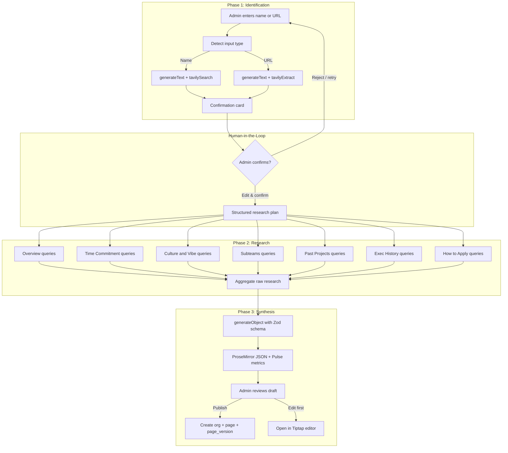
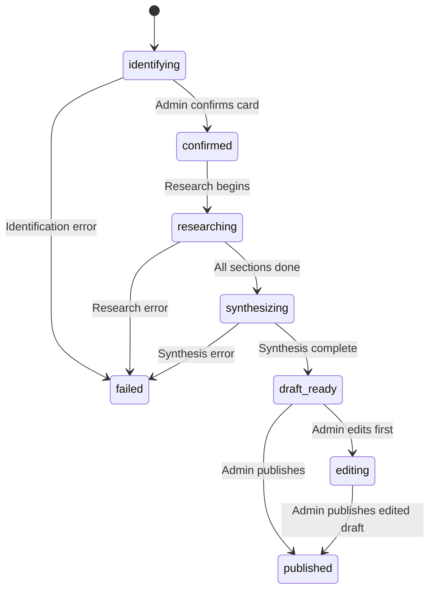

# Feature Requirements Document: FRD 5 -- Cold Start Agent (v1.0)

| Field               | Value                                                                                                                                                                             |
| ------------------- | --------------------------------------------------------------------------------------------------------------------------------------------------------------------------------- |
| **Project**         | UW Wiki                                                                                                                                                                           |
| **Parent Document** | [PRD v0.1](../PRD.md)                                                                                                                                                             |
| **FRD Order**       | [FRD Order](../FRD-order.md)                                                                                                                                                      |
| **PRD Sections**    | 6.8 (Cold Start Agent), 6.6 (The Pulse -- cold-start seeding), 13 (MVP Scope -- launch seeding)                                                                                  |
| **Type**            | AI agent feature (admin tool)                                                                                                                                                     |
| **Depends On**      | FRD 0 (Setup Document), FRD 2 (Wiki Pages -- page template, Pulse schema, empty page states)                                                                                     |
| **Delivers**        | Admin-triggered agent that identifies a UW org from a name or URL, confirms with admin, researches it across web and UW-specific sources, and generates a first-draft wiki page   |
| **Created**         | 2026-04-07                                                                                                                                                                        |

---

## Summary

FRD 5 implements the Cold Start Agent described in PRD Section 6.8. The agent is an admin-only tool that auto-populates a first-draft wiki page for a University of Waterloo student organization by searching public internet sources and UW-specific directories. It solves the empty-page problem at launch by seeding 5-10 well-known design teams and clubs before public launch.

The agent operates as a three-phase pipeline with a human-in-the-loop confirmation step. **Phase 1 (Identification)** takes an org name or URL from a single smart input field, searches the web via Tavily, and returns a confirmation card with the org's name, one-line description, website, and category. The admin reviews and optionally edits the card before confirming. **Phase 2 (Research)** runs a structured research plan with one task per wiki template section (Overview, Time Commitment, Culture and Vibe, Subteams and Roles, Past Projects, Exec History, How to Apply), querying Tavily Search and Extract for each section and reporting progress as a step-by-step tracker. **Phase 3 (Synthesis)** feeds the accumulated research data into a Claude Sonnet 4 call with a Zod-enforced ProseMirror JSON schema, producing a complete wiki page and Pulse metric estimates. The admin previews the draft and either publishes it (creating the org, page, and page version in Supabase) or opens it in the Tiptap editor for manual tweaks.

The architecture is designed for a future extension where authenticated users can request new org pages, with the admin reviewing the generated draft before publishing.

---

## Given Context (Preconditions)

The following are assumed to be in place from FRD 0 and FRD 2:

| Prerequisite                                                                                                | Source FRD |
| ----------------------------------------------------------------------------------------------------------- | ---------- |
| Next.js 15 App Router project scaffolded with TypeScript strict mode                                        | FRD 0      |
| Supabase project with PostgreSQL 17 + pgvector enabled                                                      | FRD 0      |
| Supabase Auth configured (Google OAuth + email/password)                                                    | FRD 0      |
| `universities`, `organizations`, `pages`, `page_versions`, `pulse_ratings`, `pulse_aggregates` tables exist | FRD 0      |
| Role guard utilities (`requireAdmin()`) in `src/lib/auth/guards.ts`                                         | FRD 0      |
| AI provider factory (`openrouter`) in `src/lib/ai/provider.ts`                                              | FRD 0      |
| Vercel AI SDK v5 packages installed (`ai`, `@ai-sdk/react`, `@ai-sdk/openai`, `zod`)                       | FRD 0      |
| shadcn/ui + TailwindCSS v4 with UW dark theme                                                               | FRD 0      |
| Suggested page template (`SUGGESTED_TEMPLATE`) in `src/lib/editor/template.ts`                              | FRD 2      |
| Tiptap editor extensions configured in `src/lib/editor/extensions.ts`                                       | FRD 2      |
| Pulse sidebar component and voting widget                                                                    | FRD 2      |
| Empty page state handling (AI-generated banner) in wiki page view                                            | FRD 2      |
| Cold-start Pulse seeding convention (`session_id = "cold-start-agent"`)                                     | FRD 2      |
| Org category constants: Design Teams, Engineering Clubs, Non-Engineering Clubs, Academic Programs, Student Societies, Campus Organizations | FRD 2 |

### Terms

| Term                | Definition                                                                                                                                                       |
| ------------------- | ---------------------------------------------------------------------------------------------------------------------------------------------------------------- |
| Cold Start Agent    | An AI-powered admin tool that auto-generates a first-draft wiki page for an org by searching public internet sources and UW-specific directories.                |
| Identification      | Phase 1 of the agent pipeline: detect input type (name or URL), search/extract, return a structured confirmation card.                                           |
| Confirmation Card   | A structured summary of an identified org (name, one-liner, website, category, confidence) shown to the admin for review before research begins.                 |
| Research Plan       | Phase 2 of the agent pipeline: a sequence of targeted web searches, one per wiki template section, accumulating raw data.                                        |
| Synthesis           | Phase 3 of the agent pipeline: an LLM call that transforms accumulated research data into ProseMirror JSON matching the wiki template and Pulse metric estimates.|
| Smart Input         | A single text input that auto-detects whether the admin entered an org name or pasted a URL and routes to the appropriate identification strategy.                |
| Tavily              | A web search API optimized for AI applications, providing search, extract, crawl, and map tools as pre-built Vercel AI SDK integrations.                         |
| ProseMirror JSON    | The structured document format used by the Tiptap editor. A tree of nodes (headings, paragraphs, lists, images) stored as `content_json` in `page_versions`.     |

---

## Executive Summary (Gherkin-Style)

```gherkin
Feature: Cold Start Agent

  Background:
    Given  FRD 0 and FRD 2 are complete
    And    Supabase is running with all required tables
    And    the Tavily API key is configured
    And    the OpenRouter API key is configured

  # --- Identification ---

  Scenario: Admin identifies an org by name
    When   an admin enters "Midnight Sun" in the cold start input field
    Then   the system detects this is a name (not a URL)
    And    the agent searches Tavily for "Midnight Sun University of Waterloo"
    And    a confirmation card is displayed with name, one-liner, website, and category
    And    the confidence level is shown as a badge

  Scenario: Admin identifies an org by URL
    When   an admin pastes "https://www.midnightsun.uwaterloo.ca" in the input field
    Then   the system detects this is a URL
    And    the agent extracts information from that URL
    And    a confirmation card is displayed with the extracted org details

  Scenario: Admin edits the confirmation card
    Given  a confirmation card is displayed
    When   the admin edits the org name or changes the category dropdown
    Then   the updated values are reflected in the card
    And    the "Confirm & Research" button remains available

  # --- Research ---

  Scenario: Agent researches the confirmed org
    Given  the admin has confirmed the org identity
    When   the admin clicks "Confirm & Research"
    Then   a progress tracker appears with steps for each wiki section
    And    the agent searches Tavily for section-specific queries
    And    each step transitions from pending to in-progress to completed
    And    completed steps show source counts ("Found 4 sources")

  Scenario: Research handles sparse data gracefully
    Given  the agent is researching a section
    When   Tavily returns no relevant results for "Exec History"
    Then   the step is marked as skipped ("No data found")
    And    the synthesis phase receives an empty dataset for that section

  # --- Synthesis ---

  Scenario: Agent generates a draft wiki page
    Given  research is complete for all sections
    When   the synthesis phase begins
    Then   the progress tracker shows "Generating page content..."
    And    Claude Sonnet 4 produces ProseMirror JSON matching the wiki template
    And    the progress tracker shows "Estimating Pulse metrics..."
    And    the agent produces Pulse metric estimates

  Scenario: Admin previews and publishes the draft
    Given  the draft is ready
    When   the admin views the draft preview
    Then   rendered wiki content is shown in a read-only Tiptap instance
    And    Pulse metrics are shown in a sidebar preview
    And    source URLs are listed per section
    And    a "Publish" button and an "Edit in Editor" button are available

  Scenario: Admin publishes the draft
    Given  the admin clicks "Publish"
    Then   an organizations row is created (if new)
    And    a pages row is created
    And    a page_versions row is created with the generated ProseMirror JSON
    And    pulse_ratings rows are inserted with session_id "cold-start-agent"
    And    the cold_start_jobs status is updated to "published"
    And    the wiki page displays with the AI-generated banner from FRD 2

  Scenario: Admin edits before publishing
    Given  the admin clicks "Edit in Editor"
    Then   the Tiptap editor opens with the generated content pre-loaded
    And    the admin can modify sections freely
    And    a "Publish Edited Draft" button saves the modified content

  # --- Safety ---

  Scenario: Non-admin is blocked from cold start
    Given  a user without admin role
    When   they attempt to access /admin/cold-start
    Then   they are redirected to the home page
    And    the cold start API routes return 403 Forbidden

  Scenario: Rate limit prevents runaway costs
    Given  an admin has triggered 5 cold start jobs in the last hour
    When   they attempt to trigger a 6th
    Then   the system returns a rate limit error
    And    shows the time until the next job is allowed
```

---

## Table of Contents

1. [0. Architecture Overview](#0-architecture-overview)
2. [1. Smart Input and Input Detection](#1-smart-input-and-input-detection)
3. [2. Phase 1: Identification](#2-phase-1-identification)
4. [3. Confirmation Card](#3-confirmation-card)
5. [4. Phase 2: Research](#4-phase-2-research)
6. [5. Phase 3: Synthesis](#5-phase-3-synthesis)
7. [6. Draft Preview and Publish Flow](#6-draft-preview-and-publish-flow)
8. [7. Progress Tracking](#7-progress-tracking)
9. [8. Admin UI Specification](#8-admin-ui-specification)
10. [9. Prompt Architecture](#9-prompt-architecture)
11. [10. Tool Definitions](#10-tool-definitions)
12. [11. Zod Schemas](#11-zod-schemas)
13. [12. Database Schema Additions](#12-database-schema-additions)
14. [13. API Routes](#13-api-routes)
15. [14. Environment Variables](#14-environment-variables)
16. [15. Safety and Cost Controls](#15-safety-and-cost-controls)
17. [16. Non-Functional Requirements](#16-non-functional-requirements)
18. [17. Exit Criteria](#17-exit-criteria)
19. [Appendix A: Complete System Prompts](#appendix-a-complete-system-prompts)
20. [Appendix B: ProseMirror JSON Schema (Full Zod Definition)](#appendix-b-prosemirror-json-schema-full-zod-definition)
21. [Appendix C: Example Agent Run](#appendix-c-example-agent-run)
22. [Design Decisions Log](#design-decisions-log)

---

## 0. Architecture Overview

The cold start agent is a **supervised agent** -- an LLM-in-a-loop with tools and a human confirmation checkpoint. It follows the agent-orchestration-guide's recommended pattern: foundations + agent loop + tool system + human-in-the-loop.



### Agent Pattern Selection

Following the agent-orchestration-guide decision tree:

| Decision Point              | Choice                      | Rationale                                                                                    |
| --------------------------- | --------------------------- | -------------------------------------------------------------------------------------------- |
| Agent type                  | Supervised (single)         | One orchestrator with HITL; multi-agent adds complexity without benefit for a linear pipeline |
| Research phase orchestration| Programmatic (not LLM)      | System defines the queries per section; no LLM reasoning needed to decide what to search     |
| LLM calls                   | 2 per run (identify + synth)| Minimizes cost; research uses Tavily API directly                                            |
| Tool source                 | `@tavily/ai-sdk` pre-built  | Drop-in AI SDK v5 tools; no custom tool wiring needed                                        |
| Output enforcement          | `generateObject` + Zod      | Guarantees valid ProseMirror JSON structure                                                  |
| Progress reporting          | DB polling                  | Simple, resilient to disconnects; no WebSocket complexity                                    |

### Model Selection

| Phase                        | Model                | Provider                           | Rationale                                                                    |
| ---------------------------- | -------------------- | ---------------------------------- | ---------------------------------------------------------------------------- |
| Phase 1 (Identification)    | Claude Sonnet 4      | Anthropic via OpenRouter           | Needs reasoning for disambiguation and structured extraction from search     |
| Phase 2 (Research)           | None (programmatic)  | Tavily API directly                | System issues queries; no LLM judgment needed                                |
| Phase 3 (Synthesis)          | Claude Sonnet 4      | Anthropic via OpenRouter           | Strong at long-form writing, structured output, and maintaining neutral tone |

---

## 1. Smart Input and Input Detection

### 1.1 Input Field Behavior

The admin cold start page at `/admin/cold-start` presents a single text input that auto-detects input type:

```
┌──────────────────────────────────────────────────────────────────────┐
│  🔍  Enter an organization name or paste a URL...                   │
└──────────────────────────────────────────────────────────────────────┘
   Detected: Searching by name                    [Design Teams ▼]
                                                   [ Identify → ]
```

### 1.2 Detection Logic

```typescript
// src/lib/ai/cold-start/detect-input.ts

const URL_PATTERN = /^https?:\/\/.+/i;

export function detectInputType(input: string): "url" | "name" {
  return URL_PATTERN.test(input.trim()) ? "url" : "name";
}
```

The detection is client-side and instant. A visual label below the input updates reactively: "Searching by name..." or "Extracting from URL...".

### 1.3 Optional Category Pre-Selection

An optional category dropdown sits to the right of the input:

| Value                  | Default  |
| ---------------------- | -------- |
| (Auto-detect)          | Selected |
| Design Teams           |          |
| Engineering Clubs      |          |
| Non-Engineering Clubs  |          |
| Academic Programs      |          |
| Student Societies      |          |
| Campus Organizations   |          |

If the admin selects a category, it is passed as a hint to the identification phase. If left as auto-detect, the agent infers the category from search results.

---

## 2. Phase 1: Identification

### 2.1 Overview

Phase 1 takes the admin's input and returns a structured confirmation card. It uses `generateText` from the Vercel AI SDK with Tavily tools, allowing the LLM to decide which searches to run.

### 2.2 Name-Based Identification

When the input is a name:

1. The API route calls `generateText` with Claude Sonnet 4.
2. The system prompt instructs the agent to identify a UW student org.
3. The `tavilySearch` tool is available with `searchDepth: "basic"`.
4. `maxSteps` is set to `3` (search, optionally refine, output).
5. The agent searches for `"{input} University of Waterloo"` and related queries.
6. The final text response is parsed into the `confirmationCardSchema`.

### 2.3 URL-Based Identification

When the input is a URL:

1. The API route calls `generateText` with Claude Sonnet 4.
2. The `tavilyExtract` tool is available to pull structured content from the URL.
3. The `tavilySearch` tool is also available for supplementary searching.
4. `maxSteps` is set to `3`.
5. The agent extracts from the URL and optionally searches for more context.
6. The final text response is parsed into the `confirmationCardSchema`.

### 2.4 Implementation

```typescript
// src/lib/ai/cold-start/agent.ts (identification)

import { generateText } from "ai";
import { tavilySearch, tavilyExtract } from "@tavily/ai-sdk";
import { openrouter } from "@/lib/ai/provider";
import { IDENTIFICATION_PROMPT } from "./prompts";
import { confirmationCardSchema, type ConfirmationCard } from "./schemas";

export async function identifyOrg(
  input: string,
  inputType: "name" | "url",
  categoryHint?: string,
): Promise<ConfirmationCard> {
  const tools =
    inputType === "url"
      ? {
          tavilySearch: tavilySearch({ maxResults: 5 }),
          tavilyExtract: tavilyExtract(),
        }
      : {
          tavilySearch: tavilySearch({ maxResults: 5 }),
        };

  const { text } = await generateText({
    model: openrouter("anthropic/claude-sonnet-4"),
    system: IDENTIFICATION_PROMPT,
    prompt: buildIdentificationPrompt(input, inputType, categoryHint),
    tools,
    maxSteps: 3,
  });

  return confirmationCardSchema.parse(JSON.parse(extractJSON(text)));
}

function buildIdentificationPrompt(
  input: string,
  inputType: "name" | "url",
  categoryHint?: string,
): string {
  const base =
    inputType === "url"
      ? `Extract information about the student organization at this URL: ${input}`
      : `Identify the University of Waterloo student organization: "${input}"`;

  const hint = categoryHint
    ? `\nThe admin believes this org belongs to the "${categoryHint}" category.`
    : "";

  return base + hint + "\n\nReturn your response as a JSON object matching the confirmation card format described in your instructions.";
}

function extractJSON(text: string): string {
  const match = text.match(/\{[\s\S]*\}/);
  if (!match) throw new Error("No JSON object found in agent response");
  return match[0];
}
```

---

## 3. Confirmation Card

### 3.1 Schema

```typescript
// src/lib/ai/cold-start/schemas.ts (confirmation card)

import { z } from "zod";

export const ORG_CATEGORIES = [
  "Design Teams",
  "Engineering Clubs",
  "Non-Engineering Clubs",
  "Academic Programs",
  "Student Societies",
  "Campus Organizations",
] as const;

export const confirmationCardSchema = z.object({
  name: z.string().describe("Full official name of the organization"),
  oneLiner: z
    .string()
    .max(120)
    .describe("One-line description of what the org does"),
  websiteUrl: z
    .string()
    .url()
    .optional()
    .describe("Official website URL if found"),
  category: z.enum(ORG_CATEGORIES).describe("Best-fit org category"),
  universityAffiliation: z
    .literal("University of Waterloo")
    .describe("Must be a UW org"),
  confidence: z
    .enum(["high", "medium", "low"])
    .describe("How confident the agent is in this identification"),
  sources: z
    .array(
      z.object({
        title: z.string(),
        url: z.string().url(),
      }),
    )
    .describe("Sources used for identification"),
});

export type ConfirmationCard = z.infer<typeof confirmationCardSchema>;
```

### 3.2 UI Component

The confirmation card renders as a surface card (`bg-[#141414]`) with:

```
┌──────────────────────────────────────────────────────────────────────┐
│  ✎ Midnight Sun Solar Car Team                     [HIGH] confidence│
│                                                                      │
│  UW design team building solar-powered vehicles for international    │
│  competitions                                                        │
│                                                                      │
│  🌐  midnightsun.uwaterloo.ca                                       │
│  📂  [Design Teams ▼]  (editable dropdown)                          │
│                                                                      │
│  Sources:                                                            │
│  • Midnight Sun Official Site — midnightsun.uwaterloo.ca            │
│  • WUSA Clubs Directory — wusa.ca/clubs/midnight-sun                │
│                                                                      │
│           [ Try Again ]          [ Confirm & Research → ]            │
└──────────────────────────────────────────────────────────────────────┘
```

**Editable fields:**

| Field    | Edit Method             |
| -------- | ----------------------- |
| Name     | Inline text edit (click to edit) |
| Category | Dropdown selector       |

The one-liner, website, and sources are read-only. If the admin wants different results, they click "Try Again" to return to the input.

### 3.3 Confidence Badges

| Level  | Badge Color                | Meaning                                                          |
| ------ | -------------------------- | ---------------------------------------------------------------- |
| High   | `bg-green-900/30 text-green-400`   | Clear match found with official UW presence                      |
| Medium | `bg-amber-900/30 text-amber-400`   | Likely match but some ambiguity (common name, multiple orgs)     |
| Low    | `bg-red-900/30 text-red-400`       | Uncertain; admin should verify before proceeding                 |

---

## 4. Phase 2: Research

### 4.1 Overview

After admin confirmation, Phase 2 executes a structured research plan. The system (not the LLM) defines the queries. This is a programmatic orchestration: for each wiki template section, the system issues targeted Tavily API calls, extracts content from promising URLs, and accumulates raw research data.

### 4.2 Research Plan

Each section maps to a set of Tavily queries. The system runs sections sequentially, reporting progress after each.

```typescript
// src/lib/ai/cold-start/research-plan.ts

export interface ResearchTask {
  section: string;
  queries: string[];
  extractUrls?: string[];
  searchDepth: "basic" | "advanced";
}

export function buildResearchPlan(
  orgName: string,
  websiteUrl?: string,
): ResearchTask[] {
  const tasks: ResearchTask[] = [
    {
      section: "Overview",
      queries: [
        `"${orgName}" University of Waterloo about mission`,
        `"${orgName}" UW what is club team`,
      ],
      extractUrls: websiteUrl ? [websiteUrl] : undefined,
      searchDepth: "advanced",
    },
    {
      section: "Time Commitment",
      queries: [
        `"${orgName}" UW time commitment hours weekly`,
        `"${orgName}" workload experience reddit`,
      ],
      searchDepth: "basic",
    },
    {
      section: "Culture and Vibe",
      queries: [
        `"${orgName}" University of Waterloo culture team vibe experience`,
        `"${orgName}" UW review student experience`,
      ],
      searchDepth: "basic",
    },
    {
      section: "Subteams and Roles",
      queries: [
        `"${orgName}" subteams divisions roles structure`,
        `"${orgName}" UW team departments`,
      ],
      extractUrls: websiteUrl ? [`${websiteUrl}/team`, `${websiteUrl}/about`] : undefined,
      searchDepth: "basic",
    },
    {
      section: "Past Projects",
      queries: [
        `"${orgName}" University of Waterloo projects competitions results awards`,
        `"${orgName}" UW achievements history`,
      ],
      searchDepth: "advanced",
    },
    {
      section: "Exec History",
      queries: [
        `"${orgName}" UW executive team leadership president`,
      ],
      searchDepth: "basic",
    },
    {
      section: "How to Apply",
      queries: [
        `"${orgName}" University of Waterloo apply join recruitment application`,
        `"${orgName}" UW hiring process interview`,
      ],
      extractUrls: websiteUrl ? [`${websiteUrl}/join`, `${websiteUrl}/apply`, `${websiteUrl}/recruitment`] : undefined,
      searchDepth: "basic",
    },
  ];

  return tasks;
}
```

### 4.3 Research Execution

For each task in the plan:

1. Run all `queries` via `tavilySearch` (called directly, not through an LLM).
2. If `extractUrls` are specified, attempt `tavilyExtract` on each (fail silently on 404s).
3. Deduplicate results by URL.
4. Store raw results in the `cold_start_jobs.research_data` JSONB column.
5. Update `cold_start_jobs.current_step` and `steps_completed`.

```typescript
// src/lib/ai/cold-start/agent.ts (research execution)

import { tavily } from "@tavily/core";

const tavilyClient = tavily({ apiKey: process.env.TAVILY_API_KEY! });

export interface SectionResearch {
  section: string;
  searchResults: TavilySearchResult[];
  extractedContent: TavilyExtractResult[];
  sourceCount: number;
}

export async function executeResearchPlan(
  plan: ResearchTask[],
  jobId: string,
  supabase: SupabaseClient,
): Promise<SectionResearch[]> {
  const allResearch: SectionResearch[] = [];

  for (let i = 0; i < plan.length; i++) {
    const task = plan[i];

    await updateJobProgress(supabase, jobId, {
      current_step: `Researching ${task.section}...`,
      steps_completed: i,
    });

    const searchResults: TavilySearchResult[] = [];
    for (const query of task.queries) {
      try {
        const response = await tavilyClient.search(query, {
          searchDepth: task.searchDepth,
          maxResults: 5,
          includeAnswer: false,
        });
        searchResults.push(...response.results);
      } catch {
        // Tavily call failed for this query; continue with others
      }
    }

    const extractedContent: TavilyExtractResult[] = [];
    if (task.extractUrls) {
      for (const url of task.extractUrls) {
        try {
          const response = await tavilyClient.extract([url]);
          extractedContent.push(...response.results);
        } catch {
          // URL not reachable or extraction failed; skip
        }
      }
    }

    const deduped = deduplicateByUrl(searchResults);
    const sectionData: SectionResearch = {
      section: task.section,
      searchResults: deduped,
      extractedContent,
      sourceCount: deduped.length + extractedContent.length,
    };

    allResearch.push(sectionData);

    await updateJobResearchData(supabase, jobId, task.section, sectionData);
  }

  return allResearch;
}

function deduplicateByUrl(results: TavilySearchResult[]): TavilySearchResult[] {
  const seen = new Set<string>();
  return results.filter((r) => {
    if (seen.has(r.url)) return false;
    seen.add(r.url);
    return true;
  });
}
```

### 4.4 Tavily API Budget

Each research run is capped at a maximum of **15 Tavily API calls** total (searches + extracts). The research plan as defined makes approximately 13 search calls and up to 6 extract attempts, staying within budget even if all extract URLs are reachable.

If the budget is exhausted mid-plan, remaining sections are marked as skipped with no research data.

---

## 5. Phase 3: Synthesis

### 5.1 Overview

After research completes, the synthesis phase feeds all accumulated data into a single `generateObject` call with a comprehensive Zod schema. This produces:

1. **ProseMirror JSON** matching the `SUGGESTED_TEMPLATE` structure from FRD 2.
2. **Pulse metric estimates** for Selectivity, Vibe Check, Co-op Boost, and Tech Stack.
3. **Source citations** per section.

### 5.2 Implementation

```typescript
// src/lib/ai/cold-start/agent.ts (synthesis)

import { generateObject } from "ai";
import { openrouter } from "@/lib/ai/provider";
import { SYNTHESIS_PROMPT } from "./prompts";
import { coldStartOutputSchema, type ColdStartOutput } from "./schemas";

export async function synthesizeDraft(
  orgName: string,
  category: string,
  research: SectionResearch[],
): Promise<ColdStartOutput> {
  const researchContext = formatResearchForPrompt(research);

  const { object } = await generateObject({
    model: openrouter("anthropic/claude-sonnet-4"),
    system: SYNTHESIS_PROMPT,
    prompt: `Generate a complete wiki page for "${orgName}" (${category}) at the University of Waterloo.\n\n${researchContext}`,
    schema: coldStartOutputSchema,
  });

  return object;
}

function formatResearchForPrompt(research: SectionResearch[]): string {
  return research
    .map((section) => {
      const searchContent = section.searchResults
        .map((r) => `- [${r.title}](${r.url}): ${r.content}`)
        .join("\n");

      const extractContent = section.extractedContent
        .map((r) => `- Extracted from ${r.url}:\n${r.rawContent.slice(0, 2000)}`)
        .join("\n");

      return `## Research: ${section.section}\n\n### Search Results\n${searchContent || "No results found."}\n\n### Extracted Content\n${extractContent || "No extractions."}`;
    })
    .join("\n\n---\n\n");
}
```

### 5.3 Output Structure

The synthesis produces a `ColdStartOutput` object (see Section 11 for full Zod schema) containing:

| Field            | Type            | Description                                                      |
| ---------------- | --------------- | ---------------------------------------------------------------- |
| `pageContent`    | ProseMirror JSON| Complete wiki page matching `SUGGESTED_TEMPLATE` structure       |
| `pulseEstimates` | Object          | Selectivity, Vibe Check, Co-op Boost, Tech Stack guesses         |
| `sectionSources` | Array           | Per-section list of source URLs used                             |
| `tagline`        | String          | One-line tagline for the org directory card                      |

---

## 6. Draft Preview and Publish Flow

### 6.1 Draft Preview

When synthesis completes, the admin sees a draft preview page:

```
┌──────────────────────────────────────────────────────────────────────┐
│  Draft Preview: Midnight Sun Solar Car Team          [DRAFT]        │
├──────────────────────────────────────────────────────────────────────┤
│                                                                      │
│  ┌──────────────────────────────┐  ┌─────────────────────────┐      │
│  │  (Read-only Tiptap render)   │  │  THE PULSE (preview)    │      │
│  │                               │  │                         │      │
│  │  ## Overview                  │  │  Selectivity            │      │
│  │  Midnight Sun is a student-  │  │  [Application-Based]    │      │
│  │  led solar car design team   │  │                         │      │
│  │  at the University of...     │  │  Vibe Check             │      │
│  │                               │  │  ● ● ● ○ ○  3.0/5     │      │
│  │  ## Time Commitment           │  │                         │      │
│  │  Members typically dedicate  │  │  Co-op Boost            │      │
│  │  10-15 hours per week...     │  │  ★ ★ ★ ★ ☆  4.0/5     │      │
│  │                               │  │                         │      │
│  │  (... remaining sections)    │  │  Tech Stack             │      │
│  │                               │  │  [SolidWorks] [Altium] │      │
│  └──────────────────────────────┘  └─────────────────────────┘      │
│                                                                      │
│  Sources:                                                            │
│  • Overview: midnightsun.uwaterloo.ca, wusa.ca/clubs/...           │
│  • Time Commitment: reddit.com/r/uwaterloo/...                      │
│  • (... per section)                                                 │
│                                                                      │
│           [ Edit in Editor ]                [ Publish → ]            │
└──────────────────────────────────────────────────────────────────────┘
```

### 6.2 Publish Flow

When the admin clicks "Publish":

```typescript
// src/app/api/cold-start/publish/route.ts (pseudocode)

export async function POST(request: Request) {
  const { user } = await requireAdmin();
  const { jobId } = await request.json();

  const supabase = createAdminClient();
  const job = await getJob(supabase, jobId);

  if (job.status !== "draft_ready") {
    return NextResponse.json({ error: "Job is not ready for publishing" }, { status: 400 });
  }

  // 1. Create organization (if it doesn't already exist)
  const slug = generateSlug(job.org_metadata.name);
  const { data: org } = await supabase
    .from("organizations")
    .upsert({
      name: job.org_metadata.name,
      slug,
      category: job.org_metadata.category,
      tagline: job.draft_content.tagline,
      university_id: UW_UNIVERSITY_ID,
    }, { onConflict: "slug" })
    .select("id")
    .single();

  // 2. Create page
  const { data: page } = await supabase
    .from("pages")
    .insert({ org_id: org.id })
    .select("id")
    .single();

  // 3. Create page version
  const { data: version } = await supabase
    .from("page_versions")
    .insert({
      page_id: page.id,
      version_number: 1,
      content_json: job.draft_content.pageContent,
      summary: "AI-generated cold start page",
      contributor_id: null,
      is_anonymous: false,
    })
    .select("id")
    .single();

  // 4. Link page to version
  await supabase
    .from("pages")
    .update({
      current_version_id: version.id,
      last_modified_at: new Date().toISOString(),
    })
    .eq("id", page.id);

  // 5. Insert cold-start Pulse ratings
  await insertColdStartPulseRatings(supabase, org.id, job.draft_content.pulseEstimates);

  // 6. Update job status
  await supabase
    .from("cold_start_jobs")
    .update({ status: "published", completed_at: new Date().toISOString() })
    .eq("id", jobId);

  return NextResponse.json({ slug, orgId: org.id, pageId: page.id });
}
```

### 6.3 Pulse Seeding on Publish

Per FRD 2 Section 3.6, cold-start Pulse ratings use `session_id = "cold-start-agent"`:

```typescript
// src/lib/ai/cold-start/pulse-seeding.ts

async function insertColdStartPulseRatings(
  supabase: SupabaseClient,
  orgId: string,
  estimates: PulseEstimates,
) {
  const ratings = [];

  if (estimates.selectivity) {
    ratings.push({
      org_id: orgId,
      metric: "selectivity",
      value: estimates.selectivity,
      session_id: "cold-start-agent",
    });
  }

  if (estimates.vibeCheck) {
    ratings.push({
      org_id: orgId,
      metric: "vibe_check",
      value: estimates.vibeCheck,
      session_id: "cold-start-agent",
    });
  }

  if (estimates.coopBoost) {
    ratings.push({
      org_id: orgId,
      metric: "coop_boost",
      value: estimates.coopBoost,
      session_id: "cold-start-agent",
    });
  }

  if (estimates.techStack && estimates.techStack.length > 0) {
    ratings.push({
      org_id: orgId,
      metric: "tech_stack",
      value: JSON.stringify(estimates.techStack),
      session_id: "cold-start-agent",
    });
  }

  if (ratings.length > 0) {
    await supabase.from("pulse_ratings").insert(ratings);

    for (const rating of ratings) {
      await recomputePulseAggregate(supabase, orgId, rating.metric);
    }
  }
}
```

### 6.4 Edit Before Publish

When the admin clicks "Edit in Editor":

1. Navigate to a route like `/admin/cold-start/[jobId]/edit`.
2. Load the Tiptap editor with `job.draft_content.pageContent` as initial content.
3. The admin can freely modify the generated content.
4. A "Publish Edited Draft" button saves the modified `content_json` back to `cold_start_jobs.draft_content` and runs the same publish flow.

---

## 7. Progress Tracking

### 7.1 Mechanism

Progress is tracked via the `cold_start_jobs` table in Supabase. The admin UI polls `GET /api/cold-start/[jobId]/status` on a 2-second interval.

### 7.2 Job States



### 7.3 Progress Response Format

```typescript
// GET /api/cold-start/[jobId]/status response

interface ColdStartJobStatus {
  id: string;
  status: "identifying" | "confirmed" | "researching" | "synthesizing" | "draft_ready" | "published" | "editing" | "failed";
  orgMetadata: ConfirmationCard | null;
  currentStep: string | null;
  stepsCompleted: number;
  totalSteps: number;
  sectionProgress: Array<{
    section: string;
    status: "pending" | "in_progress" | "completed" | "skipped";
    sourceCount: number;
  }>;
  draftContent: ColdStartOutput | null;
  error: string | null;
  createdAt: string;
  completedAt: string | null;
}
```

### 7.4 Step Definitions

| Step # | Step Label                      | Fires When                        |
| ------ | ------------------------------- | --------------------------------- |
| 1      | Researching Overview...         | Research begins for first section |
| 2      | Researching Time Commitment...  | Section 2 starts                  |
| 3      | Researching Culture and Vibe... | Section 3 starts                  |
| 4      | Researching Subteams...         | Section 4 starts                  |
| 5      | Researching Past Projects...    | Section 5 starts                  |
| 6      | Researching Exec History...     | Section 6 starts                  |
| 7      | Researching How to Apply...     | Section 7 starts                  |
| 8      | Generating page content...      | Synthesis begins                  |
| 9      | Estimating Pulse metrics...     | Part of synthesis                 |
| 10     | Draft ready for review          | Synthesis complete                |

Total steps: **10**.

---

## 8. Admin UI Specification

### 8.1 Page Location

The cold start admin UI lives at `/admin/cold-start`. It is accessible only to users with the `admin` role. The route is listed in the admin dashboard sidebar alongside "PR Queue" and "Page Management."

### 8.2 Layout

The page uses a single-column centered layout (`max-w-2xl mx-auto`) with the UW dark theme:

```
┌──────────────────────────────────────────────────────────┐
│  Admin Dashboard  >  Cold Start Agent                    │
├──────────────────────────────────────────────────────────┤
│                                                          │
│  Generate a First-Draft Wiki Page                        │
│  Enter an org name or paste a URL to get started.        │
│                                                          │
│  ┌────────────────────────────────────────────────────┐  │
│  │  🔍  Enter an organization name or paste a URL...  │  │
│  └────────────────────────────────────────────────────┘  │
│  Detected: Searching by name      [Auto-detect ▼]       │
│                                    [ Identify → ]        │
│                                                          │
│  ─── Recent Jobs ───────────────────────────────────── │
│  • Midnight Sun — Published 2 hours ago                  │
│  • UW Robotics — Draft ready                             │
│  • Blueprint — Researching... (3/10 steps)               │
│                                                          │
└──────────────────────────────────────────────────────────┘
```

### 8.3 State Transitions

The page manages a state machine with the following views:

| State         | UI View                                              |
| ------------- | ---------------------------------------------------- |
| `idle`        | Smart input + recent jobs list                       |
| `identifying` | Input disabled, loading spinner, "Searching..." text |
| `confirming`  | Confirmation card with edit/confirm/retry actions    |
| `researching` | Progress tracker with step list                      |
| `synthesizing`| Progress tracker (steps 8-10)                        |
| `draft_ready` | Draft preview with publish/edit actions               |
| `editing`     | Tiptap editor with publish button                    |
| `published`   | Success message with link to published page           |
| `failed`      | Error message with retry button                       |

### 8.4 Component Tree

```
ColdStartPage
├── ColdStartInput (smart input + category dropdown + identify button)
├── ConfirmationCard (editable org details + confirm/retry buttons)
├── ProgressTracker (vertical step list with status icons)
├── DraftPreview
│   ├── TiptapReadOnly (rendered ProseMirror content)
│   ├── PulseSidebarPreview (estimated metrics)
│   └── SourcesList (per-section source URLs)
├── DraftEditor (Tiptap editor for manual edits)
└── RecentJobsList (list of past cold start jobs with status)
```

### 8.5 Component Files

| Component                                    | Path                                             |
| -------------------------------------------- | ------------------------------------------------ |
| Cold start page                              | `src/app/admin/cold-start/page.tsx`              |
| Smart input                                  | `src/components/admin/cold-start-input.tsx`      |
| Confirmation card                            | `src/components/admin/confirmation-card.tsx`      |
| Progress tracker                             | `src/components/admin/progress-tracker.tsx`       |
| Draft preview                                | `src/components/admin/draft-preview.tsx`          |
| Draft editor                                 | `src/app/admin/cold-start/[jobId]/edit/page.tsx` |
| Recent jobs list                             | `src/components/admin/recent-jobs-list.tsx`       |

---

## 9. Prompt Architecture

### 9.1 Static / Dynamic Split

Following the agent-orchestration-guide's recommendation for prompt-cache efficiency, prompts are split into a **static prefix** (identical across all cold start calls, cacheable) and a **dynamic suffix** (per-call).

### 9.2 Static Prefix

Used as the `system` parameter for both Phase 1 and Phase 3 LLM calls:

```typescript
// src/lib/ai/cold-start/prompts.ts

export const COLD_START_SYSTEM_PREFIX = `You are a research agent for UW Wiki, a student-run wiki platform about University of Waterloo student organizations.

UW Wiki pages follow a standard template with sections:
- Overview: What the org does, founding year, size, mission in student terms
- Time Commitment: Honest weekly hour estimates by role and season
- Culture and Vibe: Working style, social culture, inclusivity, red flags
- Subteams and Roles: Internal structure, what each subteam does, entry points
- Past Projects: Competition results, shipped products, technical highlights
- Exec History: Leadership history, transition patterns
- How to Apply: Timeline, requirements, interview format, tips

Editorial values:
1. The SLC Test: Content should be what you'd say if a student stopped you in SLC and asked.
2. No Harm: Critique the organization, not individuals. No defamation or unverifiable accusations.
3. Honest, Not Unhinged: Student-journalism tone. Candid and grounded, not a press release or rant.
4. Credible: Should be believable as a student experience, not PR or axe-grinding.
5. Specific Over Vague: "8-10 hours/week during build season" beats "a lot of time."

UW-specific context:
- Organizations are categorized as: Design Teams, Engineering Clubs, Non-Engineering Clubs, Academic Programs, Student Societies, Campus Organizations
- Key directories: WUSA clubs list (wusa.ca), UW clubs directory, campus organization pages
- University of Waterloo is in Waterloo, Ontario, Canada`;
```

### 9.3 Identification Prompt (Phase 1 Dynamic Suffix)

```typescript
export const IDENTIFICATION_PROMPT = `${COLD_START_SYSTEM_PREFIX}

Your task is to IDENTIFY a University of Waterloo student organization from the admin's input.

Instructions:
1. Use the search tool to find information about the organization.
2. Verify it is affiliated with the University of Waterloo.
3. Determine the best-fit category from the six options.
4. Assess your confidence: "high" if you found an official UW presence, "medium" if results are plausible but ambiguous, "low" if uncertain.

Return your response as a JSON object with exactly these fields:
{
  "name": "Full official name",
  "oneLiner": "One-line description (max 120 chars)",
  "websiteUrl": "https://... (or omit if not found)",
  "category": "One of the six categories",
  "universityAffiliation": "University of Waterloo",
  "confidence": "high | medium | low",
  "sources": [{ "title": "Source name", "url": "https://..." }]
}

Do NOT include any text outside the JSON object.`;
```

### 9.4 Synthesis Prompt (Phase 3 Dynamic Suffix)

```typescript
export const SYNTHESIS_PROMPT = `${COLD_START_SYSTEM_PREFIX}

Your task is to GENERATE a complete wiki page using the research data provided.

Output requirements:
1. pageContent: A complete ProseMirror JSON document following the template structure. Each section is an H2 heading followed by paragraph nodes. Write substantive content for sections with research data. For sections with no data, write a single paragraph: "No information available yet. Propose an edit to contribute."
2. pulseEstimates: Your best estimates for Pulse metrics based on the research:
   - selectivity: "Open Membership" | "Application-Based" | "Invite-Only"
   - vibeCheck: number 1-5 (1=very social/casual, 5=very corporate/formal)
   - coopBoost: number 1-5 (1=no career benefit, 5=strong career pipeline)
   - techStack: array of technology/tool names (e.g., ["SolidWorks", "Python", "Altium"])
   Set any metric to null if there is insufficient evidence to estimate.
3. sectionSources: For each section, list the URLs that informed the content.
4. tagline: A concise one-line tagline for the org directory card (max 80 chars).

Writing guidelines:
- Be factual. If the research data says something, include it. If it doesn't, don't fabricate.
- Use specific numbers, names, dates, and details from the research.
- Write in third person, present tense, informative tone.
- Target 100-200 words per section where data is available.
- Structure content with paragraphs, not bullet lists (unless listing subteams or tech).

ProseMirror JSON format:
- The root node is { "type": "doc", "content": [...] }
- Section headings: { "type": "heading", "attrs": { "level": 2 }, "content": [{ "type": "text", "text": "Section Name" }] }
- Paragraphs: { "type": "paragraph", "content": [{ "type": "text", "text": "..." }] }
- Bold text: { "type": "text", "marks": [{ "type": "bold" }], "text": "..." }
- Bullet lists: { "type": "bulletList", "content": [{ "type": "listItem", "content": [{ "type": "paragraph", "content": [...] }] }] }`;
```

---

## 10. Tool Definitions

### 10.1 Tavily Tools (from `@tavily/ai-sdk`)

The cold start agent uses pre-built Tavily tools from the `@tavily/ai-sdk` package. These are Vercel AI SDK v5-compatible tool definitions that can be passed directly to `generateText`.

| Tool            | Usage Phase    | Configuration                                                     |
| --------------- | -------------- | ----------------------------------------------------------------- |
| `tavilySearch`  | Phase 1, 2     | `maxResults: 5`, `searchDepth` varies by section                  |
| `tavilyExtract` | Phase 1 (URL), 2 | Default config; extracts clean text from a URL                 |

### 10.2 Phase 1 Tool Setup

```typescript
// Used in identifyOrg()

import { tavilySearch, tavilyExtract } from "@tavily/ai-sdk";

const identificationTools = {
  tavilySearch: tavilySearch({ maxResults: 5, searchDepth: "basic" }),
  tavilyExtract: tavilyExtract(),
};
```

### 10.3 Phase 2 Direct API Usage

Phase 2 calls the Tavily API directly (not through the AI SDK tool abstraction) because there is no LLM in the loop during research. The system issues queries programmatically.

```typescript
import { tavily } from "@tavily/core";

const tavilyClient = tavily({ apiKey: process.env.TAVILY_API_KEY! });

// Search
const searchResponse = await tavilyClient.search(query, {
  searchDepth: "advanced",
  maxResults: 5,
  includeAnswer: false,
});

// Extract
const extractResponse = await tavilyClient.extract([url]);
```

### 10.4 Tavily API Call Budget

| Call Type | Max per Section | Max per Job | Cost per Call |
| --------- | --------------- | ----------- | ------------- |
| Search    | 2               | 14          | ~$0.01        |
| Extract   | 3               | 6           | ~$0.01        |
| **Total** |                 | **20**      | ~$0.20        |

The hard cap is **20 Tavily API calls per job**. A counter is maintained during execution and checked before each call.

---

## 11. Zod Schemas

### 11.1 Confirmation Card Schema

Defined in Section 3.1 above.

### 11.2 ProseMirror Node Schemas

```typescript
// src/lib/ai/cold-start/schemas.ts

import { z } from "zod";

const textNodeSchema = z.object({
  type: z.literal("text"),
  text: z.string(),
  marks: z
    .array(
      z.object({
        type: z.enum(["bold", "italic", "strike", "code", "link"]),
        attrs: z.record(z.unknown()).optional(),
      }),
    )
    .optional(),
});

const paragraphNodeSchema = z.object({
  type: z.literal("paragraph"),
  content: z.array(textNodeSchema).optional(),
});

const headingNodeSchema = z.object({
  type: z.literal("heading"),
  attrs: z.object({
    level: z.union([z.literal(2), z.literal(3)]),
  }),
  content: z.array(textNodeSchema),
});

const listItemNodeSchema = z.object({
  type: z.literal("listItem"),
  content: z.array(paragraphNodeSchema),
});

const bulletListNodeSchema = z.object({
  type: z.literal("bulletList"),
  content: z.array(listItemNodeSchema),
});

const orderedListNodeSchema = z.object({
  type: z.literal("orderedList"),
  content: z.array(listItemNodeSchema),
});

const blockNodeSchema = z.discriminatedUnion("type", [
  headingNodeSchema,
  paragraphNodeSchema,
  bulletListNodeSchema,
  orderedListNodeSchema,
]);

const proseMirrorDocSchema = z.object({
  type: z.literal("doc"),
  content: z.array(blockNodeSchema).min(1),
});
```

### 11.3 Pulse Estimates Schema

```typescript
export const pulseEstimatesSchema = z.object({
  selectivity: z
    .enum(["Open Membership", "Application-Based", "Invite-Only"])
    .nullable()
    .describe("Org selectivity based on application process"),
  vibeCheck: z
    .number()
    .min(1)
    .max(5)
    .nullable()
    .describe("1=very social/casual, 5=very corporate/formal"),
  coopBoost: z
    .number()
    .min(1)
    .max(5)
    .nullable()
    .describe("1=no career benefit, 5=strong career pipeline"),
  techStack: z
    .array(z.string())
    .max(10)
    .nullable()
    .describe("Technologies and tools used by the org"),
});

export type PulseEstimates = z.infer<typeof pulseEstimatesSchema>;
```

### 11.4 Section Sources Schema

```typescript
export const sectionSourcesSchema = z.array(
  z.object({
    section: z.string(),
    urls: z.array(z.string().url()),
  }),
);
```

### 11.5 Cold Start Output Schema (Complete)

```typescript
export const coldStartOutputSchema = z.object({
  pageContent: proseMirrorDocSchema.describe(
    "Complete wiki page as ProseMirror JSON following the template structure",
  ),
  pulseEstimates: pulseEstimatesSchema.describe(
    "Estimated Pulse metrics based on research findings",
  ),
  sectionSources: sectionSourcesSchema.describe(
    "Source URLs used for each section of the page",
  ),
  tagline: z
    .string()
    .max(80)
    .describe("One-line tagline for the org directory card"),
});

export type ColdStartOutput = z.infer<typeof coldStartOutputSchema>;
```

---

## 12. Database Schema Additions

### 12.1 New Table: `cold_start_jobs`

```sql
CREATE TABLE cold_start_jobs (
  id UUID PRIMARY KEY DEFAULT gen_random_uuid(),
  org_name TEXT NOT NULL,
  org_metadata JSONB,
  status TEXT NOT NULL DEFAULT 'identifying'
    CHECK (status IN (
      'identifying', 'confirmed', 'researching', 'synthesizing',
      'draft_ready', 'published', 'editing', 'failed'
    )),
  current_step TEXT,
  steps_completed INTEGER NOT NULL DEFAULT 0,
  total_steps INTEGER NOT NULL DEFAULT 10,
  section_progress JSONB NOT NULL DEFAULT '[]'::jsonb,
  research_data JSONB NOT NULL DEFAULT '{}'::jsonb,
  draft_content JSONB,
  pulse_estimates JSONB,
  error TEXT,
  created_by UUID NOT NULL REFERENCES users(id),
  created_at TIMESTAMPTZ NOT NULL DEFAULT now(),
  completed_at TIMESTAMPTZ,
  supersedes_job_id UUID REFERENCES cold_start_jobs(id)
);
```

### 12.2 Indexes

```sql
CREATE INDEX idx_cold_start_jobs_status ON cold_start_jobs (status);
CREATE INDEX idx_cold_start_jobs_created_by ON cold_start_jobs (created_by);
CREATE INDEX idx_cold_start_jobs_created_at ON cold_start_jobs (created_at DESC);
CREATE INDEX idx_cold_start_jobs_supersedes ON cold_start_jobs (supersedes_job_id) WHERE supersedes_job_id IS NOT NULL;
```

### 12.3 Column Addition: `page_versions.is_cold_start`

```sql
ALTER TABLE page_versions ADD COLUMN is_cold_start BOOLEAN NOT NULL DEFAULT false;
```

This flag enables the yellow AI-generated banner from FRD 2 Section 2.8 to be rendered when `is_cold_start = true` on the current page version.

### 12.4 RLS Policies

```sql
-- cold_start_jobs: admin-only access
ALTER TABLE cold_start_jobs ENABLE ROW LEVEL SECURITY;

CREATE POLICY "Admins can manage cold start jobs"
  ON cold_start_jobs
  FOR ALL
  USING (
    EXISTS (
      SELECT 1 FROM users
      WHERE users.id = auth.uid()
      AND users.role = 'admin'
    )
  );
```

---

## 13. API Routes

| Route                                         | Method | Auth  | Purpose                                      |
| --------------------------------------------- | ------ | ----- | -------------------------------------------- |
| `/api/cold-start/identify`                    | POST   | Admin | Phase 1: identify org from name or URL       |
| `/api/cold-start/generate`                    | POST   | Admin | Phase 2+3: research and synthesize draft     |
| `/api/cold-start/[jobId]/status`              | GET    | Admin | Poll job progress                            |
| `/api/cold-start/[jobId]/confirm`             | POST   | Admin | Confirm identification card                  |
| `/api/cold-start/[jobId]/publish`             | POST   | Admin | Publish draft (create org + page)            |
| `/api/cold-start/[jobId]/update-draft`        | POST   | Admin | Save edited draft content                    |
| `/api/admin/cold-start/jobs/[id]/rerun`       | POST   | Admin | Re-run a failed job (creates new job with `supersedes_job_id`) |

### 13.1 POST `/api/cold-start/identify`

**Request:**

```typescript
{
  input: string;        // Org name or URL
  inputType: "name" | "url";
  categoryHint?: string;
}
```

**Response (200):**

```typescript
{
  jobId: string;
  card: ConfirmationCard;
}
```

Creates a `cold_start_jobs` row with `status = "identifying"`, runs identification, updates to the card result, and returns.

### 13.2 POST `/api/cold-start/generate`

**Request:**

```typescript
{
  jobId: string;
}
```

**Response (202):**

```typescript
{
  jobId: string;
  message: "Research and synthesis started. Poll /api/cold-start/{jobId}/status for progress.";
}
```

This route kicks off the research + synthesis pipeline asynchronously. It immediately returns 202 and processes in the background using a long-running server action (Next.js `after()` or a spawned async function). The admin polls the status endpoint for progress.

### 13.3 GET `/api/cold-start/[jobId]/status`

**Response (200):** `ColdStartJobStatus` as defined in Section 7.3.

### 13.4 POST `/api/cold-start/[jobId]/confirm`

**Request:**

```typescript
{
  card: ConfirmationCard;  // Potentially edited by admin
}
```

Updates `org_metadata` on the job with the admin's edits and sets `status = "confirmed"`.

### 13.5 POST `/api/cold-start/[jobId]/publish`

Runs the publish flow from Section 6.2. Returns the new org slug and page ID.

### 13.6 POST `/api/cold-start/[jobId]/update-draft`

**Request:**

```typescript
{
  draftContent: ProseMirrorDoc;  // Edited ProseMirror JSON from Tiptap
}
```

Saves the edited content back to `cold_start_jobs.draft_content.pageContent`.

---

## 14. Environment Variables

### 14.1 New Required Variable

| Variable         | Scope       | Required | Purpose                         |
| ---------------- | ----------- | -------- | ------------------------------- |
| `TAVILY_API_KEY` | Server only | Yes      | Tavily web search/extract/crawl |

### 14.2 Addition to `.env.example`

```env
# Tavily (server only -- cold start agent)
TAVILY_API_KEY=
```

### 14.3 Environment Validation

Add to `src/lib/config/env.ts`:

```typescript
// Add to the server-only validation block

const TAVILY_API_KEY = process.env.TAVILY_API_KEY;
if (!TAVILY_API_KEY) {
  console.warn("TAVILY_API_KEY is not set. Cold start agent will be unavailable.");
}

export const tavilyConfig = {
  apiKey: TAVILY_API_KEY,
  isAvailable: Boolean(TAVILY_API_KEY),
};
```

Unlike the core API keys (Supabase, OpenRouter), the Tavily key uses a **soft warning** rather than a hard startup failure, since the cold start agent is an admin tool and not required for the main app to function.

---

## 15. Safety and Cost Controls

### 15.1 Access Control

All cold start API routes require the `admin` role via `requireAdmin()` from FRD 0.

### 15.2 Rate Limiting

| Limit                    | Value            | Scope        |
| ------------------------ | ---------------- | ------------ |
| Max jobs per hour        | 5                | Per admin    |
| Max concurrent jobs      | 1                | Per admin    |
| Max Tavily calls per job | 20               | Per job      |
| Max LLM calls per job    | 3                | Per job      |

Rate limiting is enforced in the API route handlers by querying `cold_start_jobs` for recent jobs by the requesting admin.

```typescript
async function checkRateLimit(supabase: SupabaseClient, adminId: string) {
  const oneHourAgo = new Date(Date.now() - 60 * 60 * 1000).toISOString();

  const { count } = await supabase
    .from("cold_start_jobs")
    .select("*", { count: "exact", head: true })
    .eq("created_by", adminId)
    .gte("created_at", oneHourAgo);

  if ((count ?? 0) >= 5) {
    throw new Error("Rate limit exceeded. Maximum 5 cold start jobs per hour.");
  }

  const { count: activeCount } = await supabase
    .from("cold_start_jobs")
    .select("*", { count: "exact", head: true })
    .eq("created_by", adminId)
    .in("status", ["identifying", "confirmed", "researching", "synthesizing"]);

  if ((activeCount ?? 0) >= 1) {
    throw new Error("A cold start job is already in progress. Wait for it to complete.");
  }
}
```

### 15.3 Content Safety

1. The synthesis prompt instructs the model to only include claims traceable to research data.
2. All generated content is flagged as `is_cold_start = true` on the page version.
3. The FRD 2 yellow banner ("This content was AI-generated and is pending human review") is displayed on cold-start pages.
4. Admin reviews the draft before publishing -- no auto-publish.

### 15.4 Cost Estimate

| Component                    | Cost per Job | Notes                                      |
| ---------------------------- | ------------ | ------------------------------------------ |
| Phase 1 (Claude Sonnet 4)   | ~$0.01       | ~2K input + 500 output tokens              |
| Phase 2 (Tavily Search)     | ~$0.14       | ~14 searches at $0.01 each                 |
| Phase 2 (Tavily Extract)    | ~$0.06       | ~6 extracts at $0.01 each                  |
| Phase 3 (Claude Sonnet 4)   | ~$0.09       | ~10K input + 4K output tokens              |
| **Total per job**            | **~$0.30**   | Target: 5-10 jobs for launch               |
| **Total for launch seeding** | **~$1.50-3** | Well within PRD cost-conscious strategy     |

---

## 16. Non-Functional Requirements

| Requirement                     | Target                                                                       |
| ------------------------------- | ---------------------------------------------------------------------------- |
| **Identification latency**      | < 10 seconds from submit to confirmation card                                |
| **Research phase duration**     | < 60 seconds for all 7 sections                                             |
| **Synthesis duration**          | < 30 seconds for ProseMirror JSON + Pulse generation                         |
| **Total end-to-end**            | < 2 minutes from identify to draft ready (excluding admin review time)       |
| **Progress poll interval**      | 2 seconds                                                                    |
| **Draft preview render**        | < 500ms for read-only Tiptap render of generated content                     |
| **Publish transaction**         | < 2 seconds for all DB inserts (org + page + version + Pulse ratings)        |
| **Admin auth enforcement**      | All routes return 403 within 100ms for non-admin users                       |
| **Tavily error resilience**     | Individual Tavily failures do not abort the job; affected sections are skipped|
| **Accessibility**               | Admin UI meets WCAG 2.1 AA; keyboard navigable; screen reader labels         |

---

## 17. Exit Criteria

FRD 5 is complete when ALL of the following are satisfied:

| #  | Criterion                                                          | Verification                                                                                      |
| -- | ------------------------------------------------------------------ | ------------------------------------------------------------------------------------------------- |
| 1  | Smart input detects names vs URLs                                  | Enter "Midnight Sun" (detected as name) and "https://midnightsun.uwaterloo.ca" (detected as URL) |
| 2  | Identification returns a confirmation card                         | Submit a name, verify card shows name, one-liner, website, category, confidence, sources          |
| 3  | Confirmation card is editable                                      | Edit the org name and change the category dropdown; verify changes persist to confirm              |
| 4  | Research runs with progress tracking                               | Confirm an org; verify the progress tracker shows steps advancing from pending to completed        |
| 5  | Skipped sections are handled gracefully                            | Verify that sections with no Tavily results show "No data found" status                           |
| 6  | Synthesis produces valid ProseMirror JSON                          | Verify the draft content passes the Zod schema and renders correctly in Tiptap                    |
| 7  | Pulse metrics are estimated                                        | Verify the draft includes non-null Pulse estimates for at least selectivity and tech stack         |
| 8  | Draft preview renders correctly                                    | Verify the read-only Tiptap instance shows the generated content with section headings            |
| 9  | Pulse sidebar preview renders                                      | Verify estimated metrics appear in the sidebar preview                                            |
| 10 | Source URLs are listed per section                                  | Verify at least the Overview section shows source URLs                                            |
| 11 | Publish creates org + page + page_version                          | Click Publish; verify rows exist in `organizations`, `pages`, `page_versions`                     |
| 12 | Pulse ratings are seeded with cold-start-agent session             | After publish, verify `pulse_ratings` rows with `session_id = "cold-start-agent"` exist           |
| 13 | Published page shows AI-generated banner                           | Navigate to `/wiki/[slug]`; verify the yellow banner from FRD 2 Section 2.8 is displayed          |
| 14 | Edit before publish works                                          | Click "Edit in Editor"; modify content; publish the edited version; verify changes are saved       |
| 15 | Admin-only access is enforced                                      | Attempt to access `/admin/cold-start` as a non-admin user; verify redirect                        |
| 16 | API routes return 403 for non-admin users                          | Call `/api/cold-start/identify` without admin role; verify 403 response                           |
| 17 | Rate limit prevents excessive jobs                                 | Trigger 5 jobs in quick succession; verify the 6th is rejected with a rate limit error            |
| 18 | Tavily errors do not crash the job                                 | Simulate a Tavily failure (invalid key); verify the job continues with skipped sections           |
| 19 | Recent jobs list shows past jobs                                   | After running 2+ jobs, verify the recent jobs list shows them with correct statuses               |
| 20 | End-to-end: identify, confirm, research, synthesize, publish       | Run a full cold start for a real UW org; verify the published page is browsable at `/wiki/[slug]` |

---

## Appendix A: Complete System Prompts

### A.1 Identification Prompt

```
You are a research agent for UW Wiki, a student-run wiki platform about University of Waterloo student organizations.

UW Wiki pages follow a standard template with sections:
- Overview: What the org does, founding year, size, mission in student terms
- Time Commitment: Honest weekly hour estimates by role and season
- Culture and Vibe: Working style, social culture, inclusivity, red flags
- Subteams and Roles: Internal structure, what each subteam does, entry points
- Past Projects: Competition results, shipped products, technical highlights
- Exec History: Leadership history, transition patterns
- How to Apply: Timeline, requirements, interview format, tips

Editorial values:
1. The SLC Test: Content should be what you'd say if a student stopped you in SLC and asked.
2. No Harm: Critique the organization, not individuals. No defamation or unverifiable accusations.
3. Honest, Not Unhinged: Student-journalism tone. Candid and grounded, not a press release or rant.
4. Credible: Should be believable as a student experience, not PR or axe-grinding.
5. Specific Over Vague: "8-10 hours/week during build season" beats "a lot of time."

UW-specific context:
- Organizations are categorized as: Design Teams, Engineering Clubs, Non-Engineering Clubs, Academic Programs, Student Societies, Campus Organizations
- Key directories: WUSA clubs list (wusa.ca), UW clubs directory, campus organization pages
- University of Waterloo is in Waterloo, Ontario, Canada

Your task is to IDENTIFY a University of Waterloo student organization from the admin's input.

Instructions:
1. Use the search tool to find information about the organization.
2. Verify it is affiliated with the University of Waterloo.
3. Determine the best-fit category from the six options.
4. Assess your confidence: "high" if you found an official UW presence, "medium" if results are plausible but ambiguous, "low" if uncertain.

Return your response as a JSON object with exactly these fields:
{
  "name": "Full official name",
  "oneLiner": "One-line description (max 120 chars)",
  "websiteUrl": "https://... (or omit if not found)",
  "category": "One of the six categories",
  "universityAffiliation": "University of Waterloo",
  "confidence": "high | medium | low",
  "sources": [{ "title": "Source name", "url": "https://..." }]
}

Do NOT include any text outside the JSON object.
```

### A.2 Synthesis Prompt

```
You are a research agent for UW Wiki, a student-run wiki platform about University of Waterloo student organizations.

UW Wiki pages follow a standard template with sections:
- Overview: What the org does, founding year, size, mission in student terms
- Time Commitment: Honest weekly hour estimates by role and season
- Culture and Vibe: Working style, social culture, inclusivity, red flags
- Subteams and Roles: Internal structure, what each subteam does, entry points
- Past Projects: Competition results, shipped products, technical highlights
- Exec History: Leadership history, transition patterns
- How to Apply: Timeline, requirements, interview format, tips

Editorial values:
1. The SLC Test: Content should be what you'd say if a student stopped you in SLC and asked.
2. No Harm: Critique the organization, not individuals. No defamation or unverifiable accusations.
3. Honest, Not Unhinged: Student-journalism tone. Candid and grounded, not a press release or rant.
4. Credible: Should be believable as a student experience, not PR or axe-grinding.
5. Specific Over Vague: "8-10 hours/week during build season" beats "a lot of time."

UW-specific context:
- Organizations are categorized as: Design Teams, Engineering Clubs, Non-Engineering Clubs, Academic Programs, Student Societies, Campus Organizations
- Key directories: WUSA clubs list (wusa.ca), UW clubs directory, campus organization pages
- University of Waterloo is in Waterloo, Ontario, Canada

Your task is to GENERATE a complete wiki page using the research data provided.

Output requirements:
1. pageContent: A complete ProseMirror JSON document following the template structure. Each section is an H2 heading followed by paragraph nodes. Write substantive content for sections with research data. For sections with no data, write a single paragraph: "No information available yet. Propose an edit to contribute."
2. pulseEstimates: Your best estimates for Pulse metrics based on the research:
   - selectivity: "Open Membership" | "Application-Based" | "Invite-Only"
   - vibeCheck: number 1-5 (1=very social/casual, 5=very corporate/formal)
   - coopBoost: number 1-5 (1=no career benefit, 5=strong career pipeline)
   - techStack: array of technology/tool names (e.g., ["SolidWorks", "Python", "Altium"])
   Set any metric to null if there is insufficient evidence to estimate.
3. sectionSources: For each section, list the URLs that informed the content.
4. tagline: A concise one-line tagline for the org directory card (max 80 chars).

Writing guidelines:
- Be factual. If the research data says something, include it. If it doesn't, don't fabricate.
- Use specific numbers, names, dates, and details from the research.
- Write in third person, present tense, informative tone.
- Target 100-200 words per section where data is available.
- Structure content with paragraphs, not bullet lists (unless listing subteams or tech).

ProseMirror JSON format:
- The root node is { "type": "doc", "content": [...] }
- Section headings: { "type": "heading", "attrs": { "level": 2 }, "content": [{ "type": "text", "text": "Section Name" }] }
- Paragraphs: { "type": "paragraph", "content": [{ "type": "text", "text": "..." }] }
- Bold text: { "type": "text", "marks": [{ "type": "bold" }], "text": "..." }
- Bullet lists: { "type": "bulletList", "content": [{ "type": "listItem", "content": [{ "type": "paragraph", "content": [...] }] }] }
```

---

## Appendix B: ProseMirror JSON Schema (Full Zod Definition)

The complete schema definition is provided in Section 11.2. Here is an example of valid output:

```json
{
  "type": "doc",
  "content": [
    {
      "type": "heading",
      "attrs": { "level": 2 },
      "content": [{ "type": "text", "text": "Overview" }]
    },
    {
      "type": "paragraph",
      "content": [
        {
          "type": "text",
          "text": "Midnight Sun is a student-led solar car design team at the University of Waterloo, founded in 1988. The team designs, builds, and races solar-powered vehicles in international competitions including the American Solar Challenge and the World Solar Challenge. With approximately 80 active members across multiple engineering disciplines, Midnight Sun is one of UW's longest-running and most recognized design teams."
        }
      ]
    },
    {
      "type": "heading",
      "attrs": { "level": 2 },
      "content": [{ "type": "text", "text": "Time Commitment" }]
    },
    {
      "type": "paragraph",
      "content": [
        {
          "type": "text",
          "text": "Members typically dedicate 10-15 hours per week during the academic term. During competition season (May through August), this increases significantly to 20-30 hours per week as the team prepares for race events. New members in their first term may spend closer to 8-10 hours per week as they complete training and onboarding tasks."
        }
      ]
    },
    {
      "type": "heading",
      "attrs": { "level": 2 },
      "content": [{ "type": "text", "text": "Culture and Vibe" }]
    },
    {
      "type": "paragraph",
      "content": [
        {
          "type": "text",
          "text": "Midnight Sun has a strong sense of team identity and camaraderie. The team holds regular social events alongside work sessions, and members frequently describe the team as a close-knit community. The work environment tends toward the serious side during crunch periods but is generally collaborative and supportive. First-year students are actively mentored by senior members."
        }
      ]
    }
  ]
}
```

---

## Appendix C: Example Agent Run

This appendix walks through a complete cold start run for **Midnight Sun Solar Car Team**.

### Step 1: Admin Input

Admin types "Midnight Sun" into the smart input field. Input type is detected as "name."

### Step 2: Identification (Phase 1)

The agent calls `tavilySearch` with query `"Midnight Sun University of Waterloo"`. Results include:
- midnightsun.uwaterloo.ca (official site)
- WUSA clubs directory listing
- Instagram profile

The agent produces:

```json
{
  "name": "Midnight Sun Solar Car Team",
  "oneLiner": "UW design team building solar-powered vehicles for international races",
  "websiteUrl": "https://www.midnightsun.uwaterloo.ca",
  "category": "Design Teams",
  "universityAffiliation": "University of Waterloo",
  "confidence": "high",
  "sources": [
    { "title": "Midnight Sun Official", "url": "https://www.midnightsun.uwaterloo.ca" },
    { "title": "WUSA Clubs", "url": "https://wusa.ca/clubs/midnight-sun" }
  ]
}
```

### Step 3: Admin Confirms

Admin sees the confirmation card, verifies the details, and clicks "Confirm & Research."

### Step 4: Research (Phase 2)

The system executes 7 research tasks. Progress updates:
- Researching Overview... (completed, 4 sources)
- Researching Time Commitment... (completed, 2 sources)
- Researching Culture and Vibe... (completed, 3 sources)
- Researching Subteams and Roles... (completed, 3 sources)
- Researching Past Projects... (completed, 5 sources)
- Researching Exec History... (skipped, 0 sources)
- Researching How to Apply... (completed, 2 sources)

### Step 5: Synthesis (Phase 3)

Claude Sonnet 4 generates ProseMirror JSON with ~150 words per populated section, empty placeholder for Exec History, and Pulse estimates:
- Selectivity: Application-Based
- Vibe Check: 3 (balanced)
- Co-op Boost: 4 (strong engineering pipeline)
- Tech Stack: ["SolidWorks", "Altium", "C", "Python", "MATLAB"]

### Step 6: Publish

Admin reviews the draft, clicks "Publish." The system creates:
- `organizations` row: Midnight Sun Solar Car Team, slug `midnight-sun`, category `Design Teams`
- `pages` row linked to the org
- `page_versions` row with the generated content, `is_cold_start = true`
- `pulse_ratings` rows with `session_id = "cold-start-agent"`

The page is now viewable at `/wiki/midnight-sun` with the yellow AI-generated banner.

---

## Design Decisions Log

| Decision                                                            | Rationale                                                                                                                                                                                              |
| ------------------------------------------------------------------- | ------------------------------------------------------------------------------------------------------------------------------------------------------------------------------------------------------ |
| **Single smart input over separate name/URL fields**                | Reduces cognitive load. One field handles both cases via client-side detection. Users don't need to think about which mode to use.                                                                      |
| **Confirmation card before research, not after**                    | Prevents wasting Tavily budget on the wrong org. The HITL checkpoint ensures the admin validates the target before expensive research begins.                                                           |
| **Programmatic research over agentic research**                     | The system knows exactly what sections to fill. Letting the LLM decide what to search adds cost (LLM calls per section), latency, and unpredictability without meaningful benefit.                      |
| **`generateObject` with Zod over free-form text parsing**           | Guarantees valid ProseMirror JSON structure. Free-form generation often produces malformed JSON that fails Tiptap rendering. Zod schema enforcement catches errors at generation time.                  |
| **DB polling over WebSocket/SSE for progress**                      | Simpler to implement, resilient to disconnects (admin can close and reopen the page), no WebSocket infrastructure needed. 2-second poll interval is sufficient for a multi-minute process.              |
| **`@tavily/ai-sdk` over custom Tavily wrapper**                     | Pre-built AI SDK v5 tools eliminate manual tool definition boilerplate. The package handles Zod schema generation, result formatting, and error handling.                                                |
| **Tavily over Serper/SerpAPI**                                      | Tavily is purpose-built for AI agents: results are pre-formatted for LLM consumption, the extract feature provides clean page content, and the official `@tavily/ai-sdk` package integrates natively.  |
| **Claude Sonnet 4 for both identification and synthesis**           | PRD specifies Claude Sonnet 4 for cold start. Using the same model for both phases maximizes prompt-cache hits (shared static prefix). The model's structured output and writing quality are strong.    |
| **No LLM in Phase 2 (research)**                                    | Cost optimization: 0 LLM calls during research keeps the per-job cost under $0.30. The research plan is deterministic and doesn't benefit from LLM reasoning.                                          |
| **Soft warning for missing Tavily key over hard failure**           | The cold start agent is an admin tool, not core functionality. The main app should boot without Tavily. Admins see "Cold start unavailable" in the UI if the key is missing.                            |
| **`is_cold_start` flag on page_versions over separate draft table** | Reuses the existing page_versions infrastructure. The flag triggers the FRD 2 AI-generated banner. No new table or parallel content storage needed.                                                    |
| **Admin-only now, extensible to users later**                       | Matches PRD scope. The job queue architecture naturally supports a future user-facing "Request New Org" flow where the admin reviews generated drafts.                                                  |
| **Sequential section research over parallel**                       | Simplifies progress tracking (one step at a time). Tavily rate limits may apply. Total research time (~60s) is acceptable for an admin tool. Parallel execution can be added later if needed.           |

---

*This FRD defines the implementation-ready specification for the UW Wiki Cold Start Agent. It depends on FRD 0 (infrastructure) and FRD 2 (wiki pages, Pulse, empty page states) and should be implemented after FRD 2 is complete.*
