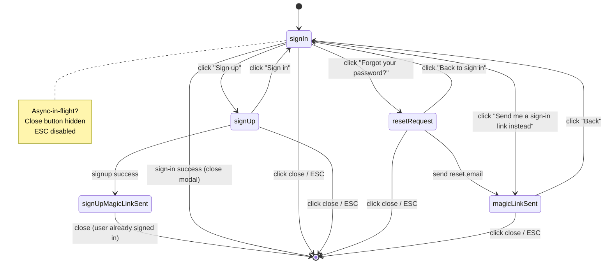

# Feature Requirements Document: FRD 6 -- Auth UI and Pending Action Preservation (v1.0)

| Field               | Value                                                                                                                                                                 |
| ------------------- | --------------------------------------------------------------------------------------------------------------------------------------------------------------------- |
| **Project**         | UW Wiki                                                                                                                                                               |
| **Parent Document** | [PRD v0.1](../PRD.md)                                                                                                                                                 |
| **FRD Order**       | [FRD Order](../FRD-order.md)                                                                                                                                          |
| **PRD Sections**    | 9 (Identity and Authentication), 12 (UX and UI Design)                                                                                                                |
| **Type**            | User-facing auth feature                                                                                                                                              |
| **Depends On**      | FRD 0                                                                                                                                                                 |
| **Unblocks**        | User-facing write paths in FRD 2 (PR submit), FRD 3 (comment submit + vote), FRD 4 (PR submit), FRD 5 (admin access)                                                  |
| **Delivers**        | `/auth/sign-in` page, AuthModal component, email/password signup with magic-link verification, passwordless magic-link sign-in, password reset, Google OAuth, sign-out, header user state + dropdown, pending-action preservation with 24h localStorage TTL, `returnTo` routing, guard redirects, stub `/my/*` routes |
| **Created**         | 2026-04-07                                                                                                                                                            |

---

## Summary

FRD 6 delivers the complete user-facing authentication experience that FRD 0 deliberately deferred. It turns the auth baseline (Supabase Auth providers, SSR cookies, middleware, guards, `public.users` sync) into an end-to-end UX: a dedicated `/auth/sign-in` page, a reusable `AuthModal` that FRDs 2 and 3 attach to PR submission, comment submission, and comment voting, an email/password signup flow with magic-link verification, passwordless magic-link sign-in, password reset, Google OAuth with automatic account linking, and a header user state with a minimal dropdown (`My Contributions`, `Bookmarks`, `Sign Out`).

FRD 6 also solves the cross-cutting problem that OAuth causes in write flows: a user clicking "Continue with Google" from the comment submit modal, the PR submit dialog, or the bookmark button is redirected off-site to Google and their pending action (draft text, vote, proposal content) is lost from memory. FRD 6 defines a localStorage-backed pending-action system with a 24-hour TTL that persists the action, correlates it through the auth round-trip, and auto-resumes on the first authenticated page load -- even in a new tab.

This FRD is deliberately scoped tightly. Profile and settings pages, email/password changes while signed in, account deletion, session management UI, 2FA, and analytics telemetry are all out of scope and reserved for later FRDs. UW SSO/CAS is Post-MVP per PRD.

---

## Supersession and Overlap Resolution

FRD 0 established the auth foundation. FRD 6 builds on top without re-doing anything in FRD 0.

What FRD 0 owns (unchanged):

1. Supabase Auth provider configuration (Google + email/password providers enabled in dashboard).
2. `@supabase/ssr` client setup (`src/lib/supabase/client.ts`, `server.ts`, `admin.ts`, `middleware.ts`).
3. Middleware session refresh via `auth.getUser()` on every request.
4. Guard helpers `requireUser()`, `requireReviewer()`, `requireAdmin()` in `src/lib/auth/guards.ts`.
5. `public.users` trigger that auto-creates rows on `auth.users` insert.
6. Role model (`user`, `reviewer`, `admin`).
7. Stub file at `src/app/auth/sign-in/page.tsx` (FRD 6 replaces the stub content).

What FRD 6 adds:

1. All user-facing auth UI.
2. The `AuthModal` component and its consumers.
3. Pending-action preservation infrastructure.
4. `/auth/callback` route for OAuth and magic-link landings.
5. `/auth/reset` page for password reset completion.
6. Stub routes `/my/contributions` and `/my/bookmarks` (placeholder pages wired to the user menu).
7. Branded Supabase email templates (via CLI + dashboard).
8. Minor `public.users` validation additions for `display_name` (CHECK constraint).

What FRD 6 explicitly does NOT include (deferred to later FRDs):

1. Profile / settings page.
2. Email address change.
3. Password change while signed in.
4. Account deletion.
5. Notification preferences.
6. Session / device management UI.
7. 2FA / MFA.
8. Analytics and telemetry for auth events.
9. UW SSO / CAS (Post-MVP per PRD).

---

## Given Context (Preconditions)

| Prerequisite                                                            | Source FRD |
| ----------------------------------------------------------------------- | ---------- |
| Supabase Auth with Google + email/password providers enabled            | FRD 0      |
| Cookie-based SSR auth via `@supabase/ssr`                               | FRD 0      |
| Middleware refresh pattern (`auth.getUser()` on every request)          | FRD 0      |
| Guard helpers (`requireUser`, `requireReviewer`, `requireAdmin`)        | FRD 0      |
| `public.users` row sync trigger on `auth.users` insert                  | FRD 0      |
| shadcn/ui + Tailwind v4 base theme (UW dark theme)                      | FRD 0      |
| Next.js 15 App Router scaffolded                                        | FRD 0      |
| Supabase dashboard credentials and service role key available in `.env` | FRD 0      |

### Terms

| Term                     | Definition                                                                                                          |
| ------------------------ | ------------------------------------------------------------------------------------------------------------------- |
| AuthModal                | The single modal component that contains all email/Google auth UI; opened from any write action or the header      |
| Pending action           | A user-initiated write that required auth; stored to localStorage so it can auto-resume after the auth round-trip    |
| Correlation ID           | UUID v4 bound to a pending action in localStorage; optionally also encoded in the OAuth `state` param for safety    |
| Magic link               | One-time sign-in or verification URL sent by email; no password required                                            |
| Auto-resume              | The process of detecting a pending action on first authenticated page load and replaying it via the matching API    |
| `returnTo`               | Query-string parameter on `/auth/sign-in?returnTo=/path` that post-auth logic uses to redirect back                  |
| Stub route               | A real Next.js route that renders a placeholder "Coming soon" page; used for `/my/contributions` and `/my/bookmarks` |
| Pre-verified user        | A user who signed up with email/password but has not yet clicked the verification magic link                        |
| Soft gate                | Verification prompt that nudges but does not block actions                                                          |

---

## Executive Summary (Gherkin-Style)

```gherkin
Feature: Auth UI and pending-action preservation

  Background:
    Given FRD 0 is complete
    And Supabase Auth has Google and email/password providers enabled
    And the middleware refreshes sessions on every request

  Scenario: Anonymous user visits and browses
    When an unauthenticated user visits "/" or any wiki page
    Then they see the page normally
    And the header shows a "Sign In" button

  Scenario: User signs in via Google from the header
    When the user clicks "Sign In" in the header
    Then the AuthModal opens in "signIn" mode
    And clicking "Continue with Google" redirects them to Google OAuth
    And after consent they land on /auth/callback
    And they are redirected to the page they were on before

  Scenario: User signs up with email and password
    When the user clicks "Sign Up" in the AuthModal
    And enters display name, email, password
    Then an account is created (unverified)
    And a magic link is sent to their email
    And they are signed in immediately
    And a banner tells them to verify their email

  Scenario: User verifies email via magic link
    When the user clicks the magic link in their email
    Then they land on /auth/callback
    And public.users.email_verified_at is set
    And the verification banner disappears
    And they are redirected to the page they were on before signing up

  Scenario: User signs in passwordlessly via magic link
    When the user enters email in the Sign In form
    And clicks "Send me a sign-in link instead"
    Then a magic link is sent to their email
    And the form shows "Check your email"
    And clicking the link signs them in and lands them on /auth/callback

  Scenario: User resets forgotten password
    When the user clicks "Forgot your password?"
    Then they enter their email
    And a password-reset magic link is sent
    And clicking the link takes them to /auth/reset
    And they set a new password
    And they are signed in with the new password

  Scenario: Pending comment submit survives Google OAuth redirect
    Given an unauthenticated user types a comment on a wiki page
    When they click "Post" on the comment form
    Then a pending-action is written to localStorage with a correlation ID
    And the AuthModal opens
    When they click "Continue with Google"
    And complete OAuth consent
    Then on the first authenticated page load the pending action is detected
    And the comment is submitted automatically
    And the pending action is cleared from localStorage

  Scenario: Pending PR submit survives Google OAuth redirect
    Given an unauthenticated user has drafted an edit to a section
    When they click "Submit Proposal"
    Then the proposal JSON, rationale, section slugs, and base version are persisted as a pending action
    And after OAuth sign-in the proposal is submitted automatically
    And the user lands on the proposal confirmation page

  Scenario: Pending action survives browser close and new-tab sign-in
    Given a pending action exists in localStorage
    And the user closes the tab without signing in
    When the user signs in within 24 hours in any tab on the same browser
    Then the pending action is auto-resumed
    And the user is notified that their previous action was completed

  Scenario: Pending action expires after 24 hours
    Given a pending action was saved more than 24 hours ago
    When the user signs in
    Then the pending action is discarded silently
    And no replay occurs

  Scenario: User signs out
    When an authenticated user clicks "Sign Out" in the user menu
    Then the session cookie is cleared
    And they stay on the current page if it is public
    And they are redirected to "/" if the current page required auth

  Scenario: Non-admin hits an admin route
    Given an authenticated user is not an admin
    When they visit "/admin/cold-start"
    Then they are redirected to "/?error=not_authorized"
    And a toast shows "You do not have access to that page"

  Scenario: Unauthenticated user hits an admin route
    When an unauthenticated user visits "/admin/cold-start"
    Then they are redirected to "/auth/sign-in?returnTo=/admin/cold-start"
    And after sign-in they land back on "/admin/cold-start"

  Scenario: Google OAuth email matches existing email/password account
    Given an account exists for alice@uwaterloo.ca with email/password credentials
    When alice signs in with Google using the same email
    Then Supabase auto-links the Google identity to the existing account
    And alice lands signed in with a single user record

  Scenario: Pre-verified user can still write
    Given a user signed up with email/password but has not yet verified
    When they submit a comment, vote, or PR
    Then the action succeeds
    And a banner continues to nudge them to verify

  Scenario: Display name validation
    When a user enters a display name shorter than 2 or longer than 50 chars
    Then the signup form shows a validation error inline
```

---

## Table of Contents

1. [1. Authentication Surfaces and UX](#1-authentication-surfaces-and-ux)
2. [2. Pending Action Preservation](#2-pending-action-preservation)
3. [3. Route Protection and returnTo](#3-route-protection-and-returnto)
4. [4. Data Model and Migrations](#4-data-model-and-migrations)
5. [5. Supabase Configuration](#5-supabase-configuration)
6. [6. API Contracts](#6-api-contracts)
7. [7. Component Tree and File Structure](#7-component-tree-and-file-structure)
8. [8. Integration with FRDs 2, 3, 4, 5](#8-integration-with-frds-2-3-4-5)
9. [9. Security, Privacy, and Abuse](#9-security-privacy-and-abuse)
10. [10. Non-Functional Requirements](#10-non-functional-requirements)
11. [11. Error Handling and Copy](#11-error-handling-and-copy)
12. [12. Exit Criteria](#12-exit-criteria)
13. [Appendix A: AuthModal State Machine](#appendix-a-authmodal-state-machine)
14. [Appendix B: Pending-Action Zod Schemas](#appendix-b-pending-action-zod-schemas)
15. [Appendix C: Supabase Email Templates](#appendix-c-supabase-email-templates)
16. [Appendix D: Design Decisions Log](#appendix-d-design-decisions-log)

---

## 1. Authentication Surfaces and UX

### 1.1 Three Entry Surfaces

FRD 6 introduces exactly three places the user interacts with auth:

| Surface              | Trigger                                                                             | Rendered As                                       |
| -------------------- | ----------------------------------------------------------------------------------- | ------------------------------------------------- |
| `/auth/sign-in` page | Direct URL visit, guard redirect with `returnTo`, or header "Sign In" (desktop)     | Full page wrapping the AuthModal component        |
| `AuthModal` (inline) | Unauthenticated user triggers a write (comment, vote, PR, bookmark)                 | Centered Dialog overlaying the triggering surface |
| Header user state    | Always present; shows "Sign In" button when unauth, avatar dropdown when auth       | Top-right of the app header                       |

Both `/auth/sign-in` and `AuthModal` render the same `AuthModal` component internally to guarantee UX parity.

### 1.2 AuthModal State Machine

The AuthModal is a finite state machine with 6 states. See Appendix A for the visual diagram. Allowed transitions:

```
signIn       ⇄ signUp
signIn       → magicLinkSent       (user clicks "Send me a sign-in link instead")
signIn       → resetRequest         (user clicks "Forgot your password?")
signUp       → signUpMagicLinkSent  (successful signup → verification email sent)
resetRequest → magicLinkSent        (reset email sent)
*            → closed               (ESC or close button; only when no blocking async in flight)
```

States:

1. `signIn` -- Default. Google button, email + password fields, "Send me a sign-in link instead" button below password, "Forgot your password?" link, switch-to-signup footer.
2. `signUp` -- Google button, display name + email + password fields, "Switch to Sign In" footer.
3. `magicLinkSent` -- Confirmation screen after passwordless sign-in magic link was sent. Shows recipient email + "Resend" button (disabled for 60s cooldown).
4. `signUpMagicLinkSent` -- Same visual as `magicLinkSent` but copy is verification-focused: "Verify your email to unlock full access. You can already comment and submit edits."
5. `resetRequest` -- Email input + "Send reset link" button + "Back to Sign In" link.
6. `closed` -- Modal not rendered.

Implementation: controlled state via React `useReducer` inside `AuthModal.tsx`; transitions are pure and testable.

### 1.3 AuthModal Component Spec

Visual layout (default `signIn` state, dark theme):

```
┌─────────────────────────────────────────────────────┐
│                                                 ✕   │
│                                                     │
│                   Welcome back                      │
│          Sign in to comment, vote, and propose      │
│                                                     │
│    ┌────────────────────────────────────────────┐  │
│    │  [G] Continue with Google                  │  │
│    └────────────────────────────────────────────┘  │
│                                                     │
│    ─────────────── or ────────────────              │
│                                                     │
│    ┌────────────────────────────────────────────┐  │
│    │ Email                                      │  │
│    └────────────────────────────────────────────┘  │
│                                                     │
│    ┌────────────────────────────────────────────┐  │
│    │ Password                                   │  │
│    └────────────────────────────────────────────┘  │
│                                                     │
│    Forgot your password?                            │
│                                                     │
│    ┌────────────────────────────────────────────┐  │
│    │                Sign In                     │  │
│    └────────────────────────────────────────────┘  │
│                                                     │
│    ─────────────────────────────────────────────   │
│                                                     │
│    ┌────────────────────────────────────────────┐  │
│    │   📧 Send me a sign-in link instead        │  │
│    └────────────────────────────────────────────┘  │
│                                                     │
│    Don't have an account? Sign up                   │
│                                                     │
└─────────────────────────────────────────────────────┘
```

**Visual specs:**

1. Dialog max width: `28rem` (`max-w-md`).
2. Background: `bg-neutral-900`, border: `border-neutral-800`.
3. Primary button: `bg-[var(--uw-gold)]` (from FRD 0 theme tokens), hover brightness +10%.
4. Secondary button (magic-link): `bg-neutral-800`, hover `bg-neutral-700`.
5. Google button: `bg-white text-black`, with official Google `g-logo` SVG.
6. Input focus ring: `ring-2 ring-[var(--uw-gold)]`.
7. All state transitions use Framer Motion `AnimatePresence` with 150ms fade+slide.
8. Close button hidden while an async operation is in flight (prevents accidental dismissal mid-OAuth redirect).
9. ESC key closes the modal only from `signIn`, `signUp`, and `resetRequest` states.
10. Focus trap: `onOpenAutoFocus` returns focus to first input; `onCloseAutoFocus` returns to the trigger element.

**Props:**

```typescript
interface AuthModalProps {
  /** Controls open/close. When false the modal renders nothing. */
  open: boolean;

  /** Called when modal closes (ESC, close button, backdrop click) */
  onClose: () => void;

  /** Initial state. Defaults to "signIn". */
  initialState?: "signIn" | "signUp";

  /**
   * Optional pending action to persist before auth. If provided, it is
   * written to localStorage and its correlation ID is passed to the
   * OAuth `state` param so we can re-verify it on callback.
   */
  pendingAction?: PendingAction;

  /** Where to redirect after successful sign-in. Defaults to current pathname. */
  returnTo?: string;
}
```

**Analytics hooks:** none in FRD 6; every `dispatch(...)` in the reducer is a natural instrumentation point for a future telemetry FRD.

### 1.4 `/auth/sign-in` Page Layout

Layout: centered, single column, max-width `32rem`, with the following stacked elements:

1. UW Wiki wordmark (top, 24px, gold).
2. Tagline: "The honest guide to UW's design teams, hackathon clubs, and build communities."
3. `AuthModal` rendered as an embedded card (not a Dialog -- same inner content, no overlay). Background: `bg-neutral-950`, card: `bg-neutral-900`.
4. Footer links: "Privacy" | "Terms" | "Contact" (placeholders; routes don't need to exist yet).

The page accepts one query param: `returnTo` (string, default `/`). It is validated server-side (must begin with `/`, must not start with `//`, must not contain protocol). After successful sign-in, the user is redirected to `returnTo`.

File: `src/app/auth/sign-in/page.tsx` (replaces the FRD 0 stub).

### 1.5 Header Integration

The header (from FRD 2) exposes two states:

**Unauthenticated state:**

```
┌──────────────────────────────────────────────────────────────────────┐
│ UW Wiki  [Search…]        [Directory] [Submit a Club]     [Sign In] │
└──────────────────────────────────────────────────────────────────────┘
```

1. "Sign In" is a shadcn `Button` variant `default` (UW gold).
2. Click opens `AuthModal` with `initialState="signIn"` and `returnTo=currentPathname`.

**Authenticated state:**

```
┌──────────────────────────────────────────────────────────────────────┐
│ UW Wiki  [Search…]        [Directory] [Submit a Club]    [🅰️ ▾]    │
└──────────────────────────────────────────────────────────────────────┘
```

The avatar (shadcn `Avatar` showing `avatar_url` or initials from `display_name`) triggers a dropdown:

```
┌────────────────────────┐
│  Alice Chen            │
│  alice@uwaterloo.ca    │
│ ────────────────────── │
│  👤 My Contributions    │ → /my/contributions
│  🔖 Bookmarks           │ → /my/bookmarks
│ ────────────────────── │
│  🚪 Sign Out            │
└────────────────────────┘
```

1. Dropdown built with shadcn `DropdownMenu`.
2. Header shows the user's `display_name` and `email` (email is `text-sm text-neutral-400`).
3. Menu items link to stub routes; stubs render "Coming soon" placeholder gated by `requireUser()`.
4. "Sign Out" calls the `/api/auth/sign-out` route handler (Section 6).

### 1.6 Sign-Up Flow

**Form fields (all required):**

| Field        | Validation                                                                                                        |
| ------------ | ----------------------------------------------------------------------------------------------------------------- |
| Display name | 2-50 chars; regex `^[\p{L}\p{N}_ \-]+$` (Unicode letters/digits, underscore, space, hyphen); trim whitespace      |
| Email        | Valid RFC 5322 email; max 254 chars                                                                               |
| Password     | 8-72 chars (bcrypt practical max); at least one lowercase, one uppercase, one digit                               |

Inline validation fires on blur. Form-level errors (e.g. "Email already taken") appear in an `Alert` above the form.

**Flow:**

1. User fills form, clicks "Sign Up".
2. Client calls `signUpAction` (server action) with `{displayName, email, password}`.
3. Server calls `supabase.auth.signUp({ email, password, options: { data: { display_name: displayName }, emailRedirectTo: `${siteUrl}/auth/callback` } })`.
4. Supabase creates `auth.users` row (unverified), the trigger from FRD 0 creates `public.users` with `display_name` pulled from `user_metadata.display_name`.
5. Supabase sends the magic-link verification email automatically.
6. `supabase.auth.signUp` with a password in Supabase >=2.x returns a session immediately (user is signed in even though unverified). Server returns success.
7. Client transitions AuthModal to `signUpMagicLinkSent` state showing: "Check alice@uwaterloo.ca. We sent a link to verify your email. You can keep using the site while you wait."
8. A toast and a dismissible banner appear across the app header until verification: "Verify your email to keep your account active. [Resend link]".

**Unverified user access:** All write actions are allowed. Verification is soft-gated (banner only). Post-MVP, trust-score features (PRD Section 9) may differentiate verified vs unverified users.

### 1.7 Magic-Link Passwordless Sign-In

Below the Sign In form's Sign In button and divider, a secondary button "📧 Send me a sign-in link instead".

**Flow:**

1. User enters email (password field may be empty).
2. User clicks "Send me a sign-in link instead".
3. Client calls `sendMagicLinkAction({ email, purpose: "signIn", returnTo })`.
4. Server calls `supabase.auth.signInWithOtp({ email, options: { shouldCreateUser: false, emailRedirectTo: `${siteUrl}/auth/callback?returnTo=${returnTo}` } })`.
5. `shouldCreateUser: false` so this does NOT create new accounts (prevents enumeration-based account creation).
6. Modal transitions to `magicLinkSent` state. Copy: "Check your email. We sent a sign-in link to alice@uwaterloo.ca. The link expires in 60 minutes."
7. "Resend" button is disabled for 60 seconds after initial send.
8. If `shouldCreateUser: false` rejects because user doesn't exist, server still returns success to the client to avoid email enumeration. Log the failure server-side for rate-limit telemetry.

**Why `shouldCreateUser: false`:** the explicit signup flow is the supported way to create an account (requires display name). Magic links from the sign-in form must not create accounts silently.

### 1.8 Password Reset Flow

**Trigger:** "Forgot your password?" link in `signIn` state.

**Flow:**

1. Modal transitions to `resetRequest` state.
2. User enters email, clicks "Send reset link".
3. Client calls `sendPasswordResetAction({ email })`.
4. Server calls `supabase.auth.resetPasswordForEmail(email, { redirectTo: `${siteUrl}/auth/reset` })`.
5. Modal transitions to `magicLinkSent` with purpose-specific copy: "Check your email. We sent a password reset link to alice@uwaterloo.ca."
6. User clicks the link in email. Lands on `/auth/reset`.
7. The reset page (separate route, Section 7) is a single form: new password + confirm password + "Save new password" button.
8. On submit, client calls `setNewPasswordAction({ newPassword })`. Server calls `supabase.auth.updateUser({ password: newPassword })`.
9. Success → redirect to `/` with a toast: "Password updated. You're signed in."

The `/auth/reset` page must check on mount that `supabase.auth.getUser()` returns a user in the `PASSWORD_RECOVERY` state. If not (e.g. direct URL visit without clicking the email link), redirect to `/auth/sign-in?error=reset_link_invalid`.

### 1.9 Google OAuth Flow

**Flow:**

1. User clicks "Continue with Google" in `signIn` or `signUp` state.
2. If `pendingAction` is set on the AuthModal, it is written to localStorage first (Section 2).
3. Client calls `supabase.auth.signInWithOAuth({ provider: "google", options: { redirectTo: `${siteUrl}/auth/callback?returnTo=${returnTo}`, queryParams: { prompt: "select_account" } } })`.
4. Browser is redirected to Google OAuth consent screen.
5. After consent, Google redirects back to `/auth/callback`.
6. `/auth/callback` handles the code exchange (Section 3.2), then either:
   - Resumes pending action and redirects to the action-specific success page, OR
   - Redirects to `returnTo`.

**Auto-link behavior:** The Supabase dashboard setting "Allow users to link accounts via email confirmation" is enabled (Section 5.1). If the Google email matches an existing `auth.users.email`, Supabase links the Google identity to that user.

**Failure modes:**

| Failure                                | Behavior                                                                            |
| -------------------------------------- | ----------------------------------------------------------------------------------- |
| User denies consent at Google          | `/auth/callback?error=access_denied` → redirect to `/auth/sign-in?error=oauth_denied` |
| Network error during code exchange     | `/auth/callback?error=network` → redirect to `/auth/sign-in?error=oauth_failed`     |
| Email collision with linking disabled  | (should not happen in MVP; linking is on) → error banner on sign-in                 |

### 1.10 Sign-Out Flow

**Trigger:** "Sign Out" in the user menu.

**Flow:**

1. Client calls `signOutAction` (server action).
2. Server calls `supabase.auth.signOut()` which clears session cookies via `@supabase/ssr`.
3. Server returns a response with the same cookies cleared (middleware-compatible).
4. Client inspects current route:
   - If current route requires auth (matches any protected prefix like `/my/*`, `/admin/*`, `/auth/reset`), push to `/`.
   - Otherwise stay on current route and refresh (`router.refresh()`).
5. Toast: "Signed out."

Protected prefixes (from consumer FRDs):

- `/admin/*` (FRD 5 and future admin features).
- `/my/*` (FRD 6 stubs).
- `/auth/reset` (password recovery only).

---

## 2. Pending Action Preservation

### 2.1 Problem Statement

Unauthenticated writes are a first-class UX pattern (PRD and FRD 2 §4.7: "Unauthenticated users can click Propose Edit and edit freely. Authentication is only required at submission time"). When the user is finally prompted to sign in:

- **Email/password sign-in** stays on the same page; no state is lost.
- **Google OAuth** causes a full-page redirect off-site; in-memory React state is lost.
- **Magic link** lands the user on `/auth/callback` possibly in a new browser tab; the original tab may be closed or orphaned.

The pending-action system preserves the user's intent across any of these redirects.

### 2.2 Action Types

Four pending action types are preserved in FRD 6. Each has a Zod schema (Appendix B).

| Type                   | Written When                                       | Replay Endpoint                                                                 |
| ---------------------- | -------------------------------------------------- | ------------------------------------------------------------------------------- |
| `comment.submit`       | User clicks "Post" on the comment form            | `POST /api/comments` (FRD 3)                                                    |
| `comment.vote`         | User clicks up/down arrow on a comment             | `POST /api/comments/[id]/vote` (FRD 3)                                          |
| `proposal.submit`      | User clicks "Submit Proposal" in PR dialog         | `POST /api/proposals` (FRD 4)                                                   |
| `bookmark.toggle`      | User clicks the bookmark icon on a page            | `POST /api/bookmarks/toggle` (FRD 8)                 |

Pulse votes are NOT preserved because Pulse is session-based (no auth) per PRD §6.6.

### 2.3 Storage Schema

Storage key: `uw-wiki:pending-action` (singleton -- only one pending action at a time; new writes overwrite).

Value (JSON serialized):

```typescript
interface PendingActionEnvelope {
  correlationId: string;     // uuid v4
  createdAt: string;         // ISO 8601 timestamp
  expiresAt: string;         // createdAt + 24h
  triggeredFrom: string;     // pathname where action was triggered
  action: PendingAction;     // the typed action payload
}

type PendingAction =
  | { type: "comment.submit"; payload: CommentSubmitPayload }
  | { type: "comment.vote"; payload: CommentVotePayload }
  | { type: "proposal.submit"; payload: ProposalSubmitPayload }
  | { type: "bookmark.toggle"; payload: BookmarkTogglePayload };
```

See Appendix B for payload schemas.

**Never-stored fields:** passwords, OAuth tokens, session cookies, CSRF tokens. localStorage is not a secure store; we only keep fields that are safe to replay via an authenticated API call.

### 2.4 Lifecycle

**Save point:**

1. Unauthenticated user triggers a write (e.g. clicks "Post" on comment form).
2. The hook `useAuthModal()` is invoked with a `PendingAction` payload.
3. Before opening the modal, the hook:
   - Generates a correlation ID.
   - Computes `expiresAt = now + 24h`.
   - Writes the envelope to `localStorage["uw-wiki:pending-action"]`.
4. Modal opens.

**Resume point:**

1. On every mount of the root layout, a client effect runs:
   ```typescript
   useEffect(() => {
     if (!user) return;
     void resumePendingAction(user);
   }, [user]);
   ```
2. `resumePendingAction` reads `localStorage["uw-wiki:pending-action"]`.
3. If missing, no-op.
4. If present and `expiresAt < now`, delete and no-op.
5. If present and valid, dispatch to the matching replay handler (Section 2.5).
6. On successful replay, delete the entry.
7. On replay failure, leave the entry in place but surface an error toast; the user can retry manually.

**Cleanup:**

1. Explicit close by the user: the `onClose` handler of the AuthModal does NOT clear the pending action (user chose `keep-with-ttl` strategy). The action remains valid for 24h.
2. TTL expiry: checked on read; expired entries are deleted lazily.
3. Successful replay: deleted immediately.
4. User manual clear: not exposed in FRD 6 UI. Can be cleared via DevTools or by signing in and letting replay complete.

### 2.5 Replay Handlers

Defined in `src/lib/auth/pending-action.ts`. Each handler:

1. Validates the payload with its Zod schema.
2. Calls the corresponding authenticated API.
3. On success, shows a toast describing what happened.
4. On success, navigates to the action-specific result location (e.g. proposal confirmation page).

```typescript
type ReplayHandler<P> = (payload: P, ctx: ReplayContext) => Promise<ReplayResult>;

interface ReplayContext {
  router: AppRouterInstance;
  toast: (opts: ToastOptions) => void;
  user: User;
}

interface ReplayResult {
  ok: boolean;
  message: string;     // shown in toast
  navigateTo?: string; // optional post-replay navigation
}
```

Toast copy examples:

- `comment.submit` success: "Your comment was posted."
- `comment.vote` success: "Vote recorded."
- `proposal.submit` success: "Proposal submitted for review." (and navigate to confirmation page).
- `bookmark.toggle` success: "Bookmarked." or "Removed from bookmarks."

### 2.6 Correlation With OAuth `state` Param

For defense-in-depth, the correlation ID is also included in the OAuth `state` param when available:

```typescript
supabase.auth.signInWithOAuth({
  provider: "google",
  options: {
    redirectTo: `${siteUrl}/auth/callback?returnTo=${encodeURIComponent(returnTo)}`,
    // We cannot set state directly via signInWithOAuth; Supabase manages it.
    // Instead, pass correlation through the redirect URL and re-match in /auth/callback.
    queryParams: { prompt: "select_account" },
  },
});
```

Note: Supabase does not expose the raw OAuth `state` param for use. The correlation ID is therefore stored only in localStorage. This is acceptable because:

1. The replay handler verifies the authenticated user ID matches the user who submitted.
2. All replay API calls re-run server-side authorization (no action succeeds without matching RLS / auth).
3. Even if a different user signs in on the same browser, the replay handler's payload checks (e.g. comment belongs to current user) will fail gracefully.

---

## 3. Route Protection and returnTo

### 3.1 Guard Redirect Pattern

Server components and route handlers that require auth follow a consistent pattern:

```typescript
// src/app/my/contributions/page.tsx
import { requireUser } from "@/lib/auth/guards";

export default async function MyContributionsPage() {
  const user = await requireUser({ returnTo: "/my/contributions" });
  // ... render
}
```

`requireUser` is updated in FRD 6 to accept a `returnTo` option:

```typescript
// src/lib/auth/guards.ts (FRD 6 addition)
export async function requireUser(options?: { returnTo?: string }) {
  const supabase = await createServerClient();
  const { data: { user } } = await supabase.auth.getUser();

  if (!user) {
    const returnTo = options?.returnTo ?? "/";
    redirect(`/auth/sign-in?returnTo=${encodeURIComponent(returnTo)}`);
  }

  // Also hydrate the public.users row and role
  const { data: profile } = await supabase
    .from("users")
    .select("id, email, display_name, avatar_url, role, email_verified_at")
    .eq("id", user.id)
    .single();

  return { user, profile };
}
```

`requireAdmin` and `requireReviewer` follow the same pattern, except non-privileged authenticated users are redirected to `/?error=not_authorized` with a toast (not to sign-in).

### 3.2 `/auth/callback` Route Handler

File: `src/app/auth/callback/route.ts`.

Responsibilities:

1. Exchange the OAuth `code` (or magic-link `token_hash`) for a session.
2. Parse the `returnTo` query param and validate it (local paths only).
3. Detect and mark email verification completion.
4. Redirect to `returnTo` (or `/` if absent or invalid).

```typescript
// src/app/auth/callback/route.ts (pseudocode; exact supabase-ssr API per FRD 0)
import { NextRequest, NextResponse } from "next/server";
import { createServerClient } from "@/lib/supabase/server";

export async function GET(req: NextRequest) {
  const url = new URL(req.url);
  const code = url.searchParams.get("code");
  const tokenHash = url.searchParams.get("token_hash");
  const type = url.searchParams.get("type");    // "email", "magiclink", "recovery", etc.
  const returnTo = sanitizeReturnTo(url.searchParams.get("returnTo"));
  const errorParam = url.searchParams.get("error");

  const supabase = await createServerClient();

  if (errorParam) {
    return NextResponse.redirect(
      new URL(`/auth/sign-in?error=${errorParam}`, req.url)
    );
  }

  if (code) {
    const { error } = await supabase.auth.exchangeCodeForSession(code);
    if (error) {
      return NextResponse.redirect(
        new URL("/auth/sign-in?error=oauth_failed", req.url)
      );
    }
  } else if (tokenHash && type) {
    const { error } = await supabase.auth.verifyOtp({
      token_hash: tokenHash,
      type: type as "email" | "magiclink" | "recovery",
    });
    if (error) {
      return NextResponse.redirect(
        new URL(`/auth/sign-in?error=link_invalid`, req.url)
      );
    }
    if (type === "email") {
      // Mark email_verified_at via RLS-safe RPC or supabase.auth.getUser()-derived flag.
      // FRD 0 user sync trigger may handle this; if not, add in 4.2.
    }
    if (type === "recovery") {
      return NextResponse.redirect(new URL("/auth/reset", req.url));
    }
  }

  return NextResponse.redirect(new URL(returnTo, req.url));
}

function sanitizeReturnTo(input: string | null): string {
  if (!input) return "/";
  if (!input.startsWith("/")) return "/";
  if (input.startsWith("//")) return "/";
  if (input.includes("://")) return "/";
  return input;
}
```

### 3.3 Post-Auth Redirect Logic

1. `/auth/callback` redirects to the sanitized `returnTo` or `/`.
2. The root layout's `useEffect` detects the authenticated session and calls `resumePendingAction`.
3. If a pending action is replayed, its `navigateTo` (if set) overrides the `returnTo` destination. The user sees one clean transition to the action's result page (e.g. PR confirmation).
4. If the user opened the magic link in a new tab, the replay happens in that tab and the original tab remains inert. Users naturally close the stale tab. No cross-tab synchronization is required for MVP.

---

## 4. Data Model and Migrations

### 4.1 No New Tables

FRD 6 introduces no new tables. All state is in `auth.users` (Supabase-managed) and `public.users` (FRD 0).

### 4.2 `public.users` Additions

FRD 6 adds two things:

1. A `CHECK` constraint on `display_name` enforcing the 2-50 char length and allowed character set.
2. A nullable `email_verified_at TIMESTAMPTZ` column (if not already present from FRD 0) and a trigger to copy it from `auth.users.email_confirmed_at`.

```sql
-- 002_auth_ui.sql

-- Add display_name validation (safe if column already exists)
ALTER TABLE public.users
  ADD CONSTRAINT users_display_name_length
    CHECK (char_length(display_name) BETWEEN 2 AND 50),
  ADD CONSTRAINT users_display_name_charset
    CHECK (display_name ~ '^[\p{L}\p{N}_ \-]+$');

-- Add email_verified_at (null until Supabase marks it)
ALTER TABLE public.users
  ADD COLUMN IF NOT EXISTS email_verified_at TIMESTAMPTZ;

-- Sync email verification state
CREATE OR REPLACE FUNCTION sync_email_verified()
RETURNS TRIGGER AS $$
BEGIN
  INSERT INTO public.users (id, email, display_name, avatar_url, email_verified_at)
  VALUES (
    NEW.id,
    NEW.email,
    COALESCE(NEW.raw_user_meta_data->>'display_name', split_part(NEW.email, '@', 1)),
    NEW.raw_user_meta_data->>'avatar_url',
    NEW.email_confirmed_at
  )
  ON CONFLICT (id) DO UPDATE
    SET email_verified_at = NEW.email_confirmed_at,
        avatar_url = COALESCE(public.users.avatar_url, NEW.raw_user_meta_data->>'avatar_url'),
        display_name = COALESCE(public.users.display_name, NEW.raw_user_meta_data->>'display_name', split_part(NEW.email, '@', 1));
  RETURN NEW;
END;
$$ LANGUAGE plpgsql SECURITY DEFINER;

DROP TRIGGER IF EXISTS on_auth_user_change ON auth.users;
CREATE TRIGGER on_auth_user_change
  AFTER INSERT OR UPDATE ON auth.users
  FOR EACH ROW EXECUTE FUNCTION sync_email_verified();
```

Notes:

1. The trigger extends FRD 0's sync trigger to also copy `email_confirmed_at` on subsequent updates (when the user clicks the magic link).
2. The display_name fallback on signup if not provided in metadata is the email prefix; this is a server-side safety net, though the signup form enforces it client-side too.
3. The character-class regex `\p{L}\p{N}` requires Postgres 17 with `ICU` collations (default in Supabase).

### 4.3 RLS Policies

No changes to existing RLS. FRD 6 does not introduce new data dependencies.

---

## 5. Supabase Configuration

### 5.1 Manual Dashboard Checklist

Documented as the implementation checklist for the Supabase project owner:

**Authentication → Providers:**

1. Enable **Google** provider. Fill client ID and client secret from Google Cloud OAuth 2.0 credentials.
2. Confirm **Email** provider is enabled with "Confirm email" set to ON.
3. Under **Email Auth**:
   - Enable **Magic Link** sign-in.
   - Enable **Email confirmation**.
   - Set **Email OTP Expiration** to 60 minutes (magic links).
4. Under **Authentication → URL Configuration**:
   - Set **Site URL** to production domain (e.g. `https://uwwiki.ca`).
   - Add **Redirect URLs**: `http://localhost:3000/auth/callback`, `http://localhost:3000/auth/reset`, `https://uwwiki.ca/auth/callback`, `https://uwwiki.ca/auth/reset`.

**Authentication → Settings:**

5. Enable **"Allow new users to link their accounts via email"** (controls Google auto-link to existing email/password accounts).
6. Set **JWT expiry** to 3600 seconds (default); refresh token: default 60 days.

**Authentication → Email Templates:**

7. Customize the four email templates (Confirm signup, Magic Link, Reset Password, Change Email). See Appendix C for HTML source.

### 5.2 Automated via Supabase CLI

Where possible, configuration is committed to the repo and applied via CLI:

**`supabase/config.toml`:**

```toml
[auth]
site_url = "http://localhost:3000"
additional_redirect_urls = [
  "http://localhost:3000/auth/callback",
  "http://localhost:3000/auth/reset",
  "https://uwwiki.ca/auth/callback",
  "https://uwwiki.ca/auth/reset",
]
jwt_expiry = 3600
enable_signup = true
enable_confirmations = true

[auth.email]
enable_signup = true
enable_confirmations = true
double_confirm_changes = true
secure_password_change = true
otp_expiry = 3600

[auth.external.google]
enabled = true
client_id = "env(SUPABASE_AUTH_GOOGLE_CLIENT_ID)"
secret = "env(SUPABASE_AUTH_GOOGLE_SECRET)"
redirect_uri = "http://localhost:54321/auth/v1/callback"
```

Custom email template HTML files committed at:

```
supabase/
  templates/
    confirmation.html
    magic-link.html
    recovery.html
    email-change.html
```

Applied via:

```bash
supabase db push
supabase functions deploy  # if any edge functions
# Email templates applied by the CLI on `supabase link` + dashboard sync, or manually via dashboard if self-hosting.
```

### 5.3 Environment Variables

Additions to `.env.example` beyond FRD 0:

```
# OAuth client credentials (used by Supabase dashboard, not directly by Next.js)
SUPABASE_AUTH_GOOGLE_CLIENT_ID=
SUPABASE_AUTH_GOOGLE_SECRET=

# Public site URL used for building email redirect URLs
NEXT_PUBLIC_SITE_URL=http://localhost:3000
```

`NEXT_PUBLIC_SITE_URL` is validated in `src/lib/config/env.ts`:

```typescript
// env.ts (addition)
siteUrl: z.string().url().refine((u) => !u.endsWith("/"), "Must not end with /"),
```

---

## 6. API Contracts

### 6.1 Server Actions

All auth operations are implemented as Next.js **server actions** where possible (cleaner for forms) and **route handlers** where server actions don't fit (callbacks).

Files: `src/app/auth/actions.ts`.

```typescript
"use server";

interface ActionResult<T = undefined> {
  ok: boolean;
  data?: T;
  error?: {
    code: string;        // machine-readable (see Section 11)
    message: string;     // user-facing
    field?: string;      // for inline form errors
  };
}
```

**`signInAction`**

```typescript
interface SignInInput {
  email: string;
  password: string;
}

async function signInAction(input: SignInInput): Promise<ActionResult>;
```

**`signUpAction`**

```typescript
interface SignUpInput {
  displayName: string;
  email: string;
  password: string;
}

async function signUpAction(input: SignUpInput): Promise<ActionResult>;
```

**`sendMagicLinkAction`** (passwordless sign-in)

```typescript
interface SendMagicLinkInput {
  email: string;
  returnTo?: string;
}

async function sendMagicLinkAction(input: SendMagicLinkInput): Promise<ActionResult>;
```

**`sendPasswordResetAction`**

```typescript
interface SendPasswordResetInput {
  email: string;
}

async function sendPasswordResetAction(input: SendPasswordResetInput): Promise<ActionResult>;
```

**`setNewPasswordAction`**

```typescript
interface SetNewPasswordInput {
  newPassword: string;
  confirmPassword: string;
}

async function setNewPasswordAction(input: SetNewPasswordInput): Promise<ActionResult>;
```

**`signOutAction`**

```typescript
async function signOutAction(): Promise<ActionResult>;
```

### 6.2 Route Handlers

| Route                   | Method | Purpose                                                               |
| ----------------------- | ------ | --------------------------------------------------------------------- |
| `/auth/callback`        | GET    | OAuth code exchange and magic-link verification; see Section 3.2       |
| `/api/auth/sign-out`    | POST   | Optional REST alternative to `signOutAction` for client-only surfaces  |

Only `/auth/callback` is strictly required. `/api/auth/sign-out` is implemented for parity and convenience.

### 6.3 Server Action Internals

Every server action:

1. Validates input with Zod before any Supabase call.
2. Wraps Supabase calls in try/catch; maps errors to `ActionResult.error.code` (Section 11).
3. Calls `revalidatePath("/")` after sign-in or sign-out so the root layout's user state is fresh.
4. Returns `ActionResult` -- never throws to the client.

Example `signInAction` implementation:

```typescript
"use server";

import { z } from "zod";
import { redirect } from "next/navigation";
import { revalidatePath } from "next/cache";
import { createServerClient } from "@/lib/supabase/server";

const schema = z.object({
  email: z.string().email(),
  password: z.string().min(8).max(72),
});

export async function signInAction(
  raw: unknown
): Promise<ActionResult> {
  const parsed = schema.safeParse(raw);
  if (!parsed.success) {
    return {
      ok: false,
      error: { code: "validation", message: "Invalid input" },
    };
  }

  const supabase = await createServerClient();
  const { error } = await supabase.auth.signInWithPassword(parsed.data);

  if (error) {
    return {
      ok: false,
      error: {
        code: "invalid_credentials",
        message: "Invalid email or password",
      },
    };
  }

  revalidatePath("/");
  return { ok: true };
}
```

---

## 7. Component Tree and File Structure

### 7.1 New Files

```
src/
  app/
    auth/
      sign-in/
        page.tsx                      [NEW] Renders AuthModal as an embedded card
      callback/
        route.ts                      [NEW] OAuth + magic-link callback handler
      reset/
        page.tsx                      [NEW] Password reset completion form
      actions.ts                      [NEW] Server actions (sign-in/up/magic-link/reset/sign-out)
    api/
      auth/
        sign-out/
          route.ts                    [NEW] Optional REST sign-out handler
    my/
      contributions/
        page.tsx                      [NEW] Auth-gated stub: "Coming soon"
      bookmarks/
        page.tsx                      [NEW] Auth-gated stub: "Coming soon"
      layout.tsx                      [NEW] Shared layout; calls requireUser once

  components/
    auth/
      AuthModal.tsx                   [NEW] Root modal component with state machine
      AuthModalBody.tsx               [NEW] Shared body used by modal AND sign-in page
      SignInForm.tsx                  [NEW] Email + password form
      SignUpForm.tsx                  [NEW] Display name + email + password form
      OAuthButtons.tsx                [NEW] Google button
      MagicLinkSent.tsx               [NEW] Confirmation screen ("Check your email")
      PasswordResetRequestForm.tsx    [NEW] Email input for reset
      PasswordResetForm.tsx           [NEW] New password + confirm (used on /auth/reset)
      UserMenu.tsx                    [NEW] Header avatar dropdown
      VerifyEmailBanner.tsx           [NEW] Dismissible banner for pre-verified users

  lib/
    auth/
      guards.ts                       [UPDATED] requireUser accepts returnTo option
      pending-action.ts               [NEW] Schemas, save/read/replay/expire
      pending-action-handlers.ts      [NEW] One handler per action type
      use-auth-modal.ts               [NEW] Hook that opens AuthModal with pending action
      use-user.ts                     [NEW] Client-side hook for current user
    validation/
      auth-schemas.ts                 [NEW] Zod schemas shared by form + server action

  hooks/
    use-pending-action-resume.ts      [NEW] Root-layout hook that fires on first auth

supabase/
  migrations/
    002_auth_ui.sql                   [NEW] display_name constraints + email_verified_at sync
  templates/
    confirmation.html                 [NEW] Signup verification email
    magic-link.html                   [NEW] Passwordless sign-in email
    recovery.html                     [NEW] Password reset email
    email-change.html                 [NEW] (Placeholder; not used in MVP but required by Supabase)
```

### 7.2 Files Changed

```
src/
  app/
    layout.tsx                        [UPDATED] Add <VerifyEmailBanner /> and <PendingActionResumer />
  components/
    layout/
      Header.tsx                      [UPDATED] Replace auth stub with <UserMenu /> + Sign In button
  lib/
    config/
      env.ts                          [UPDATED] Add NEXT_PUBLIC_SITE_URL validation
    supabase/
      middleware.ts                   [UPDATED if needed] Handle /auth/callback, /auth/reset paths
  middleware.ts                       [UPDATED] Admin/my route protection redirect with returnTo
  .env.example                        [UPDATED] Add auth env vars
```

### 7.3 Component Hierarchy

```
AuthModal (Dialog wrapper or full-page card)
└── AuthModalBody
    ├── Header ("Welcome back" | "Create your account" | "Check your email" | "Reset password")
    ├── OAuthButtons
    │   └── GoogleButton
    ├── Divider ("or")
    ├── Body (state-dependent)
    │   ├── [signIn]       SignInForm + MagicLinkCTA + "Forgot your password?" + "Sign up" footer
    │   ├── [signUp]       SignUpForm + "Sign in" footer
    │   ├── [magicLinkSent] MagicLinkSent (confirmation screen + resend button)
    │   ├── [signUpMagicLinkSent] MagicLinkSent (verification variant)
    │   └── [resetRequest] PasswordResetRequestForm + "Back to sign in" link
    └── Close button (hidden mid-async)
```

---

## 8. Integration with FRDs 2, 3, 4, 5

### 8.1 FRD 2: Wiki Pages

**§5.3 Step 3 (PR Submit Auth Gate):** The submission dialog calls `useAuthModal` with a `proposal.submit` pending action when the user clicks "Submit" while unauthenticated.

```typescript
// inside FRD 2's PR submission dialog component
const { openAuthModal } = useAuthModal();

async function handleSubmit() {
  if (!user) {
    openAuthModal({
      pendingAction: {
        type: "proposal.submit",
        payload: {
          pageId,
          basePageVersionId,
          sectionSlugs,
          sectionDiffs,
          rationale,
          isAnonymous,
        },
      },
      initialState: "signIn",
    });
    return;
  }

  // ...normal authenticated submission
}
```

Exit criterion 15 of FRD 2 ("Auth modal appears for unauthenticated users on submit") is satisfied by FRD 6 providing the AuthModal.

### 8.2 FRD 3: Comments

Two integration points:

**Comment submission:** hook the comment form's submit handler with a `comment.submit` pending action.

**Comment vote:** when an unauthenticated user clicks up/down arrow, open AuthModal with a `comment.vote` pending action.

Both are thin wrappers over `useAuthModal`. See Appendix B for payload shapes.

FRD 3's exit criterion 19 ("Unauthenticated vote shows auth modal") is satisfied.

### 8.3 FRD 4: PR-Edit System

Flows through FRD 2's submission dialog (Section 8.1). No additional integration required.

### 8.4 FRD 5: Cold Start Agent

`/admin/cold-start` uses `requireAdmin()` from FRD 0. FRD 6 updates `requireAdmin` to:

1. If user is unauthenticated: redirect to `/auth/sign-in?returnTo=/admin/cold-start`.
2. If user is authenticated but not admin: redirect to `/?error=not_authorized`. Root layout displays a toast based on the `error` query param.

FRD 5's exit criterion "Non-admin access is blocked" is now covered by the sign-in redirect path, not just the home redirect.

---

## 9. Security, Privacy, and Abuse

### 9.1 Password and Session Security

1. Passwords hashed by Supabase using bcrypt.
2. Session cookies are HTTP-only, Secure (in prod), SameSite=Lax, managed by `@supabase/ssr`.
3. JWT access tokens expire after 1 hour; refresh tokens after 60 days (Supabase defaults).
4. CSRF protection: Next.js server actions include a CSRF token; `@supabase/ssr` SameSite cookies prevent cross-origin session leak.

### 9.2 OAuth Security

1. Google OAuth uses PKCE (Supabase handles).
2. `redirect_uri` is pinned to the `/auth/callback` endpoint on the configured site URL.
3. `state` param is managed by Supabase; we don't extend it.
4. The callback handler sanitizes `returnTo` to local paths only to prevent open-redirect attacks.

### 9.3 Rate Limiting

Rely on Supabase built-in limits. FRD 6 does not add custom rate limiting.

Supabase defaults (verified in dashboard, documented here):

| Operation                   | Default limit            |
| --------------------------- | ------------------------ |
| Email OTP/magic link send   | 1 per 60s per email      |
| Password sign-in attempts   | ~5 per minute per IP     |
| Signup attempts per IP      | ~30 per hour             |

Client UI enforces a 60s cooldown on "Resend" buttons as a UX hint; server-side limits remain the source of truth.

### 9.4 Magic Link and Reset Link Hygiene

1. Magic links expire in 60 minutes (Supabase setting).
2. Links are single-use (Supabase invalidates on redemption).
3. Reset links land on `/auth/reset` which verifies the session state before allowing password change.
4. The `/auth/reset` page is not accessible outside a recovery flow; it redirects to sign-in if the session lacks the recovery marker.

### 9.5 Pending Action Hygiene

1. Never store passwords, OAuth tokens, or session data in the envelope.
2. Never store content outside the Zod schemas in Appendix B.
3. `localStorage` is explicitly not a secret store; replay always hits an authenticated API that re-validates inputs and checks authorization server-side.
4. TTL is 24h; expired entries are deleted on read.
5. Replay API calls pass through the same RLS policies as normal submissions -- a pending action cannot bypass any authorization check.

### 9.6 PII and Email Enumeration

1. Sign-in errors use a generic "Invalid email or password" message to prevent enumeration.
2. Magic-link send (from the sign-in form) returns success even if the email does not exist.
3. Signup errors for "email already taken" DO disclose existence; this is acceptable because the signup form explicitly intends to create an account for that email. (Supabase's default behavior.)

### 9.7 Email Template Security

1. Links in email templates use `{{ .ConfirmationURL }}` etc. — never hand-built URLs that could be spoofed.
2. Templates do not include any user-typed content (display_name, etc.) to avoid HTML injection via email.
3. All links are `https://` in production; staging uses `http://localhost:3000` only in local dev.

---

## 10. Non-Functional Requirements

| Requirement                                                 | Target                                                    |
| ----------------------------------------------------------- | --------------------------------------------------------- |
| AuthModal first render                                      | < 100 ms from click                                       |
| Sign-in round trip (email/password, server action p95)      | < 500 ms                                                  |
| Signup round trip (email/password, server action p95)       | < 800 ms (includes email queue)                           |
| Magic link email deliverability                             | < 30 s to inbox (Supabase SMTP)                           |
| OAuth callback code exchange p95                            | < 400 ms                                                  |
| Pending-action replay after callback p95                    | < 500 ms (plus replay API duration)                       |
| localStorage read/write                                     | synchronous; no UX impact                                 |
| Availability                                                | 99.9% for auth server actions (Supabase SLA + Vercel SLA) |
| Accessibility                                               | WCAG 2.1 AA (focus trap, ARIA, contrast ≥ 4.5:1)          |
| Keyboard navigation                                         | Tab order: close → OAuth → fields → submit → footer       |

Accessibility specifics:

1. AuthModal uses shadcn `Dialog` (Radix primitive) with full ARIA compliance out of the box.
2. Live regions announce form submission errors.
3. `aria-invalid` + `aria-describedby` connect inputs to inline error messages.
4. Color is never the only differentiator (error icons accompany red text).
5. Screen reader label on OAuth button: "Continue with Google".

---

## 11. Error Handling and Copy

Every error surface has a machine-readable code (`ActionResult.error.code`) and a user-facing message. Codes are stable so the client can route UI (inline field vs toast vs alert) without re-parsing prose.

| Code                       | User-Facing Message                                                                   | Surface                  |
| -------------------------- | ------------------------------------------------------------------------------------- | ------------------------ |
| `validation`               | "Please check your entries."                                                          | Inline (field-level)     |
| `invalid_credentials`      | "Invalid email or password."                                                          | Form alert               |
| `email_taken`              | "An account with this email already exists. Try signing in instead."                  | Form alert (link → signIn) |
| `weak_password`            | "Your password must be at least 8 characters with a letter, uppercase, and number."   | Inline (password field)  |
| `invalid_email`            | "Please enter a valid email."                                                         | Inline (email field)     |
| `display_name_invalid`     | "Display name must be 2-50 characters and can include letters, numbers, spaces, -, _."| Inline (display_name)    |
| `rate_limited`             | "Too many attempts. Please try again in a minute."                                    | Form alert               |
| `magic_link_sent`          | (not an error — success state used for UI routing)                                    | —                        |
| `reset_link_invalid`       | "This reset link has expired or is invalid. Please request a new one."                | Full-page alert on /auth/reset |
| `oauth_denied`             | "Sign-in was cancelled."                                                              | Banner at top of sign-in page |
| `oauth_failed`             | "We couldn't complete sign-in with Google. Please try again."                         | Banner at top of sign-in page |
| `link_invalid`             | "This link has expired. Please request a new one."                                    | Banner at top of sign-in page |
| `not_authorized`           | "You don't have access to that page."                                                 | Home-page toast (from ?error=not_authorized) |
| `network`                  | "Something went wrong. Please check your connection and try again."                   | Form alert               |
| `pending_replay_failed`    | "We couldn't finish what you started before signing in. Please try again."            | Toast + navigate to original trigger pathname |

Error banners persist until dismissed or navigation.

---

## 12. Exit Criteria

FRD 6 is complete when ALL of the following are satisfied:

| #   | Criterion                                                                            | Verification                                                                                          |
| --- | ------------------------------------------------------------------------------------ | ----------------------------------------------------------------------------------------------------- |
| 1   | `/auth/sign-in` renders the AuthModal as an embedded card                            | Visit the page logged out; sign in form is visible and functional                                     |
| 2   | Header shows "Sign In" button when unauthenticated                                   | Visit `/` in a logged-out browser                                                                     |
| 3   | Header shows avatar + dropdown when authenticated                                    | Sign in; verify avatar renders and dropdown items are correct                                         |
| 4   | Google OAuth sign-in completes end-to-end                                            | Click Continue with Google; land on `/auth/callback`; session cookie set; redirect to returnTo        |
| 5   | Email/password sign-in completes end-to-end                                          | Enter valid email and password; modal closes; user is signed in                                       |
| 6   | Email/password sign-up creates account + sends magic-link verification               | Sign up; check email; click link; `email_verified_at` becomes non-null                                |
| 7   | Passwordless magic-link sign-in works from the Sign In form                          | Click "Send me a sign-in link instead"; verify email link signs user in                               |
| 8   | Password reset flow works end-to-end                                                 | Click "Forgot your password?"; follow email link; set new password; sign in with it                  |
| 9   | Pre-verified users can comment, vote, and submit PRs                                 | Submit comment/vote/PR as signup user without clicking verification; actions succeed                  |
| 10  | Verify-email banner appears for unverified users and disappears after verification   | Sign up, see banner; click verification link; banner gone                                             |
| 11  | Sign out works and respects "stay on public page" rule                               | Sign out from a wiki page; stay on page. Sign out from `/my/bookmarks`; redirect to `/`               |
| 12  | User menu links (My Contributions, Bookmarks) route to auth-gated stub pages         | Click each; verify stub page renders; visit while logged out; redirect to sign-in with returnTo       |
| 13  | Comment submit from logged-out state auto-resumes after sign-in                      | Type comment, click Post, sign in via Google; comment is posted after OAuth round-trip               |
| 14  | Comment vote from logged-out state auto-resumes after sign-in                        | Click upvote, sign in; vote is recorded                                                               |
| 15  | PR submit from logged-out state auto-resumes after sign-in                           | Draft edit, click Submit, sign in; proposal is created and user lands on confirmation page           |
| 16  | Bookmark toggle from logged-out state auto-resumes after sign-in                     | Click bookmark; sign in; bookmark toggles                                                             |
| 17  | Pending action survives browser close and new-tab sign-in within 24h                 | Trigger action, close tab, sign in in new tab; action replays                                         |
| 18  | Pending action is discarded after 24h                                                | Manually set `expiresAt` in the past; sign in; no replay occurs                                       |
| 19  | Google OAuth auto-links to existing email/password account with same email           | Sign up with email/password; then sign in with Google (same email); land on the same user record     |
| 20  | `returnTo` query param is sanitized (rejects external URLs)                          | Visit `/auth/sign-in?returnTo=https://evil.com`; after sign-in, land on `/` not evil.com              |
| 21  | Unauthenticated user hitting `/admin/cold-start` is redirected to sign-in + returnTo | Visit while logged out; redirect has `returnTo=/admin/cold-start`; after sign-in, land there         |
| 22  | Non-admin authenticated user hitting `/admin/cold-start` is redirected with toast    | Sign in as `user` role; visit `/admin/cold-start`; redirect to `/?error=not_authorized` + toast       |
| 23  | Display name validation rejects invalid inputs                                       | Try 1-char, 51-char, emoji; form shows inline errors                                                  |
| 24  | Error codes and messages match Section 11 table                                      | Manual review or test each failure path                                                               |
| 25  | AuthModal meets WCAG 2.1 AA                                                          | Axe scan + keyboard navigation + screen reader check                                                  |
| 26  | Supabase dashboard checklist is documented and followed                              | Checklist executed in Supabase project; screenshots or commit log                                     |
| 27  | Branded email templates are applied                                                  | Send each email type; inspect in inbox                                                                |

---

## Appendix A: AuthModal State Machine



---

## Appendix B: Pending-Action Zod Schemas

File: `src/lib/auth/pending-action.ts`

```typescript
import { z } from "zod";

// Envelope

export const pendingActionEnvelopeSchema = z.object({
  correlationId: z.string().uuid(),
  createdAt: z.string().datetime(),
  expiresAt: z.string().datetime(),
  triggeredFrom: z.string().startsWith("/"),
  action: z.discriminatedUnion("type", [
    z.object({
      type: z.literal("comment.submit"),
      payload: z.object({
        pageId: z.string().uuid(),
        sectionSlug: z.string().min(1),
        anchorText: z.string().min(1).max(2000),
        anchorOffsetStart: z.number().int().nonnegative(),
        anchorOffsetEnd: z.number().int().nonnegative(),
        body: z.string().min(1).max(1500),
        isAnonymous: z.boolean(),
        parentCommentId: z.string().uuid().optional(),
      }),
    }),
    z.object({
      type: z.literal("comment.vote"),
      payload: z.object({
        commentId: z.string().uuid(),
        direction: z.enum(["up", "down"]),
      }),
    }),
    z.object({
      type: z.literal("proposal.submit"),
      payload: z.object({
        pageId: z.string().uuid(),
        basePageVersionId: z.string().uuid(),
        sectionSlugs: z.array(z.string().min(1)).min(1),
        sectionDiffs: z.array(
          z.object({
            sectionSlug: z.string().min(1),
            baseSectionHash: z.string().min(1),
            proposedSectionJson: z.unknown(),
          })
        ),
        rationale: z.string().min(20).max(500),
        isAnonymous: z.boolean(),
      }),
    }),
    z.object({
      type: z.literal("bookmark.toggle"),
      payload: z.object({
        pageId: z.string().uuid(),
        desiredState: z.enum(["bookmarked", "unbookmarked"]),
      }),
    }),
  ]),
});

export type PendingActionEnvelope = z.infer<typeof pendingActionEnvelopeSchema>;
export type PendingAction = PendingActionEnvelope["action"];

// Helpers

const STORAGE_KEY = "uw-wiki:pending-action";
const TTL_MS = 24 * 60 * 60 * 1000;

export function savePendingAction(
  action: PendingAction,
  triggeredFrom: string
): string {
  if (typeof window === "undefined") return "";
  const correlationId = crypto.randomUUID();
  const now = new Date();
  const envelope: PendingActionEnvelope = {
    correlationId,
    createdAt: now.toISOString(),
    expiresAt: new Date(now.getTime() + TTL_MS).toISOString(),
    triggeredFrom,
    action,
  };
  localStorage.setItem(STORAGE_KEY, JSON.stringify(envelope));
  return correlationId;
}

export function readPendingAction(): PendingActionEnvelope | null {
  if (typeof window === "undefined") return null;
  const raw = localStorage.getItem(STORAGE_KEY);
  if (!raw) return null;
  try {
    const parsed = pendingActionEnvelopeSchema.parse(JSON.parse(raw));
    if (new Date(parsed.expiresAt) < new Date()) {
      localStorage.removeItem(STORAGE_KEY);
      return null;
    }
    return parsed;
  } catch {
    localStorage.removeItem(STORAGE_KEY);
    return null;
  }
}

export function clearPendingAction(): void {
  if (typeof window === "undefined") return;
  localStorage.removeItem(STORAGE_KEY);
}
```

Replay handler skeleton (`pending-action-handlers.ts`):

```typescript
import type { PendingAction } from "./pending-action";

export async function replayPendingAction(
  action: PendingAction,
  ctx: { router: AppRouterInstance; toast: ToastFn; user: User }
): Promise<{ ok: boolean; navigateTo?: string }> {
  switch (action.type) {
    case "comment.submit": {
      const res = await fetch("/api/comments", {
        method: "POST",
        body: JSON.stringify(action.payload),
      });
      if (!res.ok) return { ok: false };
      ctx.toast({ title: "Your comment was posted." });
      return { ok: true };
    }
    case "comment.vote": {
      const res = await fetch(
        `/api/comments/${action.payload.commentId}/vote`,
        {
          method: "POST",
          body: JSON.stringify({ direction: action.payload.direction }),
        }
      );
      if (!res.ok) return { ok: false };
      ctx.toast({ title: "Vote recorded." });
      return { ok: true };
    }
    case "proposal.submit": {
      const res = await fetch("/api/proposals", {
        method: "POST",
        body: JSON.stringify(action.payload),
      });
      if (!res.ok) return { ok: false };
      const { proposalId } = await res.json();
      ctx.toast({ title: "Proposal submitted for review." });
      return { ok: true, navigateTo: `/proposals/${proposalId}` };
    }
    case "bookmark.toggle": {
      const res = await fetch("/api/bookmarks/toggle", {
        method: "POST",
        body: JSON.stringify(action.payload),
      });
      if (!res.ok) return { ok: false };
      ctx.toast({
        title:
          action.payload.desiredState === "bookmarked"
            ? "Bookmarked."
            : "Removed from bookmarks.",
      });
      return { ok: true };
    }
  }
}
```

---

## Appendix C: Supabase Email Templates

All templates use the UW Wiki dark theme and are written as valid HTML5 with inline CSS for email client compatibility.

**`confirmation.html` (signup verification):**

```html
<!doctype html>
<html>
  <body style="margin:0;padding:0;background:#0a0a0a;font-family:Inter,Arial,sans-serif;color:#f5f5f5;">
    <table width="100%" cellpadding="0" cellspacing="0" style="padding:40px 20px;">
      <tr>
        <td align="center">
          <table width="560" cellpadding="0" cellspacing="0" style="background:#171717;border-radius:12px;padding:40px;">
            <tr><td style="font-size:24px;font-weight:700;color:#facc15;">UW Wiki</td></tr>
            <tr><td height="24"></td></tr>
            <tr><td style="font-size:20px;font-weight:600;">Verify your email</td></tr>
            <tr><td height="12"></td></tr>
            <tr><td style="line-height:1.6;color:#d4d4d4;">
              Welcome to UW Wiki. Click the button below to verify your email address. This link expires in 60 minutes.
            </td></tr>
            <tr><td height="24"></td></tr>
            <tr><td>
              <a href="{{ .ConfirmationURL }}" style="display:inline-block;padding:12px 24px;background:#facc15;color:#0a0a0a;text-decoration:none;border-radius:8px;font-weight:600;">Verify email</a>
            </td></tr>
            <tr><td height="24"></td></tr>
            <tr><td style="font-size:14px;color:#737373;">
              If the button doesn't work, copy and paste this URL: <br />
              <span style="word-break:break-all;color:#a3a3a3;">{{ .ConfirmationURL }}</span>
            </td></tr>
            <tr><td height="32"></td></tr>
            <tr><td style="font-size:12px;color:#525252;">
              You received this email because someone signed up for UW Wiki using this address. If that wasn't you, you can safely ignore this email.
            </td></tr>
          </table>
        </td>
      </tr>
    </table>
  </body>
</html>
```

**`magic-link.html` (passwordless sign-in):** Same structure; subject copy replaced with "Your sign-in link" and body "Click the button below to sign in to UW Wiki. This link expires in 60 minutes."

**`recovery.html` (password reset):** Same structure; subject "Reset your password" and body "Click the button below to set a new password. This link expires in 60 minutes."

**`email-change.html`:** Placeholder for Supabase email-change feature; not linked from any FRD 6 UI. Minimal body referencing the change.

---

## Appendix D: Design Decisions Log

| Decision                                                                                        | Rationale                                                                                                                                                                                       |
| ----------------------------------------------------------------------------------------------- | ----------------------------------------------------------------------------------------------------------------------------------------------------------------------------------------------- |
| Magic-link (not 6-digit OTP) for email verification                                             | Simpler UX for most users, works on mobile without code switching; Supabase supports both but magic link matches the "passwordless also" choice                                                  |
| Allow passwordless magic-link sign-in as an option                                              | Recovery for users who forget passwords; matches modern SaaS UX; zero extra implementation because Supabase exposes the same endpoint                                                            |
| Password field required at signup (not purely passwordless)                                     | Users with flaky email access still have a durable credential; reduces support burden; PRD explicitly mentions email/password as an auth method                                                  |
| localStorage-backed pending-action with 24h TTL                                                 | Survives OAuth redirect (critical), browser close, and new-tab resume; TTL limits stale-action surprise                                                                                           |
| Keep pending action on modal-close (not clear)                                                  | User may dismiss accidentally or close the tab and come back; 24h TTL auto-expires abandoned actions safely                                                                                      |
| Auto-link Google OAuth to existing email/password account                                       | User-friendly; Supabase supports this with a dashboard flag; alternative (blocking) creates frustration without meaningful security benefit since email ownership is already verified            |
| Display name required at signup (not derived from email)                                        | PRD Section 9 references display_name as an account feature; email-derived names are ugly for UW emails (e.g. abcdefgh@uwaterloo.ca); one extra field is low-friction                            |
| Unverified users can write                                                                      | PRD Section 6.4 design emphasizes reducing friction to contribute; moderation + manual review catch bad content anyway; verification is a UX hint, not a security gate                            |
| Full-content AuthModal (not OAuth-only with page redirect)                                      | Keeps users in flow; Rosetta's FRD-09 uses the same pattern; reduces confusion from page navigations                                                                                             |
| Single shared AuthModal component for page AND modal surfaces                                   | UX parity, smaller code footprint, single source of truth for form validation and state transitions                                                                                              |
| Supabase built-in SMTP (no Resend)                                                              | Lowers dependency count, simpler deploy; custom HTML templates cover the branding need; can swap to Resend later if deliverability becomes an issue                                              |
| Stub routes `/my/contributions`, `/my/bookmarks` shipped in FRD 6                                | Reserves the URL space; makes the user menu useful immediately; downstream FRDs just implement the content without touching routing                                                              |
| Sign-out stays on public pages                                                                  | Less jarring than always redirecting home; matches behavior of most modern sites                                                                                                                 |
| Section-level error codes (not free-form messages)                                              | Client can route UI by code (inline vs toast vs alert); future localization is easier; decoupling prose from logic                                                                              |
| `returnTo` sanitized to local paths only                                                        | Open-redirect attacks are a classic auth vulnerability; no legitimate need to redirect off-site                                                                                                  |
| Resume replay hits the same authenticated APIs as manual submission                             | Pending actions cannot bypass RLS, validation, or rate limits; no new attack surface                                                                                                            |
| No account linking UI in FRD 6                                                                  | Supabase auto-link handles the common case; explicit linking UI belongs in a future profile/settings FRD                                                                                        |
| TTL expiration checked on read (lazy delete)                                                    | No background job needed; localStorage is small and single-entry; storage bloat is not a concern                                                                                                 |

Research-informed implementation notes:

1. Supabase `@supabase/ssr` cookie model is the documented pattern for Next.js App Router; do not hand-roll cookies.
2. Dialog focus traps and keyboard navigation come free with shadcn's Radix-based `Dialog`.
3. Open-redirect mitigations (path-only `returnTo`) are a standard OAuth defense.
4. Pending-action patterns mirror well-known "return to sender" flows in e-commerce checkout after login.

---

_This FRD defines the complete user-facing authentication surface for UW Wiki and the pending-action preservation infrastructure that makes write flows feel seamless across OAuth redirects. It unblocks the auth-gated submit paths in FRDs 2, 3, 4, and 5 while keeping scope tight so the rest of the account surface (profile, settings, email change, password change, notifications) can be planned and sequenced in later FRDs._
