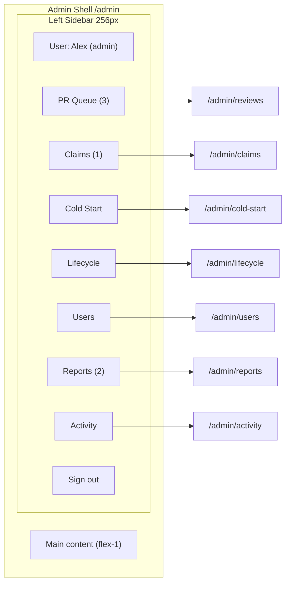
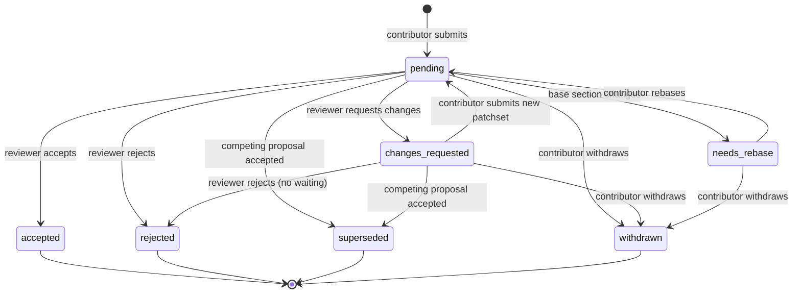

# Feature Requirements Document: FRD 7 -- Admin Dashboard and Moderation (v1.0)

| Field               | Value                                                                                                                                                                                                    |
| ------------------- | -------------------------------------------------------------------------------------------------------------------------------------------------------------------------------------------------------- |
| **Project**         | UW Wiki                                                                                                                                                                                                  |
| **Parent Document** | [PRD v0.1](../PRD.md)                                                                                                                                                                                    |
| **FRD Order**       | [FRD Order](../FRD-order.md)                                                                                                                                                                             |
| **PRD Sections**    | 6.7 (Page Claiming), 6.8 (Cold Start), 7 (Editorial Model), 8 (Platform Editorial Values)                                                                                                                |
| **Type**            | Operator / moderator tooling                                                                                                                                                                             |
| **Depends On**      | FRD 0 (schema, guards), FRD 2 (claim_requests, lifecycle_config), FRD 3 (comment_reports), FRD 4 (edit_proposals), FRD 5 (cold_start_jobs), FRD 6 (AuthModal, requireAdmin, requireReviewer, sign-in redirects) |
| **Delivers**        | Reviewer PR queue with per-section diff cards and three-state decisions (accept / request changes / reject), page claim approval queue, cold-start job history with re-run, lifecycle configuration editor, user role + affiliation management, comment moderation queue, admin activity audit log |
| **Created**         | 2026-04-18                                                                                                                                                                                               |

---

## Summary

FRD 7 is the operator surface for UW Wiki. Six admin surfaces, unified under a single `/admin` shell, turn the editorial board from an abstract concept into a working tool: reviewers can triage and decide on pending edit proposals, admins can approve page claims, re-run failed cold-start jobs, tune lifecycle thresholds per category, manage user roles and conflict-of-interest affiliations, and hide reported comments. Every admin mutation is captured in a tamper-evident audit log accessible from `/admin/activity`, so the editorial board has a paper trail from day one.

This FRD does not introduce any new user-facing features. It surfaces existing data models (`edit_proposals`, `claim_requests`, `cold_start_jobs`, `comment_reports`, `lifecycle_config`, `public.users`, `user_affiliations`) through a cohesive sidebar-based admin UI. Two schema additions are required: an `admin_activity_log` table for the audit trail, and a new `changes_requested` value on `edit_proposals.status` (with supporting `proposal_review_comments` table) to let reviewers ask for changes without rejecting outright. Both additions require small amendments to FRD 4 and FRD 2, documented in Section 12.

The admin dashboard uses a persistent left sidebar, `/admin` redirects to `/admin/reviews`, auth guards switch between `requireReviewer()` and `requireAdmin()` on a per-route basis, and nav badges show live pending counts. Scope is deliberately tight: no per-org lifecycle overrides, no user bans, no email notifications, no comment deletion. All are tracked as deferred items for a future FRD.

---

## Supersession and Overlap Resolution

FRD 7 layers on top of data models that already exist. It does not duplicate or override any of them.

| FRD | What it owns | What FRD 7 adds |
|-----|-------------|-----------------|
| FRD 0 | `public.users.role`, `user_affiliations` table, `lifecycle_config` table, `requireAdmin` / `requireReviewer` guards | Admin UI on top of these tables; guards are used unchanged |
| FRD 2 | `claim_requests` table, `/api/claims/[id]/approve`, `/api/claims/[id]/reject`, `/admin/claims` route (stub) | Admin UI for the claim queue; adds `decision_reason` column for rejection reasons (amendment required) |
| FRD 3 | `comment_reports` table, `/api/admin/reports/[id]/resolve`, `comments.is_hidden` behavior | Admin UI for the moderation queue (hide-only action) |
| FRD 4 | `edit_proposals` table, accept / reject endpoints, mergeability engine, per-section diff logic, COI rule ("affiliated reviewer cannot be accepting reviewer") | Reviewer UI, stacked diff card rendering, COI read-only detail view, new `changes_requested` state + `/api/proposals/[id]/request-changes` endpoint (amendment required) |
| FRD 5 | `cold_start_jobs` table, `/admin/cold-start` entry route, `RecentJobsList` component | Dedicated job history route at `/admin/cold-start/jobs`, re-run action for failed jobs |
| FRD 6 | `AuthModal`, `/auth/sign-in`, `requireAdmin()` redirect-to-sign-in pattern, header user menu | Admin routes consume the guards and redirect behavior unchanged; admin layout is separate from the public header |

What FRD 7 explicitly does NOT include:

1. Per-org lifecycle threshold overrides (category-only for MVP; PRD line 429 is deferred).
2. User bans (`is_banned` column, ban UI, ban enforcement).
3. Hard deletion of comments (hide-only).
4. Email notifications (in-app sidebar badges only).
5. Admin analytics dashboard (contribution trends, popular pages, query patterns). PRD Post-MVP.
6. Reviewer workload reporting (who reviewed how many, average review time).
7. Bulk actions on any queue (no multi-select).
8. A "My Decisions" or "My Reviews" personal view.

---

## Given Context (Pre-conditions from Prior FRDs)

1. **Auth guards** exist at `src/lib/auth/guards.ts`:
   - `requireUser({ returnTo })` -- redirects unauthenticated users to `/auth/sign-in?returnTo=<path>`.
   - `requireReviewer({ returnTo })` -- requires `public.users.role IN ('reviewer','admin')`; non-reviewer authenticated users redirected home with error toast.
   - `requireAdmin({ returnTo })` -- requires `public.users.role = 'admin'`; non-admin authenticated users redirected home with error toast.
2. **Schema**:
   - `public.users (id, email, display_name, avatar_url, role, created_at, ...)` with `role IN ('user','reviewer','admin')`.
   - `user_affiliations (id, user_id, org_id, created_at, UNIQUE(user_id, org_id))` created by FRD 0.
   - `edit_proposals (id, page_id, section_slugs TEXT[], proposed_content_json, rationale, ai_verdict, ai_reason, status, contributor_id, reviewer_id, submitted_at, reviewed_at, reviewer_comment, mergeability_status, ...)` with current `status IN ('pending','needs_rebase','accepted','rejected','superseded','withdrawn')`. See FRD 4 Section 3.
   - `edit_proposal_patchsets` per FRD 4 Section 3.
   - `claim_requests (id, org_id, requester_id, requester_name, requester_email, requester_role, justification, status, reviewed_by, reviewed_at, created_at)` with `status IN ('pending','approved','rejected')`. See FRD 2 Section 12.2.
   - `cold_start_jobs (id, created_by, status, org_metadata, research_data JSONB, draft_content JSONB, current_step, steps_completed, error_message, created_at, updated_at)`. See FRD 5 Section 12.1.
   - `comment_reports (id, comment_id, reporter_id, reason, details, status, resolved_by, resolved_at, created_at)` with `status IN ('pending','resolved','dismissed')`. See FRD 3 Section 14.3.
   - `comments.is_hidden BOOLEAN DEFAULT false` column per FRD 3 Section 12.
   - `lifecycle_config (category, needs_update_months, stale_months, defunct_months, updated_at)` per FRD 0 Section 4.
3. **Existing API routes** referenced but not redefined here:
   - `POST /api/proposals/[id]/accept`, `POST /api/proposals/[id]/reject` -- FRD 4 Section 8.
   - `POST /api/claims/[id]/approve`, `POST /api/claims/[id]/reject` -- FRD 2 Section 13.
   - `POST /api/admin/reports/[id]/resolve` -- FRD 3 Section 13.
   - `POST /api/cold-start` and child routes -- FRD 5 Section 13.
4. **Routing stubs** from prior FRDs:
   - `/admin/reviews` stub referenced by FRD 4 (never fully built).
   - `/admin/claims` stub referenced by FRD 2.
   - `/admin/cold-start` entry built by FRD 5 (FRD 7 adds `/admin/cold-start/jobs`).
   - `/admin/reports` stub referenced by FRD 3.
5. **Header / app shell** from FRD 0 and FRD 6 wraps all non-admin routes. The admin layout at `src/app/admin/layout.tsx` replaces the default public layout.

---

## Terms

| Term | Definition |
|------|------------|
| Admin shell | The `src/app/admin/layout.tsx` wrapper that renders the sidebar, guard-switches per route, and hosts every admin surface |
| Reviewer | A user with `public.users.role = 'reviewer'` or `'admin'`; can view PR queue, accept / reject / request changes on proposals, and see comment reports |
| Admin | A user with `public.users.role = 'admin'`; can do everything a reviewer can plus approve claims, re-run cold-start jobs, edit lifecycle config, manage roles, and view the activity log |
| Changes requested | A new non-terminal `edit_proposals.status` value introduced by this FRD. Reviewer leaves structured feedback, contributor can submit a patchset response. |
| Request Changes | The reviewer action that transitions a proposal from `pending` to `changes_requested` |
| Proposal review comment | A row in the new `proposal_review_comments` table; stores the reviewer's request message plus optional per-section suggestions |
| Conflict of interest (COI) | A reviewer who is affiliated with the target organization via `user_affiliations`; cannot accept or request changes on that proposal but can read the detail |
| Admin activity log | A row in the new `admin_activity_log` table capturing every admin/reviewer mutation (accept, reject, request changes, approve claim, reject claim, re-run job, change role, edit affiliation, edit lifecycle, hide comment) |
| Nav badge | Small pill on a sidebar nav item showing the live pending count (e.g., "PR Queue (3)", "Reports (1)") |
| Quick action | An Accept or Reject button rendered directly on a queue row for low-ambiguity proposals; the full decision surface remains in the detail page |

---

## Executive Summary (Gherkin-Style)

```gherkin
Feature: Admin shell and access control

  Scenario: Unauthenticated user visits /admin
    Given I am not signed in
    When I navigate to /admin/reviews
    Then I am redirected to /auth/sign-in?returnTo=/admin/reviews

  Scenario: Regular user visits /admin
    Given I am signed in with role=user
    When I navigate to /admin/reviews
    Then I am redirected to /
    And an error toast "Admin access required" is shown

  Scenario: Visiting /admin redirects to reviews
    Given I am a reviewer
    When I navigate to /admin
    Then I am redirected to /admin/reviews

Feature: Reviewer PR queue and three-state decisions

  Scenario: Reviewer accepts a mergeable proposal from detail page
    Given I am a reviewer with no affiliation to the target org
    And the proposal is pending with AI verdict pass and mergeability mergeable
    When I open the proposal detail page
    And I click Accept
    Then the proposal transitions to accepted
    And an admin_activity_log row is written
    And competing proposals touching any same section are superseded

  Scenario: Reviewer requests changes on a proposal
    Given I am a reviewer
    When I click Request Changes on a pending proposal
    And I enter a required change request message
    Then the proposal transitions to changes_requested
    And a row is written to proposal_review_comments
    And the contributor sees the request on their proposal detail page

  Scenario: Contributor responds to changes_requested with a new patchset
    Given my proposal has status changes_requested
    When I submit an updated patchset
    Then the proposal transitions back to pending
    And the reviewer queue shows the proposal again

  Scenario: COI proposal renders read-only
    Given I am a reviewer affiliated with the target org
    When I open the proposal detail page
    Then the Accept, Reject, and Request Changes buttons are disabled
    And a tooltip "You are affiliated with this org" is shown

  Scenario: Queue row quick action
    Given I am viewing /admin/reviews with a pending proposal
    When I click the quick Accept button on the row
    Then a confirmation dialog opens with the proposal summary
    And confirming accepts the proposal without opening the detail page

Feature: Claim approval

  Scenario: Admin approves a claim in one click
    Given I am an admin and a pending claim exists
    When I click Approve on the row
    Then organizations.claimed_by and claimed_at are set
    And claim_requests.status becomes approved
    And an admin_activity_log row is written

  Scenario: Admin rejects a claim with reason
    Given I am an admin and a pending claim exists
    When I click Reject
    Then a modal requires a reason
    When I submit a reason
    Then claim_requests.status becomes rejected
    And claim_requests.decision_reason is persisted
    And the requester can see the reason if they view the claim

Feature: Cold-start re-run

  Scenario: Admin re-runs a failed cold-start job
    Given I am viewing /admin/cold-start/jobs and one job has status failed
    When I click Re-run on that job
    Then a new cold_start_jobs row is created with the same inputs
    And the failed job remains in history unchanged

Feature: Lifecycle config editor

  Scenario: Admin edits a category threshold
    Given I am an admin on /admin/lifecycle
    When I change Design Teams needs_update_months from 9 to 12
    And I click Save
    Then lifecycle_config is updated
    And subsequent wiki page renders use the new threshold

Feature: User role and affiliation management

  Scenario: Admin promotes a user to reviewer
    Given I am an admin on /admin/users
    When I search for a user and change their role to reviewer
    Then public.users.role is updated
    And an admin_activity_log row is written

  Scenario: Admin adds an affiliation
    Given I am an admin viewing a user's affiliations drawer
    When I add an org affiliation
    Then a user_affiliations row is inserted
    And the user is now blocked from accepting PRs on that org

Feature: Comment moderation

  Scenario: Reviewer hides a reported comment
    Given I am a reviewer on /admin/reports with a pending report
    When I click Hide on the comment
    Then comments.is_hidden is set to true
    And the report is marked resolved
    And the comment is no longer shown to readers

Feature: Admin activity audit log

  Scenario: Admin views activity log
    Given I am an admin
    When I navigate to /admin/activity
    Then I see a paginated, reverse-chronological feed
    And each entry shows actor, action, target, timestamp, and summary
```

---

## 1. Admin Shell and Navigation

### 1.1 Route Structure

```
/admin                          → server-side redirect to /admin/reviews
/admin/reviews                  → reviewer queue                   [requireReviewer]
/admin/reviews/[proposalId]     → proposal detail                  [requireReviewer]
/admin/claims                   → claim approval queue             [requireAdmin]
/admin/cold-start               → cold-start entry (owned by FRD 5) [requireAdmin]
/admin/cold-start/jobs          → job history and re-run           [requireAdmin]
/admin/lifecycle                → category threshold editor        [requireAdmin]
/admin/users                    → user search, role, affiliations  [requireAdmin]
/admin/reports                  → comment moderation queue         [requireReviewer]
/admin/activity                 → audit log viewer                 [requireAdmin]
```

Guard choice rule: surfaces that affect editorial decisions (reviews, reports) allow `reviewer`. Surfaces that affect operational or platform state (claims, cold-start, lifecycle, users, activity) require `admin`.

### 1.2 Layout Shell

`src/app/admin/layout.tsx` is a server component:

1. Calls the appropriate guard based on the current pathname (via `headers()` or deferred to each page). Per-page guard calls are preferred because the pathname is known in each `page.tsx`.
2. Renders `<AdminSidebar>` on the left and `<main>` on the right.
3. Does NOT render the public header (no search bar, no "Sign In" button).
4. Replaces the default `src/app/layout.tsx` providers only in the layout slot; global providers (Supabase, toast, theme) are still inherited.

Visual spec:

```
┌──────────────────┬───────────────────────────────────────┐
│                  │                                       │
│  UW Wiki Admin   │  /admin/reviews                       │
│                  │                                       │
│  👤 Alex (Admin) │  ┌────────────────────────────────┐   │
│  ────────────    │  │  ... page content ...          │   │
│  📋 PR Queue (3) │  └────────────────────────────────┘   │
│  🏷️  Claims (1)   │                                       │
│  ✨ Cold Start    │                                       │
│  ⏱️  Lifecycle    │                                       │
│  👥 Users         │                                       │
│  ⚠️  Reports (2)  │                                       │
│  📜 Activity      │                                       │
│                  │                                       │
│  ─── [Sign out]  │                                       │
└──────────────────┴───────────────────────────────────────┘
```

The sidebar width is 256px. The main area is flex-1.

### 1.3 AdminSidebar Component

`src/components/admin/AdminSidebar.tsx` (client component for active-route highlighting):

Props:

```ts
type AdminSidebarProps = {
  user: { display_name: string; role: "reviewer" | "admin" };
  badgeCounts: {
    reviews: number;     // count(edit_proposals where status='pending' OR status='changes_requested')
    claims: number;      // count(claim_requests where status='pending')
    reports: number;     // count(comment_reports where status='pending')
  };
};
```

Nav items:

| Icon | Label | Route | Guard | Visible to reviewer? |
|------|-------|-------|-------|---------------------|
| `Inbox` | PR Queue | `/admin/reviews` | reviewer | yes |
| `Award` | Claims | `/admin/claims` | admin | no (hidden) |
| `Sparkles` | Cold Start | `/admin/cold-start` | admin | no (hidden) |
| `Clock` | Lifecycle | `/admin/lifecycle` | admin | no (hidden) |
| `Users` | Users | `/admin/users` | admin | no (hidden) |
| `AlertCircle` | Reports | `/admin/reports` | reviewer | yes |
| `ScrollText` | Activity | `/admin/activity` | admin | no (hidden) |

If the current user is a reviewer (not admin), only `PR Queue` and `Reports` appear. If admin, all seven appear.

Badge styling: small pill next to the label, rendered only when count > 0. Badge count is computed once per page render via `src/lib/admin/badges.ts` and passed as a prop to avoid per-row queries.

### 1.4 Pending Count Helper

`src/lib/admin/badges.ts`:

```ts
export async function getAdminBadgeCounts(userId: string, role: "reviewer" | "admin") {
  const supabase = await createServerClient();

  const [reviews, claims, reports] = await Promise.all([
    supabase
      .from("edit_proposals")
      .select("id", { count: "exact", head: true })
      .in("status", ["pending", "changes_requested"]),
    role === "admin"
      ? supabase
          .from("claim_requests")
          .select("id", { count: "exact", head: true })
          .eq("status", "pending")
      : Promise.resolve({ count: 0 }),
    supabase
      .from("comment_reports")
      .select("id", { count: "exact", head: true })
      .eq("status", "pending"),
  ]);

  return {
    reviews: reviews.count ?? 0,
    claims: claims.count ?? 0,
    reports: reports.count ?? 0,
  };
}
```

Counts are fetched once per admin layout render (not per route change) and cached via React Server Component fetch cache. Badge updates are eventual: if a reviewer accepts a proposal, the next navigation sees the new count.

---

## 2. Reviewer PR Queue and Decision Workflow

### 2.1 Queue View (`/admin/reviews`)

Server component. Guard: `requireReviewer({ returnTo: "/admin/reviews" })`.

Query:

```ts
const { data: proposals } = await supabase
  .from("edit_proposals")
  .select(`
    id,
    status,
    ai_verdict,
    ai_reason,
    section_slugs,
    mergeability_status,
    submitted_at,
    contributor_id,
    pages (
      id,
      title,
      organizations ( id, name, slug, category )
    ),
    users:contributor_id ( display_name, email )
  `)
  .in("status", ["pending", "changes_requested", "needs_rebase"])
  .order(orderBy, { ascending: orderBy === "oldest" });
```

### 2.2 Filters and Sort

URL-backed query params:

| Param | Values | Default |
|-------|--------|---------|
| `status` | `pending`, `changes_requested`, `needs_rebase`, `all_open` | `all_open` |
| `ai` | `pass`, `fail`, `unknown`, `any` | `any` |
| `org` | free-text search against `organizations.name` | (empty) |
| `sort` | `oldest`, `newest` | `oldest` |

Filter UI: horizontal toolbar at the top of the queue. `org` is a debounced text input.

### 2.3 Queue Row Layout

Each row is a card spanning full width of the main area:

```
┌──────────────────────────────────────────────────────────────────┐
│  [AI pass] [mergeable]       Blueprint -- Time Commitment          │
│  Rationale: "Updated hours based on new exec onboarding."          │
│  2 sections · submitted 3d ago · by @anon-user-4f2                 │
│  ──────────────────────────────────────────────────────────────── │
│                          [Open Detail]  [Accept]  [Reject]         │
└──────────────────────────────────────────────────────────────────┘
```

Row content:

1. **Badges** (left): AI verdict (`pass` green / `fail` red / `unknown` grey), mergeability (`mergeable` green / `needs_rebase` amber / `conflict` red).
2. **Title** (org name -- first section heading from `section_slugs[0]`; if multiple sections, append "+N more"). Click the title to open the detail page.
3. **Rationale snippet** (first 120 chars of `edit_proposals.rationale`).
4. **Metadata row**: section count, relative submission time, contributor display (respects anonymity from `edit_proposals.is_anonymous`).
5. **Row actions** (bottom right): `Open Detail`, quick `Accept`, quick `Reject`. Quick actions open a confirmation dialog, not an inline no-confirm click.

### 2.4 Quick Action Dialogs

Quick Accept dialog:

```
┌────────────────────────────────────────┐
│  Accept proposal?                      │
│                                        │
│  Blueprint -- Time Commitment + 1 more │
│  Mergeable · AI pass                   │
│                                        │
│  [Cancel]        [Confirm Accept]      │
└────────────────────────────────────────┘
```

Quick Reject dialog: identical layout, but with a required reason textarea (minimum 10 chars, matching FRD 4 Section 7.2).

Quick `Request Changes` is NOT on the row. That action is intentionally detail-only because it requires a message.

Row quick actions are disabled (greyed with tooltip) when:

- AI verdict is `fail` -- force detail review. Tooltip: "AI flagged this proposal; open detail to review."
- Mergeability is `needs_rebase` or `conflict` -- Accept disabled. Tooltip: "Proposal requires rebase before acceptance."
- Viewer is a COI reviewer for this proposal -- Accept and Reject both disabled. Tooltip: "You are affiliated with this org."

### 2.5 Proposal Detail View (`/admin/reviews/[proposalId]`)

Server component. Guard: `requireReviewer({ returnTo: "/admin/reviews/[proposalId]" })`.

Layout:

```
┌──────────────────────────────────────────────────────────────────┐
│  ← Back to queue                                                  │
│                                                                   │
│  Blueprint -- Time Commitment + Culture and Vibe                  │
│  [AI pass] [mergeable] [pending] · submitted 3d ago by @anon-4f2  │
│                                                                   │
│  ─────────── Rationale ───────────────────────────────            │
│  "Updated hours based on new exec onboarding. Added sub-team-    │
│  specific breakdown."                                             │
│                                                                   │
│  ─────────── AI Pre-screen ───────────────────────────            │
│  ✅ Pass -- "Specific numbers, honest tone, no harm."             │
│                                                                   │
│  ─────────── Section: Time Commitment ────────────────            │
│  [mergeable]                                                      │
│  ┌─────────────────────┬────────────────────────┐                 │
│  │  Original (v3)      │  Proposed              │                 │
│  ├─────────────────────┼────────────────────────┤                 │
│  │  Mechanical: 8-10h  │  Mechanical build      │                 │
│  │  Electrical: 5h     │  season: 10-12h...     │                 │
│  └─────────────────────┴────────────────────────┘                 │
│                                                                   │
│  ─────────── Section: Culture and Vibe ───────────────            │
│  [mergeable]                                                      │
│  ┌─────────────────────┬────────────────────────┐                 │
│  │  Original (v3)      │  Proposed              │                 │
│  ├─────────────────────┼────────────────────────┤                 │
│  │  ...                │  ...                   │                 │
│  └─────────────────────┴────────────────────────┘                 │
│                                                                   │
│  ─────────── Prior Review Comments (if any) ──────                │
│  [reviewer jamie] "Could you add a cite?" (2d ago)                │
│                                                                   │
│  ─────────── Decision ────────────────────────────────            │
│  [Accept]   [Request Changes]   [Reject]                          │
└──────────────────────────────────────────────────────────────────┘
```

Stacked diff cards (Section 2.7) render each section as a full-width card in the order given by `section_slugs`. Each card has its own mergeability pill.

### 2.6 Three Decision Actions

| Action | Required input | Resulting status | Endpoint | Auth |
|--------|---------------|------------------|----------|------|
| Accept | None | `accepted` | `POST /api/proposals/[id]/accept` (existing, FRD 4) | reviewer, non-COI |
| Request Changes | Message ≥ 10 chars | `changes_requested` | `POST /api/proposals/[id]/request-changes` (NEW, FRD 7) | reviewer, non-COI |
| Reject | Message ≥ 10 chars | `rejected` | `POST /api/proposals/[id]/reject` (existing, FRD 4) | reviewer, non-COI |

Decision buttons are always visible on the detail page but disabled with tooltip copy when:

- Viewer is a COI reviewer -- all three disabled.
- Proposal status is terminal (`accepted`, `rejected`, `superseded`, `withdrawn`) -- all three disabled. Detail is read-only.
- Proposal status is `changes_requested` -- Accept and Request Changes both disabled; only Reject remains enabled. Tooltip: "Waiting for contributor patchset. Reject only."
- Mergeability is not `mergeable` -- Accept disabled. Tooltip: "Proposal requires rebase before acceptance." Reject and Request Changes remain enabled.

### 2.7 Stacked Diff Cards (`ProposalDiffCard` component)

`src/components/admin/ProposalDiffCard.tsx`:

Props:

```ts
type ProposalDiffCardProps = {
  sectionSlug: string;
  sectionHeading: string;
  mergeabilityStatus: "unknown" | "mergeable" | "needs_rebase" | "conflict";
  originalContent: ProseMirrorNode;   // rendered read-only via Tiptap
  proposedContent: ProseMirrorNode;   // rendered read-only via Tiptap
};
```

Renders:

1. Card header: `Section: {sectionHeading}` + mergeability pill.
2. Two columns (CSS grid, stacked on mobile): Original (left) and Proposed (right), each a read-only Tiptap renderer.
3. Below the columns: a toggleable "Unified diff view" (text-level additions/removals highlighted). Unified view is collapsed by default; toggle reveals a line-oriented diff using `diff-match-patch` or similar library on the serialized markdown representation of each section. Unified view is a nice-to-have; if implementation time is tight, ship only the side-by-side and defer the unified toggle.

### 2.8 COI Read-Only Mode

FRD 4 currently says affiliated reviewers "cannot be accepting reviewer." FRD 7 tightens this to also prevent rejection and request-changes, because any decision by an affiliated reviewer creates the appearance of bias. The detail page is readable so the affiliated reviewer can stay informed.

Implementation:

```ts
// src/app/admin/reviews/[proposalId]/page.tsx
const isAffiliated = await supabase
  .from("user_affiliations")
  .select("id")
  .eq("user_id", currentUser.id)
  .eq("org_id", proposal.page.organizations.id)
  .maybeSingle();

const canDecide = !isAffiliated.data && currentUser.role !== "user";
```

The `canDecide` boolean is passed to the decision button component. If `false`, all three buttons render with `aria-disabled="true"` and the affiliation tooltip.

### 2.9 Queue Performance

FRD 4 specifies reviewer queue load p95 < 1s. FRD 7 upholds this:

1. Initial queue query is a single `SELECT ... FROM edit_proposals JOIN pages JOIN organizations` with `limit 50`.
2. Per-row queries are avoided -- everything needed for the row card is in the joined query.
3. Pagination: offset-based with 50 per page. FRD 7 does not implement cursor pagination for MVP; 50/page is sufficient at launch scale.

---

## 3. Changes Requested Workflow

This section defines the new non-terminal state and its supporting flow. It requires an amendment to FRD 4 Section 2.3 (state machine) and Section 3 (status enum); see Section 12.

### 3.1 New Status Value

Migration additions to `edit_proposals.status` CHECK constraint:

```sql
-- Drop and recreate the CHECK constraint
ALTER TABLE edit_proposals DROP CONSTRAINT IF EXISTS edit_proposals_status_check;
ALTER TABLE edit_proposals ADD CONSTRAINT edit_proposals_status_check
  CHECK (status IN (
    'pending',
    'changes_requested',
    'needs_rebase',
    'accepted',
    'rejected',
    'superseded',
    'withdrawn'
  ));
```

### 3.2 New Table: `proposal_review_comments`

```sql
CREATE TABLE proposal_review_comments (
  id UUID PRIMARY KEY DEFAULT gen_random_uuid(),
  proposal_id UUID NOT NULL REFERENCES edit_proposals(id) ON DELETE CASCADE,
  reviewer_id UUID NOT NULL REFERENCES users(id),
  message TEXT NOT NULL CHECK (char_length(message) >= 10 AND char_length(message) <= 2000),
  section_suggestions JSONB,
    -- optional array: [{ section_slug: string, suggestion: string }]
  created_at TIMESTAMPTZ NOT NULL DEFAULT now()
);

CREATE INDEX idx_proposal_review_comments_proposal_id
  ON proposal_review_comments (proposal_id);
```

RLS:

```sql
ALTER TABLE proposal_review_comments ENABLE ROW LEVEL SECURITY;

-- Reviewer/admin can insert
CREATE POLICY proposal_review_comments_insert
  ON proposal_review_comments
  FOR INSERT
  TO authenticated
  WITH CHECK (
    EXISTS (
      SELECT 1 FROM public.users u
      WHERE u.id = auth.uid() AND u.role IN ('reviewer','admin')
    )
  );

-- Proposal owner + reviewer/admin can read
CREATE POLICY proposal_review_comments_select
  ON proposal_review_comments
  FOR SELECT
  TO authenticated
  USING (
    EXISTS (
      SELECT 1 FROM public.users u
      WHERE u.id = auth.uid() AND u.role IN ('reviewer','admin')
    )
    OR EXISTS (
      SELECT 1 FROM edit_proposals p
      WHERE p.id = proposal_review_comments.proposal_id
        AND p.contributor_id = auth.uid()
    )
  );
```

### 3.3 `POST /api/proposals/[id]/request-changes`

Route handler at `src/app/api/admin/proposals/[id]/request-changes/route.ts`.

Request body:

```ts
type RequestChangesInput = {
  message: string;                         // 10-2000 chars
  section_suggestions?: Array<{
    section_slug: string;
    suggestion: string;
  }>;
};
```

Response:

```ts
type RequestChangesResult =
  | { ok: true; proposal: { id: string; status: "changes_requested" } }
  | { ok: false; error: string; code: "UNAUTHORIZED" | "COI" | "INVALID_STATE" | "INVALID_INPUT" };
```

Server logic:

1. `requireReviewer()`.
2. Load proposal. If status is not `pending`, return `INVALID_STATE`.
3. Check COI via `user_affiliations`. If affiliated, return `COI`.
4. Validate input with Zod.
5. Insert row into `proposal_review_comments`.
6. Update `edit_proposals.status = 'changes_requested'` and `reviewer_id = currentUser.id` and `reviewed_at = now()`.
7. Write to `admin_activity_log` (action = `request_changes`, target_id = proposal.id).
8. Return success.

### 3.4 Contributor Response Flow

When `edit_proposals.status = 'changes_requested'`:

1. On the contributor's `/my/contributions` page (FRD 8), the status badge is orange "Changes Requested".
2. The proposal detail page at `/wiki/[slug]/proposals/[id]` (owned by FRD 4) displays:
   - The reviewer's message at the top of the page.
   - A `Submit Updated Patchset` button.
3. Submitting an updated patchset (reusing FRD 4's patchset submission flow) transitions status from `changes_requested` back to `pending`.
4. A fresh row in `edit_proposal_patchsets` captures the updated content.
5. AI pre-screen re-runs on the new patchset (per FRD 4 Section 5.3).
6. Mergeability re-computes.
7. The proposal re-enters the reviewer queue at the top (sorted by `submitted_at` of the latest patchset).

This flow is owned by FRD 4 (the amendment in Section 12 describes what changes there). FRD 7 only owns the reviewer-side Request Changes action.

### 3.5 State Machine

```
        submitted
           │
           ▼
        pending ◄──────────┐
           │               │
   ┌───────┼───────┐       │
   ▼       ▼       ▼       │
accepted reject   changes_│
         (term.) requested │
                    │       │
                    │  new patchset
                    └───────┘
```

See Appendix B for the full mermaid diagram.

---

## 4. Page Claim Approval

### 4.1 Queue View (`/admin/claims`)

Server component. Guard: `requireAdmin({ returnTo: "/admin/claims" })`.

Query:

```ts
const { data: claims } = await supabase
  .from("claim_requests")
  .select(`
    id,
    requester_name,
    requester_email,
    requester_role,
    justification,
    status,
    decision_reason,
    created_at,
    reviewed_at,
    organizations ( id, name, slug, category )
  `)
  .eq("status", "pending")
  .order("created_at", { ascending: true });
```

### 4.2 Claim Row Layout

```
┌──────────────────────────────────────────────────────────────────┐
│  Blueprint (Engineering Clubs)                                    │
│  Requester: Alex Chen <alex@uwblueprint.org> -- "Co-President"    │
│  Justification: "I'm the current co-president; I'd like to add    │
│  our official contact info and mission statement."                │
│  Submitted 2d ago                                                 │
│  ──────────────────────────────────────────────────────────────── │
│                                    [Open Page ↗]  [Approve]  [Reject]│
└──────────────────────────────────────────────────────────────────┘
```

Approve is a direct one-click action that opens a lightweight confirmation toast; no modal. Reject opens the `RejectClaimModal`.

### 4.3 RejectClaimModal Component

`src/components/admin/RejectClaimModal.tsx`:

```
┌────────────────────────────────────────┐
│  Reject claim?                          │
│                                         │
│  Blueprint                              │
│  Requester: Alex Chen                   │
│                                         │
│  Reason (shown to requester):           │
│  ┌─────────────────────────────────┐    │
│  │                                 │    │
│  │                                 │    │
│  └─────────────────────────────────┘    │
│                                         │
│  [Cancel]            [Reject claim]     │
└────────────────────────────────────────┘
```

Reason is required (min 20 chars). Stored in the new `claim_requests.decision_reason` column.

### 4.4 Approve and Reject Endpoints

Existing endpoints (FRD 2 Section 13):

- `POST /api/claims/[id]/approve` -- already defined.
- `POST /api/claims/[id]/reject` -- already defined.

FRD 7 wraps both with:

1. `requireAdmin()` guard.
2. `admin_activity_log` insert (action = `approve_claim` or `reject_claim`).

Amendment to `/api/claims/[id]/reject` handler: accept new `decision_reason` field in request body, persist to `claim_requests.decision_reason`. Amendment to FRD 2 is documented in Section 12.

### 4.5 Approve Side Effects

On approve:

1. `claim_requests.status = 'approved'`, `reviewed_by = currentUser.id`, `reviewed_at = now()`.
2. `organizations.claimed_by = claim_requests.requester_id` (or fallback to NULL if requester was not authenticated; in that case an admin manually assigns after email correspondence).
3. `organizations.claimed_at = now()`.
4. `admin_activity_log` row inserted.

### 4.6 Reject Side Effects

1. `claim_requests.status = 'rejected'`, `reviewed_by`, `reviewed_at` set.
2. `claim_requests.decision_reason` = input reason.
3. `admin_activity_log` row inserted.
4. No notification to requester for MVP (in-app badges only); requester sees the rejection if they return to the claim status page (deferred UI).

---

## 5. Cold Start Job History and Re-run

### 5.1 Context

FRD 5 already specifies the `/admin/cold-start` entry route (identification → research → synthesis → publish). The `RecentJobsList` component on that page shows the most recent jobs. FRD 7 adds a dedicated history route `/admin/cold-start/jobs` for deeper inspection and the re-run action.

### 5.2 Route (`/admin/cold-start/jobs`)

Server component. Guard: `requireAdmin({ returnTo: "/admin/cold-start/jobs" })`.

Query:

```ts
const { data: jobs } = await supabase
  .from("cold_start_jobs")
  .select(`
    id, status, current_step, error_message,
    org_metadata, created_at, updated_at,
    users:created_by ( display_name )
  `)
  .order("created_at", { ascending: false })
  .limit(100);
```

### 5.3 Job Row Layout

```
┌──────────────────────────────────────────────────────────────────┐
│  [failed] Blueprint · started 2h ago by Alex                      │
│  Step: synthesis                                                  │
│  Error: "OpenRouter rate limit exceeded"                          │
│  ──────────────────────────────────────────────────────────────── │
│                                    [View details]  [Re-run]       │
└──────────────────────────────────────────────────────────────────┘
```

Status pill colors:

| Status | Color |
|--------|-------|
| `identifying` | blue |
| `research` | blue |
| `synthesis` | blue |
| `draft_ready` | amber (waiting for admin) |
| `published` | green |
| `failed` | red |
| `superseded` | grey (a newer re-run exists) |

### 5.4 Re-run Action

`POST /api/admin/cold-start/jobs/[id]/rerun`:

1. `requireAdmin()`.
2. Load source job. Must be in `failed` status.
3. Create a new `cold_start_jobs` row with:
   - `created_by = currentUser.id`
   - `status = 'identifying'`
   - `org_metadata = source.org_metadata` (copy of input)
   - `research_data = null`, `draft_content = null`, `error_message = null`, `current_step = 'identifying'`
   - Reference to source: `supersedes_job_id UUID` (new nullable column on `cold_start_jobs`; see Section 10).
4. Mark source job as `status = 'superseded'` (if we add this status to FRD 5's enum; alternatively keep source as `failed` and rely on `supersedes_job_id` for the link).
5. Redirect admin to `/admin/cold-start?jobId={newJobId}` to watch progress live.
6. Write `admin_activity_log` row (action = `rerun_cold_start_job`).

Decision for MVP: keep source job as `failed` and do NOT add a new `superseded` status to the cold-start enum. Use the new `supersedes_job_id` column to link re-runs. This avoids amending FRD 5's status enum.

### 5.5 Job Detail Side Panel

Clicking "View details" opens a side panel (not a new route) showing:

1. Full `org_metadata` (input data).
2. Full `research_data` JSONB (Tavily results).
3. Full `draft_content` if present.
4. `error_message` if failed.
5. Timeline of `current_step` transitions (computed from `updated_at` + polled history if available).
6. Link to the published page if `status = 'published'`.

### 5.6 Retention

No automatic cleanup. All jobs persist. FRD 5 deferred TTL to a future FRD; FRD 7 does not add one.

---

## 6. Lifecycle Configuration

### 6.1 Scope

Category-only for MVP. Admins can edit the six category threshold rows in the `lifecycle_config` table. Per-org overrides are deferred.

### 6.2 Route (`/admin/lifecycle`)

Server component. Guard: `requireAdmin({ returnTo: "/admin/lifecycle" })`.

Query:

```ts
const { data: configs } = await supabase
  .from("lifecycle_config")
  .select("category, needs_update_months, stale_months, defunct_months, updated_at")
  .order("category", { ascending: true });
```

### 6.3 Layout

Single-page table editor:

```
┌────────────────────────────────────────────────────────────────────┐
│  Lifecycle Thresholds                                              │
│  Edit the staleness thresholds that drive lifecycle banners and   │
│  The Pulse's Health Status. Changes apply to future page renders.  │
│                                                                   │
│  ┌─────────────────────┬───────────┬────────┬──────────┬────────┐  │
│  │ Category            │ Needs Upd │ Stale  │ Defunct  │        │  │
│  ├─────────────────────┼───────────┼────────┼──────────┼────────┤  │
│  │ Design Teams        │   [ 9 ]   │ [ 15 ] │ [ 24 ]   │ months │  │
│  │ Engineering Clubs   │   [ 6 ]   │ [ 12 ] │ [ 18 ]   │ months │  │
│  │ ...                 │    ...    │   ...  │    ...   │        │  │
│  └─────────────────────┴───────────┴────────┴──────────┴────────┘  │
│                                                                   │
│                                               [Save all changes]   │
└────────────────────────────────────────────────────────────────────┘
```

Form behavior:

1. Numeric inputs only (integer months, 1-120 range).
2. Save button is disabled until at least one cell is modified.
3. Save submits all rows in a single batch `POST /api/admin/lifecycle/config`.
4. On success: toast "Lifecycle thresholds updated." Timestamp beside each row updates.
5. Validation: `needs_update_months < stale_months < defunct_months` per row. If violated, the row highlights red with an error message.

### 6.4 `POST /api/admin/lifecycle/config`

Request body:

```ts
type UpdateLifecycleConfigInput = {
  configs: Array<{
    category: string;
    needs_update_months: number;
    stale_months: number;
    defunct_months: number;
  }>;
};
```

Server logic:

1. `requireAdmin()`.
2. Validate all rows with Zod (integer, range, ordering).
3. Single transaction: `UPSERT` each row (on conflict update).
4. Write one `admin_activity_log` row per changed category (only rows where values differ from current).
5. Return `{ ok: true, updated_at: now() }`.

### 6.5 Flag: Per-Org Overrides

Not implemented. If the product team later wants per-org overrides, the plan is:

1. New table `org_lifecycle_overrides (org_id PK, needs_update_months, stale_months, defunct_months, set_by, set_at)`.
2. FRD 2 page-render logic updated to check the override first and fall back to `lifecycle_config`.
3. New admin UI on this page to add an override (modal with org picker and threshold inputs).

All three changes are out of scope for FRD 7. This is flagged in the header as a deferred item.

---

## 7. User Management

### 7.1 Route (`/admin/users`)

Server component. Guard: `requireAdmin({ returnTo: "/admin/users" })`.

Query (paginated, default page size 50):

```ts
const { data: users } = await supabase
  .from("users")
  .select(`
    id, display_name, email, role, created_at,
    user_affiliations ( id, org_id, organizations ( id, name, slug ) )
  `)
  .order("created_at", { ascending: false })
  .range(offset, offset + 49);
```

### 7.2 Layout

```
┌──────────────────────────────────────────────────────────────────────┐
│  Users                                                                │
│  [ 🔍 Search by email or display name ... ]                           │
│                                                                       │
│  ┌──────────────────────────┬─────────────┬───────────┬──────────┐    │
│  │ Alex Chen                │ alex@...    │ [admin ▾] │ [Orgs 2] │    │
│  │ jamie (anon)             │ jamie@...   │ [user ▾]  │ [Orgs 0] │    │
│  │ ...                                                                │
│  └──────────────────────────┴─────────────┴───────────┴──────────┘    │
│                                                                       │
│  [← Prev]          Page 1 of N          [Next →]                      │
└──────────────────────────────────────────────────────────────────────┘
```

Search: case-insensitive `ILIKE` across `display_name` and `email`. Debounced 300ms. Uses URL query params so state survives reload.

### 7.3 Role Picker

Inline dropdown per row (`user` / `reviewer` / `admin`). Changing the role opens a confirmation dialog:

```
Change Alex Chen's role from user to admin?

[Cancel]                    [Confirm]
```

On confirm:

1. `POST /api/admin/users/[id]/role` with `{ role: "admin" }`.
2. `admin_activity_log` row inserted (action = `change_role`, payload = `{ from, to }`).
3. Table re-renders with new role.

Guards:

1. An admin cannot demote themselves (prevents accidental lockout). UI disables the dropdown on the current user's own row with tooltip "You cannot change your own role."
2. Demoting the last remaining admin is blocked server-side with error "At least one admin is required."

### 7.4 Affiliations Drawer

Clicking the `[Orgs N]` button on a user row opens a right-side drawer:

```
┌────────────────────────────────┐
│  Alex Chen -- Affiliations      │
│  ──────────────────────────── │
│  Current affiliations:         │
│   ✕ Blueprint                  │
│   ✕ Hack the North             │
│                                │
│  Add affiliation:              │
│  [ Search orgs ... ]    [+Add] │
└────────────────────────────────┘
```

Add: `POST /api/admin/users/[id]/affiliations` with `{ org_id }`. Inserts into `user_affiliations` (UNIQUE constraint prevents duplicates).

Remove: `DELETE /api/admin/users/[id]/affiliations/[affiliationId]`.

Every change writes to `admin_activity_log`.

Affiliation purpose: this is the data that drives the COI rule in the reviewer queue. An admin who knows a reviewer has a conflict of interest for an org adds the affiliation here; from that point on, the COI guard in `/admin/reviews/[proposalId]` kicks in.

---

## 8. Comment Moderation

### 8.1 Scope

Hide-only. No delete. No ban.

### 8.2 Route (`/admin/reports`)

Server component. Guard: `requireReviewer({ returnTo: "/admin/reports" })`.

Query:

```ts
const { data: reports } = await supabase
  .from("comment_reports")
  .select(`
    id, reason, details, status, created_at,
    comments (
      id, body_md, anchor_text, section_slug, is_hidden,
      pages ( id, title, organizations ( name, slug ) ),
      users:author_id ( display_name )
    ),
    users:reporter_id ( display_name )
  `)
  .eq("status", "pending")
  .order("created_at", { ascending: true });
```

### 8.3 Report Row Layout

```
┌──────────────────────────────────────────────────────────────────┐
│  [spam]  reported 1h ago by @reporter-4f2                         │
│  On: Blueprint -- Time Commitment                                 │
│  Anchor: "...weekly hours..."                                     │
│  Comment:                                                         │
│   "Make $$$ click here http://..."                                │
│  -- by @anon-author-a81                                           │
│                                                                   │
│  Reporter details: "Looks like a bot link."                       │
│  ──────────────────────────────────────────────────────────────── │
│                                              [Dismiss]  [Hide]    │
└──────────────────────────────────────────────────────────────────┘
```

### 8.4 Hide and Dismiss Actions

**Hide**: `POST /api/admin/comments/[id]/hide`:

1. `requireReviewer()`.
2. `UPDATE comments SET is_hidden = true WHERE id = ?`.
3. `UPDATE comment_reports SET status = 'resolved', resolved_by = currentUser.id, resolved_at = now() WHERE comment_id = ?` (all pending reports for this comment resolved at once).
4. `admin_activity_log` row inserted (action = `hide_comment`, payload = `{ comment_id, report_ids }`).
5. Hidden comments remain in the database for audit; FRD 3 rendering rule hides them from readers.

**Dismiss**: `POST /api/admin/reports/[id]/dismiss`:

1. `requireReviewer()`.
2. `UPDATE comment_reports SET status = 'dismissed', resolved_by = currentUser.id, resolved_at = now() WHERE id = ?`.
3. Comment remains visible.
4. `admin_activity_log` row inserted.

Note: FRD 3 Section 13 describes a `/api/admin/reports/[id]/resolve` endpoint. FRD 7 replaces this with the more explicit `/hide` and `/dismiss` pair because the endpoint action was ambiguous ("resolve" could mean either hide or dismiss). This requires a minor amendment to FRD 3; see Section 12.

### 8.5 Multiple Reports on One Comment

If the same comment has multiple pending reports, they are shown as separate rows in the queue, but acting on any one of them (Hide) resolves all of them in a single update. The other rows disappear from the queue on refresh.

Alternative: group rows by comment. Deferred to a future UX polish pass.

---

## 9. Admin Activity Audit Log

### 9.1 Purpose

Every admin mutation writes a row capturing who did what when. This is the editorial board's paper trail and a requirement for dispute resolution, abuse investigation, and general trust hygiene.

### 9.2 Schema

See Section 10.1. In short: `admin_activity_log (id, actor_user_id, action, target_type, target_id, payload JSONB, created_at)`.

Action values (finite enum enforced in application code, NOT DB, to allow extension without migrations):

| Action | Target type | Written by |
|--------|-------------|------------|
| `accept_proposal` | `edit_proposal` | accept route |
| `reject_proposal` | `edit_proposal` | reject route |
| `request_changes` | `edit_proposal` | request-changes route |
| `approve_claim` | `claim_request` | approve route |
| `reject_claim` | `claim_request` | reject route |
| `rerun_cold_start_job` | `cold_start_job` | rerun route |
| `update_lifecycle_config` | `lifecycle_config` | config route |
| `change_role` | `user` | role route |
| `add_affiliation` | `user` | affiliations route |
| `remove_affiliation` | `user` | affiliations route |
| `hide_comment` | `comment` | hide route |
| `dismiss_report` | `comment_report` | dismiss route |

### 9.3 Write Helper

`src/lib/admin/activity-log.ts`:

```ts
export async function logAdminActivity(params: {
  actorUserId: string;
  action: AdminActivityAction;
  targetType: string;
  targetId: string;
  payload?: Record<string, unknown>;
}): Promise<void> {
  const supabase = await createServiceRoleClient(); // admin client, bypasses RLS
  const { error } = await supabase.from("admin_activity_log").insert({
    actor_user_id: params.actorUserId,
    action: params.action,
    target_type: params.targetType,
    target_id: params.targetId,
    payload: params.payload ?? {},
  });
  if (error) {
    // Log error but do NOT throw -- audit failure should not fail the primary mutation.
    console.error("Failed to write admin_activity_log", error);
  }
}
```

Design choice: log writes never fail the parent action. An audit-log failure is non-fatal. The tradeoff is that a DB outage could drop audit entries; this is acceptable for MVP.

### 9.4 Activity Viewer (`/admin/activity`)

Server component. Guard: `requireAdmin({ returnTo: "/admin/activity" })`.

Query:

```ts
const { data: entries } = await supabase
  .from("admin_activity_log")
  .select(`
    id, action, target_type, target_id, payload, created_at,
    users:actor_user_id ( display_name, role )
  `)
  .order("created_at", { ascending: false })
  .limit(100);
```

Pagination: offset-based, 100 per page.

Filter UI:

| Param | Values |
|-------|--------|
| `action` | any enum value or `all` |
| `actor` | user id or `all` |
| `date_range` | last 24h / 7d / 30d / all |

### 9.5 Row Layout

```
┌──────────────────────────────────────────────────────────────────┐
│  [accept_proposal]   Alex Chen (admin)           2h ago            │
│  Target: edit_proposal abc123                                     │
│  Payload: { mergeability: "mergeable", ai_verdict: "pass" }       │
└──────────────────────────────────────────────────────────────────┘
```

Clicking the target link opens the relevant detail page (for proposals, claims, reports, etc.). For targets that have been deleted since (e.g., a user whose row was removed), the link renders plain text with tooltip "Target no longer exists."

### 9.6 Immutability

The activity log is append-only. No UPDATE or DELETE endpoints are exposed. RLS policy blocks write access outside the service-role insert path. This is a soft guarantee for MVP; hard guarantees (append-only via DB triggers preventing DELETE) are deferred.

---

## 10. Data Model and Migrations

### 10.1 New Table: `admin_activity_log`

```sql
CREATE TABLE admin_activity_log (
  id UUID PRIMARY KEY DEFAULT gen_random_uuid(),
  actor_user_id UUID NOT NULL REFERENCES users(id),
  action TEXT NOT NULL,
  target_type TEXT NOT NULL,
  target_id UUID,
  payload JSONB NOT NULL DEFAULT '{}'::jsonb,
  created_at TIMESTAMPTZ NOT NULL DEFAULT now()
);

CREATE INDEX idx_admin_activity_log_created_at
  ON admin_activity_log (created_at DESC);
CREATE INDEX idx_admin_activity_log_actor
  ON admin_activity_log (actor_user_id, created_at DESC);
CREATE INDEX idx_admin_activity_log_action
  ON admin_activity_log (action, created_at DESC);
CREATE INDEX idx_admin_activity_log_target
  ON admin_activity_log (target_type, target_id);
```

RLS:

```sql
ALTER TABLE admin_activity_log ENABLE ROW LEVEL SECURITY;

CREATE POLICY admin_activity_log_select_admins
  ON admin_activity_log
  FOR SELECT
  TO authenticated
  USING (
    EXISTS (SELECT 1 FROM public.users u WHERE u.id = auth.uid() AND u.role = 'admin')
  );

-- No INSERT policy. Writes happen via service-role key from the activity-log helper.
```

### 10.2 New Table: `proposal_review_comments`

Defined in Section 3.2. Summary:

```sql
CREATE TABLE proposal_review_comments (
  id UUID PRIMARY KEY DEFAULT gen_random_uuid(),
  proposal_id UUID NOT NULL REFERENCES edit_proposals(id) ON DELETE CASCADE,
  reviewer_id UUID NOT NULL REFERENCES users(id),
  message TEXT NOT NULL CHECK (char_length(message) >= 10 AND char_length(message) <= 2000),
  section_suggestions JSONB,
  created_at TIMESTAMPTZ NOT NULL DEFAULT now()
);

CREATE INDEX idx_proposal_review_comments_proposal_id
  ON proposal_review_comments (proposal_id);
```

### 10.3 Edit to `edit_proposals.status` CHECK Constraint

Defined in Section 3.1. Adds `changes_requested` as a valid status value.

### 10.4 Edit to `claim_requests` Table

New column:

```sql
ALTER TABLE claim_requests
  ADD COLUMN decision_reason TEXT;
```

Nullable. Populated only on reject.

### 10.5 Edit to `cold_start_jobs` Table

New column:

```sql
ALTER TABLE cold_start_jobs
  ADD COLUMN supersedes_job_id UUID REFERENCES cold_start_jobs(id);

CREATE INDEX idx_cold_start_jobs_supersedes
  ON cold_start_jobs (supersedes_job_id);
```

Populated when an admin re-runs a failed job.

### 10.6 Migration File

All changes land in a single migration:

```
supabase/migrations/007_admin_dashboard.sql
```

Ordering: create `admin_activity_log`, create `proposal_review_comments`, alter `edit_proposals` status check, alter `claim_requests`, alter `cold_start_jobs`.

---

## 11. API Contracts

### 11.1 Summary Table

| Route | Method | Guard | FRD Ownership | Purpose |
|-------|--------|-------|---------------|---------|
| `/api/proposals/[id]/accept` | POST | reviewer, non-COI | FRD 4 (amend for audit log call) | Accept proposal |
| `/api/proposals/[id]/reject` | POST | reviewer, non-COI | FRD 4 (amend for audit log call) | Reject proposal |
| `/api/proposals/[id]/request-changes` | POST | reviewer, non-COI | FRD 7 (new) | Transition proposal to changes_requested |
| `/api/claims/[id]/approve` | POST | admin | FRD 2 (amend for audit log call) | Approve claim |
| `/api/claims/[id]/reject` | POST | admin | FRD 2 (amend for decision_reason + audit log call) | Reject claim with reason |
| `/api/admin/cold-start/jobs/[id]/rerun` | POST | admin | FRD 7 (new) | Create re-run job from failed source |
| `/api/admin/lifecycle/config` | POST | admin | FRD 7 (new) | Batch update category thresholds |
| `/api/admin/users/[id]/role` | POST | admin | FRD 7 (new) | Change user role |
| `/api/admin/users/[id]/affiliations` | POST | admin | FRD 7 (new) | Add user affiliation |
| `/api/admin/users/[id]/affiliations/[affId]` | DELETE | admin | FRD 7 (new) | Remove user affiliation |
| `/api/admin/comments/[id]/hide` | POST | reviewer | FRD 7 (supersedes FRD 3's `/resolve`) | Hide comment + resolve pending reports |
| `/api/admin/reports/[id]/dismiss` | POST | reviewer | FRD 7 (new) | Dismiss report; comment unchanged |
| `/api/admin/activity` | GET | admin | FRD 7 (new) | Paginated activity log read |

### 11.2 Response Contract

All admin API responses use the `ActionResult<T>` pattern established by FRD 6:

```ts
type ActionResult<T> =
  | { ok: true; data: T }
  | { ok: false; error: string; code: AdminErrorCode };

type AdminErrorCode =
  | "UNAUTHORIZED"     // not signed in
  | "FORBIDDEN"        // signed in but wrong role
  | "COI"              // reviewer affiliation blocks action
  | "INVALID_STATE"    // proposal/claim/report in wrong status for action
  | "INVALID_INPUT"    // Zod validation failed
  | "NOT_FOUND"
  | "DB_ERROR";
```

### 11.3 `POST /api/admin/proposals/[id]/request-changes` Example

```ts
// src/app/api/admin/proposals/[id]/request-changes/route.ts
import { z } from "zod";
import { requireReviewer } from "@/lib/auth/guards";
import { logAdminActivity } from "@/lib/admin/activity-log";

const Input = z.object({
  message: z.string().min(10).max(2000),
  section_suggestions: z
    .array(z.object({ section_slug: z.string(), suggestion: z.string().min(1) }))
    .optional(),
});

export async function POST(
  req: Request,
  { params }: { params: { id: string } }
) {
  const user = await requireReviewer();
  const body = await req.json();
  const parsed = Input.safeParse(body);
  if (!parsed.success) {
    return Response.json({ ok: false, error: "Invalid input", code: "INVALID_INPUT" }, { status: 400 });
  }

  const supabase = await createServerClient();

  const { data: proposal } = await supabase
    .from("edit_proposals")
    .select("id, status, page_id, pages ( organizations ( id ) )")
    .eq("id", params.id)
    .maybeSingle();

  if (!proposal) {
    return Response.json({ ok: false, error: "Not found", code: "NOT_FOUND" }, { status: 404 });
  }
  if (proposal.status !== "pending") {
    return Response.json({ ok: false, error: "Proposal not pending", code: "INVALID_STATE" }, { status: 409 });
  }

  // COI check
  const { data: affiliation } = await supabase
    .from("user_affiliations")
    .select("id")
    .eq("user_id", user.id)
    .eq("org_id", proposal.pages.organizations.id)
    .maybeSingle();
  if (affiliation) {
    return Response.json({ ok: false, error: "Conflict of interest", code: "COI" }, { status: 403 });
  }

  // Persist review comment and update status
  await supabase.from("proposal_review_comments").insert({
    proposal_id: params.id,
    reviewer_id: user.id,
    message: parsed.data.message,
    section_suggestions: parsed.data.section_suggestions ?? null,
  });

  await supabase
    .from("edit_proposals")
    .update({
      status: "changes_requested",
      reviewer_id: user.id,
      reviewed_at: new Date().toISOString(),
    })
    .eq("id", params.id);

  await logAdminActivity({
    actorUserId: user.id,
    action: "request_changes",
    targetType: "edit_proposal",
    targetId: params.id,
    payload: { message_length: parsed.data.message.length },
  });

  return Response.json({ ok: true, data: { id: params.id, status: "changes_requested" } });
}
```

### 11.4 `POST /api/admin/users/[id]/role` Example

```ts
const Input = z.object({
  role: z.enum(["user", "reviewer", "admin"]),
});

export async function POST(req, { params }) {
  const actor = await requireAdmin();
  const parsed = Input.safeParse(await req.json());
  if (!parsed.success) return invalid();

  if (params.id === actor.id) {
    return Response.json(
      { ok: false, error: "Cannot change your own role", code: "FORBIDDEN" },
      { status: 403 }
    );
  }

  // Last-admin guard
  if (parsed.data.role !== "admin") {
    const { count } = await supabase
      .from("users")
      .select("id", { count: "exact", head: true })
      .eq("role", "admin");
    if ((count ?? 0) <= 1) {
      // check target is current admin
      const { data: target } = await supabase
        .from("users")
        .select("role")
        .eq("id", params.id)
        .single();
      if (target?.role === "admin") {
        return Response.json(
          { ok: false, error: "At least one admin required", code: "INVALID_STATE" },
          { status: 409 }
        );
      }
    }
  }

  const { data: before } = await supabase
    .from("users")
    .select("role")
    .eq("id", params.id)
    .single();

  await supabase.from("users").update({ role: parsed.data.role }).eq("id", params.id);

  await logAdminActivity({
    actorUserId: actor.id,
    action: "change_role",
    targetType: "user",
    targetId: params.id,
    payload: { from: before?.role, to: parsed.data.role },
  });

  return Response.json({ ok: true, data: { id: params.id, role: parsed.data.role } });
}
```

---

## 12. Required Amendments to Prior FRDs

The following amendments must be applied before implementation begins. They are small and surgical. FRD 7 does NOT edit those FRDs; the amendments are listed here so a follow-up commit can apply them as a batch.

### 12.1 Amendments to [FRD 4 (PR-Edit System)](./FRD-4-pr-edit-system.md)

**Section 2.3 (State Machine):** Add `changes_requested` as a new non-terminal state. Transitions:

- `pending` → `changes_requested` (reviewer action)
- `changes_requested` → `pending` (contributor submits patchset)
- `changes_requested` → `rejected` (reviewer rejects after waiting)

**Section 3 (Data Model):** Update the `edit_proposals.status` CHECK constraint to include `'changes_requested'`.

**Section 7 (Accept and Reject Pipelines):** Add a new subsection 7.3 "Request Changes Pipeline":

1. Validate reviewer role and non-COI.
2. Require reviewer message ≥ 10 chars.
3. Insert row into `proposal_review_comments`.
4. Update proposal status to `changes_requested`, set `reviewer_id` and `reviewed_at`.
5. Return success.

Also update Section 6.3 COI language from "cannot be accepting reviewer" to "cannot perform any decision action (accept, reject, request changes) on affiliated org proposals; detail view is read-only."

**Section 8 (API Contracts):** Add row for `POST /api/proposals/[id]/request-changes` with the contract in FRD 7 Section 11.3.

**Section 11 (Exit Criteria):** Add:

- Contributor sees reviewer message on proposal detail when status is `changes_requested`.
- Submitting an updated patchset transitions status back to `pending`.

### 12.2 Amendments to [FRD 2 (Wiki Pages)](./FRD-2-wiki-pages.md)

**Section 12.2 (New Tables):** Add column to `claim_requests`:

```sql
ALTER TABLE claim_requests
  ADD COLUMN decision_reason TEXT;
```

**Section 13 (API Routes):** Update `POST /api/claims/[id]/reject` contract to accept `{ decision_reason: string }` in the body (required, min 20 chars).

### 12.3 Amendments to [FRD 3 (Comments System)](./FRD-3-comments-system.md)

**Section 13 (API Contracts):** Replace `POST /api/admin/reports/[id]/resolve` with the two explicit endpoints:

- `POST /api/admin/comments/[id]/hide` -- sets `comments.is_hidden = true` and resolves all pending reports for the comment.
- `POST /api/admin/reports/[id]/dismiss` -- marks a single report as `dismissed` without hiding the comment.

**Section 13 (Admin Reports Route):** Rename `/admin/reports` from FRD 3 is consistent with FRD 7 Section 8; no route changes.

### 12.4 Amendments to [FRD 5 (Cold Start Agent)](./FRD-5-cold-start-agent.md)

**Section 12.1 (cold_start_jobs Table):** Add nullable column `supersedes_job_id UUID REFERENCES cold_start_jobs(id)` and index.

**Section 13 (API Contracts):** Add `POST /api/admin/cold-start/jobs/[id]/rerun` with the contract in FRD 7 Section 5.4.

---

## 13. Security, Non-Functional Requirements, Accessibility

### 13.1 Security

1. Every admin route calls the appropriate guard (`requireReviewer` or `requireAdmin`). Guards are server-side; client-side role gating is UX only.
2. Every admin mutation is behind a POST or DELETE (not GET) to prevent CSRF via link-following.
3. Every admin mutation is authenticated and writes to `admin_activity_log`.
4. `admin_activity_log` has no UPDATE/DELETE API; rows are immutable from the application layer.
5. The Supabase service-role key is used only in `logAdminActivity` and is never exposed to the client.
6. RLS policies on `admin_activity_log` allow SELECT only to admins. Reviewers cannot see the audit log.
7. RLS policies on `proposal_review_comments` allow reviewers + the proposal owner to read.
8. All admin API responses avoid leaking data outside the current user's authorized scope (e.g., a reviewer hitting the affiliations endpoint for another user receives 403, not 404 with details).
9. No PII beyond what's already in the schema is stored in `admin_activity_log.payload`. Reviewer messages are content, not PII, and are stored separately in `proposal_review_comments.message`.

### 13.2 Non-Functional Requirements

| Surface | Target |
|---------|--------|
| Reviewer queue load | p95 < 1 second (inherited from FRD 4) |
| Proposal detail load | p95 < 1.5 seconds (accounts for ProseMirror render of both original and proposed content) |
| Admin activity log pagination | p95 < 500ms per 100-row page |
| All other admin queries | p95 < 1 second |
| Badge count computation | p95 < 300ms (three count queries in parallel) |

Caching:

- Badge counts are computed once per layout render (not cached across requests) to keep pending counts fresh.
- Admin activity log pages are not cached.
- Lifecycle config page caches category list for 60 seconds server-side (rare change).

### 13.3 Accessibility (WCAG 2.1 AA)

1. All buttons (Accept, Reject, Request Changes, Approve, Re-run, Hide, Dismiss) have visible focus indicators and descriptive `aria-label`s.
2. All dialogs (quick accept, reject claim, role change confirm) trap focus and restore focus to the trigger on close.
3. All tables have semantic `<table>` markup with `<th scope>` headers.
4. All form inputs have associated `<label>` elements.
5. All color-coded badges (AI pass/fail, mergeability, role) include a text label, not just color.
6. The sidebar is keyboard-navigable; active route is announced via `aria-current="page"`.
7. All error states include a text error message; icons alone are not sufficient.

---

## 14. Exit Criteria

All of the following must be true before FRD 7 is considered complete:

| # | Criterion | Verification |
|---|-----------|--------------|
| 1 | `/admin` redirects to `/admin/reviews` | Navigate; URL changes |
| 2 | Unauthenticated user hitting any `/admin/*` route redirects to `/auth/sign-in?returnTo=...` | Sign out; visit `/admin/reviews`; verify redirect |
| 3 | Non-reviewer/admin user hitting `/admin/*` redirects home with error toast | Sign in as `user`; visit `/admin/reviews`; verify redirect |
| 4 | Reviewer sees only PR Queue and Reports in sidebar | Sign in as reviewer; check nav |
| 5 | Admin sees all seven nav items | Sign in as admin; check nav |
| 6 | Nav badges show live pending counts on first load | Seed DB with 3 pending proposals; verify "PR Queue (3)" |
| 7 | Queue renders with standard filters (status, AI, org search, sort) | Verify filters change URL and re-fetch |
| 8 | Quick Accept on a mergeable, AI-pass row opens a confirm dialog and accepts on confirm | Click quick accept; verify status transition |
| 9 | Quick Accept is disabled when AI verdict is fail | Verify tooltip + disabled state |
| 10 | Proposal detail shows stacked per-section diff cards in `section_slugs` order | Verify visual |
| 11 | Request Changes button requires a message ≥ 10 chars | Submit with 5 chars; verify validation error |
| 12 | Request Changes transitions status to `changes_requested` and writes `proposal_review_comments` row | Verify DB state |
| 13 | COI reviewer sees all three decision buttons disabled with tooltip | Add affiliation, open detail; verify |
| 14 | Terminal proposals (accepted/rejected/superseded/withdrawn) render read-only detail | Verify visual |
| 15 | Claims queue lists pending claims with requester info and justification | Seed claim; verify |
| 16 | Approve Claim is a one-click action that updates organizations.claimed_by | Click; verify DB |
| 17 | Reject Claim opens a modal requiring ≥ 20 char reason | Verify validation |
| 18 | Reject Claim persists `claim_requests.decision_reason` | Verify DB |
| 19 | Cold-start job history at `/admin/cold-start/jobs` shows all jobs ordered by newest | Navigate; verify |
| 20 | Re-run action on a failed job creates a new job with `supersedes_job_id` set | Click re-run; verify DB |
| 21 | Re-run is disabled on non-failed jobs | Verify tooltip |
| 22 | Lifecycle config editor loads current six category rows | Navigate; verify |
| 23 | Saving lifecycle config validates per-row ordering `needs_update < stale < defunct` | Submit invalid; verify error |
| 24 | Lifecycle config save writes one admin_activity_log row per changed category | Change 2; verify 2 log rows |
| 25 | Users page supports search by email and display_name with debounce | Type; verify filtered list |
| 26 | Role change requires confirmation and writes audit log | Change role; verify |
| 27 | Admin cannot change own role (UI disabled) | Verify tooltip on self row |
| 28 | Last-admin guard blocks demoting the only admin | Attempt; verify server error |
| 29 | Affiliations drawer adds and removes affiliations | Add + remove; verify DB |
| 30 | Hiding a comment sets `comments.is_hidden = true` and resolves all pending reports for that comment | Verify DB |
| 31 | Dismissing a report sets status to `dismissed` without touching the comment | Verify DB |
| 32 | Hidden comments are not rendered to readers | View wiki page; verify |
| 33 | `/admin/activity` is admin-only and paginated | Verify access + pagination |
| 34 | Every admin mutation writes a row to `admin_activity_log` | Trigger each action; verify log |
| 35 | Audit log write failure does NOT fail the parent mutation | Force insert failure; verify parent succeeded |
| 36 | All admin pages meet WCAG 2.1 AA (focus, ARIA, contrast) | Run axe-core check; fix violations |

---

## Appendix A: Admin Sidebar Wireframe



---

## Appendix B: Proposal Decision State Machine (with `changes_requested`)



`changes_requested` is non-terminal. It exists to give the reviewer a way to keep a proposal alive while asking for improvements, rather than rejecting and forcing the contributor to resubmit from scratch.

---

## Appendix C: Design Decisions Log

| # | Decision | Rationale |
|---|----------|-----------|
| 1 | Persistent left sidebar over top tabs | Admin workflows are deep and specialized; sidebar scales better as surfaces are added (e.g., future per-org overrides, analytics). |
| 2 | `/admin` redirects to `/admin/reviews` rather than showing a summary dashboard | The PR queue is the highest-value, most-used surface. Skipping an extra click matters when reviewers work through dozens of PRs. Summary counts live on the sidebar badges, not a dedicated home. |
| 3 | Full audit log shipped in FRD 7, not deferred | Editorial trust and dispute resolution require a paper trail from day one. Implementing it after the fact leaves early actions untraceable. |
| 4 | In-app sidebar badges only; no email notifications | Reviewers log in daily; email adds complexity (SMTP, unsubscribe, digest cadence) without clear value at launch scale. Can be added later. |
| 5 | Stacked inline diff cards per section (not tabbed, not accordion) | Multi-section proposals are the primary motivation for FRD 4's multi-section flow. Stacked cards let reviewers see all changes in one scroll. Tabs or accordions hide context and add clicks. |
| 6 | Accept/Reject both at row-level and detail, Request Changes at detail only | Low-ambiguity cases (AI pass + mergeable + small diff) benefit from quick actions. Request Changes requires a message, so it can't fit on a row. |
| 7 | Quick actions require a confirmation dialog | One-click accept/reject risks sloppy decisions. A lightweight confirm dialog is near-zero friction but adds a safety interlock. |
| 8 | Added `changes_requested` state (ripples to FRD 4) | Previously reviewers had only a binary accept/reject. Forcing rejection for a minor issue creates friction and discourages contribution. Request Changes preserves the proposal, gives structured feedback, and re-enters the queue on response. |
| 9 | COI reviewer sees detail read-only, not hidden | Affiliated reviewers still need awareness of what's happening in their org's queue. Hiding creates information asymmetry; read-only preserves visibility without enabling action. |
| 10 | Standard filter set (status, AI, org search, sort); no date/mergeability filters | Reviewers mostly sort by age and filter by AI verdict or status. Adding every filter we can think of clutters the UI. Additional filters can be added on demand. |
| 11 | Reject claim requires ≥ 20 char reason; Approve claim is one-click | Reject reasons are shown to the requester; a vague reason is worse than no reason. Approvals have no message to display. |
| 12 | Cold-start re-run keeps source job as `failed` and links via `supersedes_job_id` | Avoids amending FRD 5's status enum. Source job remains findable in history and audit log. |
| 13 | Lifecycle per-org overrides deferred | PRD mentions it as a "can" not a "must." MVP ships with category-level editing only. Schema migration deferred to avoid committing to a design before it's needed. |
| 14 | User management includes affiliations but not bans | Affiliations are required to make the COI rule work end-to-end. Bans are a separate moderation escalation that's not needed at launch scale; no pre-launch use case demands them. |
| 15 | Moderation is hide-only | FRD 3 Section 14 established post-hoc moderation with reporting. Hide preserves audit trail (data remains in DB). Delete is irreversible and unnecessary for MVP. Ban is a separate abuse vector; deferred. |
| 16 | Audit log write failure does not fail the parent mutation | Primary action succeeds > primary action fails because logging failed. Accept the small risk of a missing log row in exchange for mutation reliability. |
| 17 | Admin cannot demote self; last-admin guard | Two simple safety interlocks to prevent accidental total lockout. Cheap to implement, high cost to recover from without them. |
| 18 | `proposal_review_comments` as a separate table, not a JSONB column on edit_proposals | Review comments may have per-section suggestions (structured), multiple over time (if we extend to back-and-forth), and need indexing by reviewer. A table is the right primitive. |
