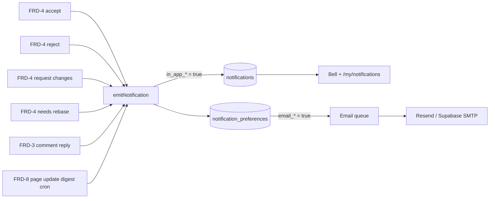

# Feature Requirements Document: FRD 9 -- Notifications (v1.0)

| Field               | Value                                                                                                                                 |
| ------------------- | ------------------------------------------------------------------------------------------------------------------------------------- |
| **Project**         | UW Wiki                                                                                                                               |
| **Parent Document** | [PRD v0.1](../PRD.md)                                                                                                                 |
| **FRD Order**       | [FRD Order](../FRD-order.md)                                                                                                          |
| **PRD Sections**    | §13 (Notifications — moved from Post-MVP)                                                                                             |
| **Type**            | Cross-cutting infrastructure + user-facing feature                                                                                    |
| **Depends On**      | FRD 0 (notifications table baseline), FRD 3 (comment reply), FRD 4 (PR decision pipelines), FRD 6 (auth, user profile), FRD 8 (bookmarks) |
| **Delivers**        | In-app notification bell, `/my/notifications` page, email delivery via Resend/Supabase SMTP, `notification_preferences` schema, per-channel opt-out |
| **Created**         | 2026-05-05                                                                                                                            |

---

## Summary

FRD 9 delivers the full notifications system for UW Wiki. Notifications are generated by three triggering sources: the PR decision pipeline (FRD 4), comment replies (FRD 3), and a scheduled digest for bookmarked page updates (FRD 8). Each notification can be delivered in-app (bell icon + `/my/notifications` page) and optionally via email (Resend or Supabase SMTP). Users control delivery via per-channel preferences. Anonymous PR contributors (with `contributor_id = NULL`) receive no notifications — no recipient identity exists to deliver to.

---

## Supersession and Overlap Resolution

| FRD | What it owns | What FRD 9 adds |
|-----|-------------|-----------------|
| FRD 0 | `notifications` table (baseline columns: `id`, `user_id`, `created_at`) | Adds `type`, `payload`, `read_at`, `delivered_email` columns; adds `notification_preferences` table |
| FRD 3 | Comment reply logic, comment submission | Emits `comment.reply` notification event; drops the prior "no notifications for MVP" note |
| FRD 4 | PR accept/reject/request-changes/mark-needs-rebase pipelines | Emits `pr.*` notification events from each pipeline's post-commit jobs |
| FRD 8 | Bookmark creation and page associations | Informs the scheduled page-update digest; FRD 9 owns the digest job and delivery |

---

## Given Context (Pre-conditions)

1. `notifications` table exists in FRD 0 with baseline schema `(id UUID, user_id UUID, created_at TIMESTAMPTZ)`.
2. `users` table has `email TEXT` and `display_name TEXT`.
3. FRD 4 pipelines (accept, reject, request-changes, needs-rebase) are implemented. FRD 9 adds notification emission as a post-commit async job.
4. FRD 3 comment reply flow is implemented. FRD 9 adds notification emission after a reply is inserted.
5. FRD 8 `bookmarks (user_id, page_id, created_at)` table exists.

---

## Terms

| Term | Definition |
|------|------------|
| In-app notification | A row in the `notifications` table surfaced in the bell icon dropdown and `/my/notifications` page |
| Email notification | An email sent for a given notification event if the user's `email_*` preference is true |
| Notification type | A string enum identifying the triggering event (e.g., `pr.accepted`, `comment.reply`) |
| Digest | A batched email covering multiple page-update events for bookmarked pages, sent at the user's configured frequency |
| Unread count | Count of `notifications` rows with `read_at IS NULL` for the current user |
| Anonymous skip | Anonymous PR contributors (`contributor_id = NULL`) have no user account and receive no notifications |

---

## Executive Summary (Gherkin-Style)

```gherkin
Feature: PR status notifications

  Scenario: Contributor receives accepted notification
    Given I submitted a PR and it is accepted by a reviewer
    When the accept pipeline completes
    Then a notifications row with type pr.accepted is created for me
    And the bell icon shows an unread count badge
    And if my email_pr_status preference is true, an email is sent

  Scenario: Anonymous contributor receives no notification
    Given I submitted an anonymous PR (contributor_id is NULL)
    When the accept pipeline completes
    Then no notification row is created

Feature: Comment reply notifications

  Scenario: Author receives reply notification
    Given I posted a comment with my account (not anonymous)
    When another user replies to my comment thread
    Then a notifications row with type comment.reply is created for me

  Scenario: Anonymous comment receives no reply notification
    Given a comment was posted anonymously (author_id is NULL)
    When another user replies to that comment thread
    Then no notification is created (no recipient identity)

Feature: Page update digest

  Scenario: User receives weekly digest for bookmarked pages
    Given I have bookmarked two pages
    And both pages were edited in the past 7 days
    And my page_update_digest_frequency is weekly
    When the weekly digest job runs
    Then I receive one email listing both updated pages

Feature: Notification preferences

  Scenario: User disables email for PR status
    Given I set email_pr_status = false
    When my PR is accepted
    Then a notification row is created (in-app)
    But no email is sent

  Scenario: User marks all notifications read
    Given I have 5 unread notifications
    When I click "Mark all read"
    Then all 5 notifications have read_at set to now()
    And the bell badge shows 0
```

---

## 1. Notification Types

| Type | Trigger | Recipient | Payload fields |
|------|---------|-----------|----------------|
| `pr.accepted` | Proposal accepted (FRD-4 §6.1) | `edit_proposals.contributor_id` | `proposal_id`, `page_slug`, `org_name` |
| `pr.rejected` | Proposal rejected (FRD-4 §6.2) | `edit_proposals.contributor_id` | `proposal_id`, `page_slug`, `org_name`, `reviewer_comment` |
| `pr.changes_requested` | Reviewer requests changes (FRD-4 §6.3) | `edit_proposals.contributor_id` | `proposal_id`, `page_slug`, `org_name`, `reviewer_message` |
| `pr.needs_rebase` | Proposal marked needs_rebase (FRD-4 §6.1 step 10) | `edit_proposals.contributor_id` | `proposal_id`, `page_slug`, `org_name` |
| `comment.reply` | A reply is posted in a comment thread (FRD-3) | Parent comment's `author_id` | `comment_id`, `reply_id`, `page_slug`, `section_slug`, `org_name` |
| `page.updated` | Digest: bookmarked page had PR accepted (FRD-8 + FRD-4) | Bookmarking user | `page_id`, `page_slug`, `org_name`, `updated_at` (digest, not per-edit) |

**Anonymous skip rule**: for all types above, if the recipient user ID is `NULL`, no notification is created. This applies to anonymous PR contributors and anonymous comment authors.

---

## 2. Schema

### 2.1 Extend Existing `notifications` Table

```sql
-- Extending the FRD-0 baseline (id, user_id, created_at already exist)
ALTER TABLE notifications ADD COLUMN type TEXT NOT NULL;
ALTER TABLE notifications ADD COLUMN payload JSONB NOT NULL;
ALTER TABLE notifications ADD COLUMN read_at TIMESTAMPTZ;
ALTER TABLE notifications ADD COLUMN delivered_email BOOLEAN NOT NULL DEFAULT false;

CREATE INDEX idx_notifications_user_id ON notifications (user_id);
CREATE INDEX idx_notifications_user_unread ON notifications (user_id, read_at)
  WHERE read_at IS NULL;
```

### 2.2 `notification_preferences` Table

```sql
CREATE TABLE notification_preferences (
  user_id UUID PRIMARY KEY REFERENCES users(id) ON DELETE CASCADE,
  in_app_pr_status BOOLEAN NOT NULL DEFAULT true,
  in_app_comment_reply BOOLEAN NOT NULL DEFAULT true,
  in_app_page_update BOOLEAN NOT NULL DEFAULT true,
  email_pr_status BOOLEAN NOT NULL DEFAULT true,
  email_comment_reply BOOLEAN NOT NULL DEFAULT false,
  email_page_update BOOLEAN NOT NULL DEFAULT false,
  page_update_digest_frequency TEXT NOT NULL DEFAULT 'weekly'
    CHECK (page_update_digest_frequency IN ('daily', 'weekly', 'never')),
  updated_at TIMESTAMPTZ NOT NULL DEFAULT now()
);
```

Rows are created lazily on first access (default values serve as defaults until the user customizes). On sign-up, no row is inserted; the GET preference endpoint creates a row with defaults if one doesn't exist (`UPSERT ON CONFLICT DO NOTHING`).

---

## 3. Triggering Points

### 3.1 PR Decision Events (FRD-4 Integration)

After each PR pipeline completes (see FRD-4 §6.1–§6.3), a notification event is emitted as an async post-commit job:

```typescript
// src/lib/notifications/emit.ts
export async function emitNotification(params: {
  userId: string | null; // null = anonymous skip
  type: NotificationType;
  payload: Record<string, unknown>;
}): Promise<void> {
  if (!params.userId) return; // anonymous skip
  const prefs = await getOrCreatePreferences(params.userId);
  const shouldSendInApp = prefs[`in_app_${prefKey(params.type)}`];
  if (shouldSendInApp) {
    await supabase.from("notifications").insert({
      user_id: params.userId,
      type: params.type,
      payload: params.payload,
    });
  }
  const shouldSendEmail = prefs[`email_${prefKey(params.type)}`];
  if (shouldSendEmail) {
    await enqueueEmail({ userId: params.userId, type: params.type, payload: params.payload });
  }
}
```

Post-commit jobs per pipeline:
- **Accept** (§6.1): `emitNotification({ userId: proposal.contributor_id, type: 'pr.accepted', payload: { proposal_id, page_slug, org_name } })`
- **Reject** (§6.2): `emitNotification({ ..., type: 'pr.rejected', payload: { ..., reviewer_comment } })`
- **Request Changes** (§6.3): `emitNotification({ ..., type: 'pr.changes_requested', payload: { ..., reviewer_message } })`
- **Mark Needs Rebase** (§6.1 step 10): `emitNotification({ ..., type: 'pr.needs_rebase', payload: { ... } })`

### 3.2 Comment Reply Events (FRD-3 Integration)

When a reply is posted to an existing comment thread, after inserting the reply row:

```typescript
const parentComment = await getComment(parentCommentId);
if (parentComment.author_id) { // skip anonymous parent
  await emitNotification({
    userId: parentComment.author_id,
    type: 'comment.reply',
    payload: { comment_id: parentComment.id, reply_id: newComment.id, page_slug, section_slug, org_name },
  });
}
```

### 3.3 Page Update Digest (FRD-8 Integration)

A scheduled job (Vercel Cron, runs daily at 06:00 UTC) collects page-update events and batches them into digests:

```
For each user with bookmarks:
  Collect all pages bookmarked by this user that had a PR accepted since the user's last digest delivery.
  If count > 0 and the user's digest frequency is 'daily' (or 'weekly' and it's Sunday):
    Send digest email.
    Optionally: create a single summary notification row (type = page.updated) in the notifications table.
```

No per-edit in-app notification for bookmarked pages — digest-only to avoid notification fatigue.

---

## 4. In-App Notification UI

### 4.1 Bell Icon

Located in the app header (right side). Shows an unread count badge when `unread_count > 0`:

```
┌────────────────────────────────────────────────────┐
│   UW Wiki              🔔 3   Alex ▾               │
└────────────────────────────────────────────────────┘
```

Unread count is fetched on page load via `GET /api/notifications/unread-count`.

### 4.2 Bell Dropdown

Clicking the bell icon opens a dropdown showing the 5 most recent notifications:

```
┌────────────────────────────────────────────────┐
│  Notifications                    [Mark all read] │
│  ─────────────────────────────────────────────── │
│  ✅  Your proposal for Blueprint was accepted.   │
│      2h ago                                      │
│  ─────────────────────────────────────────────── │
│  💬  Someone replied to your comment on Midnight  │
│      Sun's "Culture and Vibe" section.           │
│      5h ago                                      │
│  ─────────────────────────────────────────────── │
│  [View all notifications →]                      │
└────────────────────────────────────────────────┘
```

Clicking a notification navigates to the relevant resource (PR detail page, comment anchor, etc.) and marks it as read.

### 4.3 `/my/notifications` Page

Full paginated history (50 per page). Auth required (`requireUser`). 

Layout:
- Tabs: "All" / "Unread"
- Each row: icon + short message + timestamp + "Mark read" button
- "Mark all read" button at the top

### 4.4 Mark as Read

- **Individual**: `POST /api/notifications/[id]/mark-read` sets `read_at = now()`.
- **All**: `POST /api/notifications/mark-all-read` sets `read_at = now()` for all unread notifications for the current user.

---

## 5. Email Delivery

### 5.1 Transport

Email is sent via Resend (preferred) or Supabase SMTP as a fallback. Both are configured via environment variables:

```
RESEND_API_KEY=...
EMAIL_FROM=notifications@uw-wiki.ca
```

### 5.2 Email Templates

Templates are minimal, plain-text-compatible HTML. Each type has a dedicated template:

| Type | Subject | Body summary |
|------|---------|-------------|
| `pr.accepted` | "Your edit proposal was accepted" | "Your proposal for [Org Name] has been accepted. View the updated page: [link]" |
| `pr.rejected` | "Your edit proposal was rejected" | "Your proposal for [Org Name] was rejected. Reviewer note: [comment]. You can submit a new proposal." |
| `pr.changes_requested` | "A reviewer has requested changes to your proposal" | "Your proposal for [Org Name] needs revision. Reviewer: [message]. Log in to submit a revised patchset." |
| `pr.needs_rebase` | "Your proposal needs rebasing" | "Another accepted edit means your proposal for [Org Name] needs to be rebased. Log in to submit a new version." |
| `comment.reply` | "Someone replied to your comment" | "A reply was posted in the comment thread you're part of on [Org Name]. [Link to comment]" |
| `page.updated` (digest) | "Pages you follow have been updated" | Bulleted list of pages with update dates. |

### 5.3 Delivery Tracking

`notifications.delivered_email` is set to `true` after a successful email send (or email enqueue in the queue). Used to avoid duplicate sends on retry.

---

## 6. API Routes

| Route | Method | Auth | Description |
|-------|--------|------|-------------|
| `GET /api/notifications` | GET | Required | Paginated notification list (default: 50, unread first) |
| `GET /api/notifications/unread-count` | GET | Required | Returns `{ count: number }` for the bell badge |
| `POST /api/notifications/[id]/mark-read` | POST | Required | Sets `read_at = now()` on the notification |
| `POST /api/notifications/mark-all-read` | POST | Required | Sets `read_at = now()` on all unread notifications for the user |
| `GET /api/me/notification-preferences` | GET | Required | Returns or creates (with defaults) the `notification_preferences` row |
| `PUT /api/me/notification-preferences` | PUT | Required | Updates preference columns; partial update (only provided fields are changed) |

All routes enforce `requireUser()`. Anonymous users have no notifications to view.

---

## 7. Notification Preferences UI

Located at `/my/profile` (FRD-6 user profile page) under a "Notifications" tab:

```
┌─────────────────────────────────────────────────────────────┐
│  Notifications                                               │
│                                                             │
│  PR Status Updates                                          │
│    In-app  [●──] On      Email  [●──] On                    │
│                                                             │
│  Comment Replies                                            │
│    In-app  [●──] On      Email  [───] Off                   │
│                                                             │
│  Page Updates (for bookmarked pages)                        │
│    In-app  [●──] On      Email  [───] Off                   │
│    Email digest frequency: [Weekly ▾]                       │
│                                                             │
│  [Save Preferences]                                         │
└─────────────────────────────────────────────────────────────┘
```

Preferences are saved via `PUT /api/me/notification-preferences`. Debounced 500ms on toggle change (auto-save on change).

---

## 8. Exit Criteria

| # | Criterion | How to verify |
|---|-----------|---------------|
| 1 | Bell icon shows correct unread count on page load | Accept a PR for a contributor; verify count appears |
| 2 | Bell dropdown shows the 5 most recent notifications in reverse-chronological order | Create 6+ notifications; verify only 5 show |
| 3 | Clicking a notification navigates to the correct resource | Click each notification type; verify deep link |
| 4 | Clicking a notification marks it as read | Verify `read_at` is set and badge decrements |
| 5 | "Mark all read" clears the badge | Click; verify count = 0 and all rows have `read_at` |
| 6 | `/my/notifications` shows full paginated history | Create 51+ notifications; verify pagination |
| 7 | `pr.accepted` notification is created when a PR is accepted | Accept PR; query `notifications` table |
| 8 | `pr.rejected` notification is created with reviewer comment | Reject PR with message; verify payload |
| 9 | `pr.changes_requested` notification is created | Request changes; verify notification |
| 10 | `pr.needs_rebase` notification is created when competing PR is accepted | Accept overlapping PR; verify other PR owner's notification |
| 11 | `comment.reply` notification is created for signed-in comment author | Reply to signed-in user's comment; verify |
| 12 | Anonymous comment author receives no reply notification | Reply to anonymous comment; verify no row created |
| 13 | Anonymous PR contributor receives no PR notification | Accept anonymous PR; verify no row created |
| 14 | Email is sent when `email_pr_status = true` | Accept PR; verify email delivery |
| 15 | Email is NOT sent when `email_pr_status = false` | Disable preference; accept PR; verify no email |
| 16 | Page update digest is sent for bookmarked pages with `page_update_digest_frequency = 'weekly'` | Advance time; accept PR on bookmarked page; run digest cron; verify email |
| 17 | Preference toggle saves and persists across sessions | Toggle; reload; verify toggle state matches |
| 18 | `notification_preferences` row is created with defaults on first GET | Call GET for new user; verify row created |

---

## Appendix A: Notification Flow Diagram


