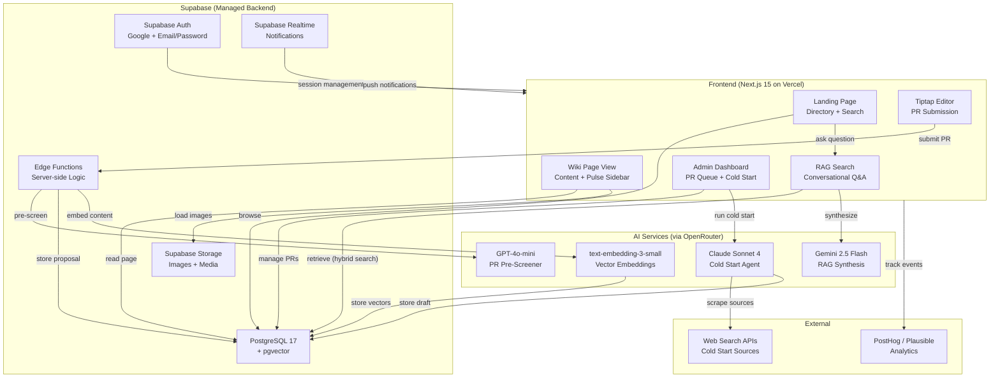

# UW Wiki -- Product Requirements Document

| Field | Value |
|---|---|
| **Project** | UW Wiki |
| **Type** | Product Launch |
| **Team** | Small team (2-4 engineers) |
| **License** | MIT (fully open-source) |
| **Version** | 0.1 -- Initial PRD |

---

## Table of Contents

1. [Executive Summary](#1-executive-summary)
2. [Problem Space](#2-problem-space)
3. [User Personas](#3-user-personas)
4. [User Stories](#4-user-stories)
5. [Content Model](#5-content-model)
6. [Core Features](#6-core-features)
7. [Editorial Model and Trust](#7-editorial-model-and-trust)
8. [Platform Editorial Values](#8-platform-editorial-values)
9. [Identity and Authentication](#9-identity-and-authentication)
10. [Technical Architecture](#10-technical-architecture)
11. [High-Level File Structure](#11-high-level-file-structure)
12. [UX and UI Design](#12-ux-and-ui-design)
13. [MVP Scope](#13-mvp-scope)
14. [Open Questions and TBD](#14-open-questions-and-tbd)
15. [Assumptions and Dependencies](#15-assumptions-and-dependencies)
16. [Appendix](#16-appendix)
17. [Document History and Versioning](#17-document-history-and-versioning)

---

## 1. Executive Summary

### Problem

First-year students at the University of Waterloo face the same problem every September: they need to decide which clubs, design teams, and programs to pursue, but the only information available is either polished marketing material from official club websites or scattered, unstructured hearsay from Reddit threads, Discord servers, and cold LinkedIn DMs to upperclassmen. None of these sources provide honest, structured, queryable information about what the extracurricular experience is actually like -- how much time it takes, what the culture feels like, whether the team is worth it for a specific career goal, or who ran it three years ago.

### Solution

UW Wiki is a shared, version-controlled, student-edited knowledge base for design teams, engineering clubs, academic programs, and student societies at the University of Waterloo. It is the extracurricular equivalent of UWFlow: where UWFlow covers courses, UW Wiki covers everything else. Every organization has a single wiki page with a full version history. Any user can propose edits through a PR-style review system, and an independent editorial board ensures content quality. The platform is paired with an AI-powered search layer that lets users ask natural-language questions and receive synthesized answers cited directly from wiki content.

### Unique Value

Unlike official club websites (marketing material), Reddit (scattered and unsearchable), or LinkedIn DMs (unscalable), UW Wiki provides:

- **Structured honesty:** Student-toned content reviewed by an independent editorial board, not controlled by the clubs themselves
- **AI-native search:** Natural-language questions answered with synthesized, cited responses drawn from across all wiki pages
- **Version-controlled transparency:** Every edit is tracked, every contributor is logged internally, and the full history of a page is preserved
- **Anonymous contribution:** Opt-in attribution removes the fear of retaliation, encouraging candid information that official channels will never publish
- **Community-driven accuracy:** PR-style edit proposals, inline comments for disputed content, and crowdsourced metadata keep information current and honest

### Core Principles

- **Honest:** Student-toned, not marketing-toned. The floor for information is "what you'd say if a student stopped you in SLC and asked."
- **Anonymous by Default:** Opt-in transparency, not mandatory exposure. Contributors can post without attribution. No UW email is required to submit.
- **Wiki-Style:** Information is added by the community and reviewed by independent editors. Clubs can suggest corrections but cannot own or control their page.
- **AI-Native:** The AI search layer synthesizes across all pages and cites its sources. Users can ask anything; the system gives the best answer it can from available content.

### Product Context

UW Wiki is a serious product launch targeting real users from day one. It is fully open-source under the MIT license, built by a small team (2-4 engineers), and designed with multi-university expansion in mind from the data model level -- even though the initial launch is scoped exclusively to the University of Waterloo.

---

## 2. Problem Space

### Who Has the Problem

Incoming and current University of Waterloo students making decisions about clubs, design teams, engineering competitions, academic programs, and student societies. These decisions carry meaningful weight: design team membership can define a student's co-op trajectory, club leadership shapes resumes, and program choice determines the next four to five years of their academic life.

### What They Currently Do

| Channel | What It Provides | Why It Fails |
|---|---|---|
| **LinkedIn DMs to upperclassmen** | First-hand experience from someone who was there | Scalability bottleneck. One person, one conversation. The same questions get asked hundreds of times. |
| **r/uwaterloo** | Candid opinions, occasional deep dives | Scattered across thousands of posts. Hard to query. Answers are inconsistent and often outdated. No structure. |
| **Official club websites** | Polished descriptions, application timelines | Marketing material. Never answers "how much time does this actually take?" or "what's the culture really like?" |
| **Discord servers** | Real-time conversation with members | Ephemeral. Buried in chat history. Requires knowing which server to join. Intimidating for first-years. |
| **Friends and hallway conversations** | Honest, contextual advice | Limited to one person's experience. Biased by their specific role, year, and subteam. |
| **Club fairs (in-person)** | Brief exposure to many clubs at once | Surface-level. Two minutes of rehearsed pitch. No follow-up depth. |

### The Gap

No structured, honest, queryable, student-sourced knowledge base exists for extracurriculars and programs at UW. The information students need to make good decisions exists -- it is distributed across hundreds of individual memories -- but there is no system to aggregate, structure, and make it searchable.

### Closest Analog

**UWFlow** solved this problem for courses. Before UWFlow, students relied on the same fragmented channels (Reddit, friends, official course descriptions) to evaluate courses. UWFlow created a structured, student-contributed, queryable database for course reviews.

UW Wiki is the UWFlow for everything that is not a course.

---

## 3. User Personas

### Primary: First-Year Student Evaluating Clubs

**Profile:** Anika, 18, first-year Mechatronics Engineering student

- Just arrived at UW with no existing network or context on campus organizations
- Interested in design teams but overwhelmed by the number of options and unsure which ones align with her goals
- Wants to go into hardware engineering and needs to understand which teams actually do hands-on hardware work versus software-heavy projects
- Has heard conflicting advice from upper-years on LinkedIn about time commitment and culture
- Preparing for club application interviews and wants to show genuine knowledge of the team

**Key needs:** Honest comparisons between design teams, realistic time commitment estimates, interview preparation context, understanding of which teams are hardware-focused.

**Success metric:** Makes an informed club decision based on structured, multi-perspective information rather than two LinkedIn DMs and a Reddit thread.

### Secondary: Senior Student Contributing Institutional Memory

**Profile:** Marcus, 22, fourth-year Systems Design Engineering student, former Midnight Sun electrical lead

- Spent three years on a design team and has deep institutional knowledge that will be lost when he graduates
- Gets DMs from first-years every September asking the same questions about the team
- Wants a place to point people to instead of repeating himself, and wants to contribute honest information that the team's official website does not cover
- Cares about accuracy and wants to correct outdated information on the platform

**Key needs:** Easy contribution flow (no account friction), ability to add nuanced information about culture and internal dynamics, confidence that contributions will be preserved and accessible to future students.

**Success metric:** Can write a detailed, honest section about his design team in under 15 minutes, and can point future LinkedIn DMs to the wiki page instead of repeating himself.

### Tertiary: Club Executive Maintaining Accurate Presence

**Profile:** Sarah, 21, third-year CS student, current president of UW Blueprint

- Wants her club's wiki page to have accurate factual information (founding date, current projects, team size, application timeline)
- Does not want editorial control over the student-contributed sections but wants an official section where the club can post verified information
- Concerned about outdated or inaccurate information persisting on the page

**Key needs:** Page claiming process to establish official org presence, ability to contribute verified information to a clearly labelled official section, visibility into what edits are being proposed about her org.

**Success metric:** Club's page has accurate factual information in the official section, and the student-contributed sections are honest without being defamatory.

---

## 4. User Stories

### Discovery and Research

| # | As a... | I want to... | So that... |
|---|---|---|---|
| US-01 | First-year student | Ask "Which design team is best for someone going into hardware?" and get a cited answer | I can make an informed decision without cold-messaging 10 people on LinkedIn |
| US-02 | Student evaluating clubs | Browse a design team's wiki page and see time commitment, culture notes, past projects, and exec history | I understand what I'm signing up for before I apply |
| US-03 | Prospective SYDE applicant | Read a program page that includes real student perspectives on workload and career outcomes | I get information that does not exist on the official program website |
| US-04 | Student comparing two clubs | Ask the AI "Compare Blueprint and UWDSC for a first-year CS student" and receive a structured answer with in-text citations | I can make a side-by-side comparison without manually reading two full pages |
| US-05 | Student browsing the directory | Filter orgs by category (Design Teams) and see them sorted with Pulse metadata (vibe, selectivity, co-op boost) | I can quickly scan options and identify which ones to explore further |

### Content and Interview Prep

| # | As a... | I want to... | So that... |
|---|---|---|---|
| US-06 | Student interviewing for a design team | Look up all past projects the team has shipped, their current subteam structure, and who their past leads were | I can walk into an interview with context that shows genuine interest |
| US-07 | Student prepping for a club interview | Read the "How to Apply" section and any notes about interview style contributed by past applicants | I know what to expect and can prepare accordingly |
| US-08 | Student reading about a club | See the Pulse sidebar showing selectivity, vibe check, and co-op boost ratings alongside the main content | I get a quick quantitative snapshot before diving into the full page |

### Contribution and Editing

| # | As a... | I want to... | So that... |
|---|---|---|---|
| US-09 | Current or former club member | Submit a PR proposing an edit to a wiki page using a rich-text editor | I can add or correct information I have first-hand knowledge of |
| US-10 | Contributor | Submit a PR and immediately see an AI pre-screen result indicating whether my submission aligns with platform values | I understand upfront whether my contribution is likely to be accepted |
| US-11 | Club executive | Claim my club's page through an admin-approved process to add a clearly labelled "Official" section with verified information | Factual details (founding date, active projects) are accurate without giving us editorial control |
| US-12 | Student reading about a club | Highlight a specific sentence and leave an anonymous comment disagreeing or adding nuance | Secondary perspectives are visible without replacing the primary article |
| US-13 | Reviewer | See all pending PRs with the AI pre-screen result, contributor rationale, and the content being modified | I can make accept/reject decisions efficiently and consistently |
| US-14 | User rating a club | Use the Pulse widget on a page to submit my own selectivity, vibe, and co-op boost ratings | My experience contributes to the aggregated metadata visible to future students |

### Cold Start and Admin

| # | As a... | I want to... | So that... |
|---|---|---|---|
| US-15 | Platform admin | Trigger a cold start agent that auto-fills a wiki page for a given org by scraping public internet sources and UW-specific directories | No page starts completely empty at launch |
| US-16 | Platform admin | Manage a list of all orgs that have pages, their claimed status, and their pending PR queue from a central dashboard | The platform is operationally manageable as it grows |
| US-17 | Platform admin | Configure lifecycle thresholds per org type so that design teams (which go dormant in summer) are not incorrectly flagged as defunct | Automated banners are accurate and context-appropriate |

---

## 5. Content Model

### Entity Types

Any student organization or academic entity at UW can have a wiki page. The directory organizes entities into six fixed categories:

| Category | Examples |
|---|---|
| **Design Teams** | Midnight Sun, UW Robotics, WATonomous, Waterloo Rocketry, UW Formula Motorsports |
| **Engineering Clubs** | IEEE UW, UW Blueprint, UWDSC, UW PM, Hack the North |
| **Non-Engineering Clubs** | UW Debate, DECA UW, UW Finance Association, Drama Club |
| **Academic Programs** | Systems Design Engineering (SYDE), Computer Science, Accounting and Financial Management (AFM) |
| **Student Societies** | EngSoc, MathSoc, WUSA, Faculty Associations |
| **Campus Organizations** | Co-op Connection, Student Success Office, Campus Wellness |

Each entity belongs to exactly one primary category. The data model includes a `university_id` foreign key on all org-level records, defaulting to UW at launch but supporting multi-university expansion without schema migration.

### Page Structure

Pages are organic -- structure emerges through contributions. However, cold-start auto-fill and a suggested template guide pages toward consistent sections. The suggested template is pre-filled when a new page is created but all sections are editable and removable. Contributors can add new sections beyond the template.

**Suggested Template Sections:**

| Section | What It Contains |
|---|---|
| **Overview** | What the org does, founding year, size, mission in student terms |
| **Time Commitment** | Honest weekly hour estimates from contributors -- the section the official site never has |
| **Culture and Vibe** | Working style, social culture, how competitive or collaborative it is |
| **Subteams and Roles** | Internal structure, what different roles actually do |
| **Past Projects** | Historical project work, competition results, shipped products |
| **Exec History** | Past and present leadership, years served, notable decisions |
| **How to Apply** | Timeline, what they look for, interview format notes from past applicants |
| **External Links** | Structured fields: Official Website, Instagram, LinkedIn, GitHub, Linktree, Competition Pages (predefined fields with ability to add custom links) |
| **Official Section** | Verified content submitted by the org itself, clearly labelled as such. Only available on claimed pages. |

### The Pulse (Sidebar Metadata)

Every wiki page has a sidebar infobox (similar to a Wikipedia infobox) displaying quantitative metadata about the organization. This provides a quick-scan snapshot alongside the prose content.

**Pulse Metrics:**

| Metric | Type | Description |
|---|---|---|
| **Selectivity** | Categorical | Open Membership, Application-Based, or Invite-Only |
| **Vibe Check** | Slider (1-5) | Social (1) to Corporate (5) -- how the culture feels |
| **Co-op Boost** | Rating (1-5) | Perceived resume and co-op value |
| **Tech Stack / Tooling** | Tags | Specific software and hardware used (e.g., Altium, ROS2, SolidWorks, React) |
| **Health Status** | Automated Tag | Active, Inactive, or Potentially Defunct -- based on the date of the last verified edit, with thresholds configurable per org type |

**Data source:** The cold-start agent populates initial Pulse values when generating a first-draft page. After launch, values are crowdsourced: users submit ratings through a standalone voting widget on the page (similar to a poll), and the displayed values reflect the aggregate.

### Media

Wiki pages support inline image uploads within the rich-text editor. Contributors can embed project photos, team logos, competition images, and other visual content. Images are stored in Supabase Storage and served via CDN.

### Version Control

Every wiki page maintains a complete version history using diff-based storage. Each accepted edit proposal creates a new version record storing the diff from the previous version. Any historical version can be reconstructed by replaying diffs forward from the initial version.

**User-facing version history** is a simple chronological list showing: version number, date, a one-line summary of the change (provided by the contributor in their PR), and whether the contributor chose to be attributed or remained anonymous. Side-by-side diff comparison between versions is not included in MVP -- the history view shows what changed and when, not a visual diff.

---

## 6. Core Features

### 6.1 AI-Powered Search (RAG)

This is the primary entry point into the product, positioned above the browsable directory on the landing page.

Users ask natural-language questions. The system retrieves relevant sections from across all wiki pages, synthesizes a single response, and cites specific passages inline -- similar to how Perplexity surfaces content from relevant sources.

**Core behavior:**

- Handles both factual queries ("What projects has Midnight Sun shipped?") and opinion/comparison queries ("Which design team has the best culture for a first-year?")
- Responses are generated by an LLM and grounded in wiki content, with inline citations pointing to specific page sections
- Answers stream token-by-token for a responsive feel (using Vercel AI SDK for streaming)
- When information is sparse or contested, the system surfaces that uncertainty rather than fabricating an answer
- Falls back gracefully when a question cannot be answered from current wiki content, suggesting the user browse relevant pages directly
- **Conversational follow-ups:** After receiving an answer, users can ask follow-up questions that maintain context from the previous exchange, enabling multi-turn research sessions

**Retrieval strategy:**

- Wiki page content is chunked by section and embedded using OpenAI `text-embedding-3-small` via OpenRouter
- Retrieval uses hybrid search: semantic search (cosine similarity on pgvector embeddings) combined with keyword search (PostgreSQL full-text search via `tsvector`) for precise term matching
- Results are re-ranked by relevance before being passed to the synthesis LLM
- The Pulse metadata and structured external links are included in the retrieval corpus so that quantitative questions ("How selective is WATonomous?") can be answered

**Model:** Gemini 2.5 Flash via OpenRouter (cost-effective for a startup, fast inference, strong synthesis quality, large context window for multi-page retrieval).

### 6.2 Browsable Directory

The browsable directory is the hero section of the landing page, sitting below the search bar. It provides a traditional navigation path into the wiki for users who prefer browsing over asking questions.

**Organization:**

- Org pages are grouped into six fixed categories: Design Teams, Engineering Clubs, Non-Engineering Clubs, Academic Programs, Student Societies, Campus Organizations
- Each category is displayed as a section with org cards showing the org name, a one-line tagline, and key Pulse metrics (Selectivity, Vibe Check, Co-op Boost)
- **Traditional text search and filter:** A filter bar above the directory allows users to search by org name, filter by category, and sort by Pulse metrics (e.g., sort by Co-op Boost descending)
- Category pages show all orgs in that category with Pulse summaries

**Distinction from RAG search:** The directory search is a traditional text filter (instant, client-side or Postgres `ILIKE`) for browsing and scanning. The RAG search (Section 6.1) is a separate, AI-powered natural-language question answering system. Both are accessible from the landing page.

### 6.3 Wiki Pages and Version Control

Every org has a single wiki page with a full version history -- all edits tracked, all contributors logged internally even if anonymous publicly. Pages are the secondary entry point into the product after the RAG search.

**Page viewing:**

- Pages are browsable directly via URL (e.g., `/wiki/midnight-sun`) without going through the AI search
- The page layout consists of the main content area (left/center) and the Pulse sidebar infobox (right)
- Sections can be individually linked via anchor tags (e.g., `/wiki/midnight-sun#how-to-apply`) and cited by the RAG system
- Pages are server-side rendered (Next.js SSR) for SEO -- search engines can index every wiki page

**Page editing:**

- The rich-text editor is built on **Tiptap** (ProseMirror-based WYSIWYG), providing a Notion-like editing experience
- Content is stored internally as **ProseMirror JSON** (the native Tiptap document format), enabling rich rendering, structured diffs, and reliable round-tripping between editor and storage
- The editor supports: headings, bold/italic, bullet and numbered lists, inline images (uploaded to Supabase Storage), links, code blocks, and tables
- A suggested template (Section 5) is pre-filled when creating a new page, with all sections editable and removable

**Version history:**

- Each accepted edit proposal creates a new version with a diff stored against the previous version
- The version history view shows a chronological list of changes: version number, date, one-line summary, contributor attribution (if opted in)
- Internally, every contributor is logged (account ID if authenticated, IP/fingerprint if anonymous) for abuse tracking, even when publicly anonymous

### 6.4 PR-Style Edit Proposals

Any user can propose an edit to a wiki page, similar to a GitHub pull request. This is the primary content contribution mechanism.

**Submission flow:**

1. User clicks "Propose Edit" on a wiki page
2. The Tiptap editor loads with the current page content pre-filled
3. User makes changes anywhere on the page (full-page editing per PR -- not scoped to a single section)
4. User writes a short rationale explaining why their edit aligns with platform values
5. If the user is not already email-verified, they are prompted to verify their email (lightweight auth -- no full account required)
6. On submission, the system diffs the proposed content against the current version and creates an edit proposal record

**AI pre-screening:**

- Immediately on submission, an AI pre-screener evaluates the proposed edit against the Platform Editorial Values (Section 8)
- The pre-screener produces a **pass/fail verdict with a one-line reason** (e.g., "Pass: Specific time commitment data with credible tone" or "Fail: Marketing language, not student-toned")
- The assessment is visible to both the contributor and reviewers
- **Model:** GPT-4o-mini via OpenRouter (cheap, fast classification task -- does not require strong reasoning, just editorial value alignment)

**Review flow:**

- Reviewers (the editorial board) see all pending PRs in their dashboard
- Each PR shows: the AI pre-screen verdict, the contributor's rationale, and a view of the proposed changes
- Reviewers make the final accept/reject decision -- the AI assessment is advisory, not binding
- Club members can submit PRs like any user, but a reviewer with an active affiliation to the org being edited cannot approve that org's PRs

### 6.5 Inline Section Comments (Medium-Style)

Users can highlight any text on a wiki page and leave a comment anchored to that specific passage. This is the mechanism for surfacing disagreements and adding nuance without replacing the primary article content.

**Core behavior:**

- Any user can leave a comment -- no account required (lower friction than PR submission)
- Comments can be anonymous or attributed, at the commenter's choice
- **Threaded replies:** Users can reply to existing comments, creating discussion threads anchored to specific passages
- Comments serve as secondary perspectives: they surface disagreements, add nuance, or provide additional data points
- This elegantly resolves disputed information: rather than picking one version, the article states one view and comments surface the counterpoint

**Comment persistence across edits:**

When the underlying text changes (an edit proposal is accepted that modifies a section), the system handles existing comments in two stages:

1. **Best-effort re-anchoring:** The system attempts to find the closest matching text in the new version and re-attach the comment to it
2. **Previous-version marking:** If re-anchoring succeeds, the comment remains visible at its new anchor. If it fails (the anchored text was deleted or changed beyond recognition), the comment remains visible but is marked with a "This comment references a previous version of this page" indicator, linking to the version it was originally anchored to

### 6.6 The Pulse (Crowdsourced Metadata)

The Pulse is a standalone voting widget on each wiki page that allows users to submit quantitative ratings about the org. It populates the sidebar infobox described in Section 5.

**Voting mechanics:**

- The Pulse widget is displayed on the page as a collapsible card (not part of the main content area)
- Users rate each applicable metric: Selectivity (categorical dropdown), Vibe Check (1-5 slider), Co-op Boost (1-5 stars)
- Tech Stack / Tooling is contributed as freeform tags, deduplicated and aggregated
- No account is required to vote, but rate-limiting prevents ballot-stuffing (one vote per session/IP per org per metric)
- Displayed values are aggregates: median for numeric ratings, mode for categorical, count of total votes shown for transparency

**Cold-start seeding:** When the cold-start agent generates a first-draft page, it also populates initial Pulse values based on publicly available information (e.g., if a team's website says "applications open each term," Selectivity is set to "Application-Based"). These AI-seeded values are clearly tagged and weighted lower than human-submitted ratings once crowdsourced data starts flowing.

### 6.7 Page Claiming

Clubs and orgs can claim their wiki page to establish an official presence. Claiming grants the ability to contribute to a clearly labelled "Official" section on the page but does not grant any editorial control over student-contributed content.

**Claiming process:**

1. A representative of the org contacts the UW Wiki team (via a "Claim This Page" button that triggers an admin request form)
2. An admin manually verifies the claim (e.g., confirming the requestor's identity through official org communication channels, social media, or known contacts)
3. Upon approval, the page is marked as "Claimed" and an "Official" section becomes available

**Official section:**

- Visually distinct from student-contributed content (bordered, labelled "Official -- submitted by [org name]")
- The org can submit content to this section through the same PR pipeline, with their org affiliation verified and noted on the PR
- Official section edits go through the same editorial review as all other PRs -- claiming does not bypass review
- Claiming does not grant any ability to edit, reject, or remove changes to the rest of the page

### 6.8 Cold Start Agent

An internal admin tool that takes an org name as input and runs an agent-powered search to auto-populate a first-draft wiki page. This solves the empty-page problem at launch.

**Data sources:**

- **General web search:** Google/Bing search for official websites, news articles, social media profiles, and public mentions
- **UW-specific sources:** UW clubs directory, WUSA clubs list, campus directories, Instagram/LinkedIn profiles of known UW orgs, competition results pages, GitHub repositories

**Agent behavior:**

1. Admin enters an org name and optionally a category
2. The agent searches across both general and UW-specific sources
3. The agent synthesizes findings into the suggested page template structure, populating as many sections as it can from available data
4. The agent also generates initial Pulse metric estimates based on what it finds
5. The generated content is clearly tagged as "AI-generated, pending human review" with a distinct visual banner
6. The page is saved as a draft for admin review before publishing

**Model:** Claude Sonnet 4 via OpenRouter (strong at web research synthesis, structured output generation, and maintaining appropriate tone).

**Usage:** Admins run this one-by-one for each org before public launch. The target is to seed 5-10 well-known design teams and clubs for launch.

### 6.9 Automated Lifecycle Management

The system monitors the "Last Modified" timestamp of each wiki page and automatically applies status banners when pages become stale. This prevents users from relying on outdated information.

**Configurable thresholds:**

Staleness thresholds are configurable per org category, because different types of organizations have different activity cycles. For example, design teams may go dormant during summer co-op terms without being defunct, while academic programs should have year-round relevance.

| Category | "Needs Update" | "Stale" | "Potentially Defunct" |
|---|---|---|---|
| Design Teams | 9 months | 15 months | 24 months |
| Engineering Clubs | 6 months | 12 months | 18 months |
| Non-Engineering Clubs | 6 months | 12 months | 18 months |
| Academic Programs | 12 months | 24 months | 36 months |
| Student Societies | 6 months | 12 months | 18 months |
| Campus Organizations | 12 months | 24 months | 36 months |

**Behavior:**

- When a threshold is crossed, the corresponding banner is automatically appended to the page header
- Banners are color-coded: yellow for "Needs Update," orange for "Stale," red for "Potentially Defunct"
- Any accepted edit resets the timer and removes all banners
- The Health Status field in the Pulse sidebar reflects the current lifecycle state
- Admins can override thresholds per individual org if needed

---

## 7. Editorial Model and Trust

| Role | Who | Access |
|---|---|---|
| **Viewer** | Anyone | No account required to read any page or use RAG search |
| **Commenter** | Anyone | No account required to leave inline comments (anonymous by default) |
| **Contributor** | Any email-verified user | Can submit edit proposals (PRs) after email verification |
| **Reviewer** | Editorial board member | Can accept/reject PRs, see AI pre-screen results, manage pending queue |
| **Admin** | Platform operators | Can run cold start agent, approve page claims, manage editorial board, configure lifecycle thresholds |

### Editorial Board

A small independent editorial board of 3-5 people at launch, platform-affiliated only, with no active club memberships that create conflicts of interest. Ideally recruited from students with humanities, journalism, or communications backgrounds -- the role itself serves as an extracurricular opportunity.

**PR assignment:** First-come, first-served. Any reviewer can pick up any pending PR from the queue. The system enforces that a reviewer with an active affiliation to the org being edited cannot approve that org's PRs.

### Anonymity Model

Anonymous by default. Contributors may optionally attach a name or attribution to their edit proposals and comments. Even when publicly anonymous, the system logs the contributor's identity internally (account ID if authenticated, IP address and browser fingerprint if anonymous) for abuse tracking and moderation purposes.

### AI Pre-Screening

Every PR is automatically assessed against the Platform Editorial Values (Section 8) before human review. The assessment is a simple pass/fail with a one-line reason. This helps reviewers prioritize their queue (failed PRs may need closer scrutiny) and provides immediate feedback to contributors.

### Disputed Content

Disputes are handled through inline comments (Section 6.5) rather than forced resolution. When information is contested:

- The article maintains one version (chosen by the editorial board during review)
- Dissenting perspectives are captured in inline comments anchored to the disputed passage
- If a dispute is significant enough, the editorial board may incorporate both perspectives directly into the article text

### Club Recourse

Clubs can submit PRs like any user to correct factual inaccuracies. They can also reach out directly to the editorial team. They cannot unilaterally edit or remove content from student-contributed sections.

---

## 8. Platform Editorial Values

The following values define what content is accepted and what gets rejected. These are the criteria the AI pre-screener is evaluated against, and the standard reviewers apply.

**The SLC Test:** Content should be the kind of thing you would say if a student stopped you in SLC and asked about the club. Nothing more extreme than that, nothing less honest either.

**No Harm:** Opinions and experiences are valid, but claims that could get someone in trouble -- defamation, identifying individuals negatively by name, unverifiable accusations of misconduct -- are not. Critique the organization, not the person.

**Honest, Not Unhinged:** Student-journalism tone: candid, grounded, not a press release. Fluff and marketing language will be edited out. So will rants that lack specificity.

**Credible:** The experience described should be believable as a student experience, not an axe-grind or a PR campaign. First-hand accounts carry more weight than hearsay.

**Specific Over Vague:** Specific numbers are better than vague impressions. "8-10 hours a week during competition season, 3-4 hours otherwise" beats "a lot of time." "The team uses SolidWorks and Altium for all PCB work" beats "they use industry tools."

---

## 9. Identity and Authentication

### Access Tiers

| Action | Auth Required | Identity Logged |
|---|---|---|
| Browse pages and directory | None | No |
| Use RAG search | None | No |
| Leave inline comments | None (anonymous by default) | IP/fingerprint |
| Rate Pulse metrics | None | IP/fingerprint (rate-limited) |
| Submit edit proposals (PRs) | Email verification | Email + IP/fingerprint |
| View contribution history | Account | Account ID |
| Bookmark pages | Account | Account ID |
| Review PRs (editorial board) | Full account + reviewer role | Account ID |
| Admin actions | Full account + admin role | Account ID |

### Authentication Providers (MVP)

| Method | Implementation |
|---|---|
| **Google OAuth** | Supabase Auth + Google provider. Most UW students have Google accounts. |
| **Email / Password** | Supabase Auth Password provider. Email verification required via OTP. |

**Post-MVP:** UW SSO / CAS integration for stronger institutional trust signal. Deferred from MVP due to implementation complexity.

### Lightweight Auth for Contributors

Contributors submitting PRs are required to verify their email address, but do not need to create a full account. The email verification flow:

1. User clicks "Propose Edit" on a page
2. If not already email-verified in this session, user enters their email
3. System sends a one-time verification code
4. User enters the code and proceeds to the editor
5. The email is logged internally but not displayed publicly unless the contributor opts in

This reduces friction while providing a traceable identity for abuse prevention.

### Account Features (Optional)

Users who choose to create a full account (Google OAuth or email/password) unlock:

- **Contribution history:** View all PRs submitted and their status (pending, accepted, rejected)
- **Bookmarks:** Save pages for quick access
- **Notifications:** Receive alerts when a bookmarked page is updated, when your PR is accepted/rejected, and when someone replies to your comment
- **Reputation (future):** Trust score based on contribution quality, unlocking reduced review scrutiny over time

### Abuse Prevention

- **Manual moderation:** The editorial board reviews all PRs -- no content goes live without human approval
- **Rate limiting:** Pulse voting is limited to one vote per session/IP per org per metric. Comment submission is rate-limited per IP.
- **Internal tracking:** All anonymous activity is logged with IP address and browser fingerprint. This data is used exclusively for abuse investigation and is not publicly exposed.
- **No CAPTCHA for MVP:** With manual moderation on all PRs and rate-limiting on comments/votes, CAPTCHA is unnecessary at launch scale. Revisit if spam volume increases.

---

## 10. Technical Architecture

### Tech Stack

| Layer | Technology | Purpose |
|---|---|---|
| **Frontend** | Next.js 15 (App Router) | Server-side rendering for SEO, React Server Components, API routes |
| **UI Components** | shadcn/ui + TailwindCSS v4 | Component library with dark theme customization |
| **Rich-Text Editor** | Tiptap (ProseMirror) | WYSIWYG editing for wiki pages and PR submissions |
| **Animations** | Framer Motion | Page transitions, entrance animations, microinteractions |
| **Icons** | Lucide React | Consistent icon system |
| **Backend** | Supabase | Managed PostgreSQL, Auth, Edge Functions, Storage, Realtime |
| **Database** | PostgreSQL 17 + pgvector | Unified relational store and vector store |
| **Auth** | Supabase Auth | Google OAuth, email/password, session management |
| **File Storage** | Supabase Storage | Image uploads, media assets |
| **Real-Time** | Supabase Realtime | Notifications, live page update indicators |
| **LLM Gateway** | OpenRouter API | Unified access to multiple LLM providers |
| **RAG Synthesis** | Gemini 2.5 Flash | Natural-language answer generation from wiki content |
| **AI Pre-Screener** | GPT-4o-mini | Cheap pass/fail editorial value classification |
| **Cold Start Agent** | Claude Sonnet 4 | Web research synthesis for first-draft page generation |
| **Embeddings** | OpenAI text-embedding-3-small | Vector embeddings for RAG retrieval |
| **Streaming** | Vercel AI SDK | Token-by-token streaming for RAG search responses |
| **Analytics** | PostHog or Plausible | Third-party analytics (page views, usage patterns) |
| **Deployment** | Vercel + Supabase | Fully serverless: Vercel hosts Next.js, Supabase hosts everything else |

**Why these choices:**

- **Supabase over standalone Postgres/FastAPI:** Managed Postgres + pgvector + Auth + Storage + Edge Functions in one platform. Perfect for serverless deployment with Vercel. Row-level security (RLS) handles user-scoped data access. Built-in auth supports Google OAuth and email/password out of the box. Supabase Realtime provides WebSocket-based notifications without custom infrastructure. For a small team launching a real product, Supabase eliminates an enormous amount of boilerplate.
- **Next.js App Router over React SPA:** SSR/SSG is critical because wiki pages must rank on Google (SEO is a priority). App Router provides React Server Components for efficient server-side data fetching, and API routes for server-side operations (LLM calls, Supabase admin operations) without a separate backend.
- **Tiptap over Markdown editor:** The product targets students who expect a Notion-like editing experience, not a GitHub-like Markdown experience. Tiptap (ProseMirror-based) provides WYSIWYG editing, supports image embedding, is extensible, and stores content as ProseMirror JSON -- a structured format that enables clean diffs, reliable rendering, and future collaborative editing.
- **OpenRouter as unified gateway:** Allows accessing Gemini (RAG synthesis), GPT (pre-screener), and Claude (cold start) through a single API with consistent authentication and billing. Eliminates separate API keys and SDKs per provider.
- **pgvector over dedicated vector DB:** Since the backend already uses Supabase PostgreSQL, pgvector keeps everything in one database with ACID compliance and the ability to join vector search results with relational data. For the scale of this product (hundreds of pages, not millions of documents), pgvector performance is more than sufficient.

### Architecture Diagram



### Data Model Overview

| Table | Purpose | Key Fields |
|---|---|---|
| `universities` | Multi-university support | `id`, `name`, `slug`, `domain` |
| `organizations` | Org registry | `id`, `university_id`, `name`, `slug`, `category`, `claimed_by`, `claimed_at` |
| `pages` | Wiki page metadata | `id`, `org_id`, `current_version_id`, `created_at`, `last_modified_at` |
| `page_versions` | Version history (diff-based) | `id`, `page_id`, `version_number`, `content_json` (ProseMirror), `diff_json`, `summary`, `contributor_id`, `created_at` |
| `edit_proposals` | Pending PRs | `id`, `page_id`, `proposed_content_json`, `rationale`, `ai_verdict`, `ai_reason`, `status` (pending/accepted/rejected), `contributor_email`, `reviewer_id`, `submitted_at`, `reviewed_at` |
| `comments` | Inline comments | `id`, `page_id`, `page_version_id`, `anchor_text`, `anchor_offset`, `body`, `parent_comment_id` (threading), `is_anonymous`, `contributor_id`, `created_at` |
| `pulse_ratings` | Individual votes | `id`, `org_id`, `metric` (selectivity/vibe/coop_boost), `value`, `session_fingerprint`, `created_at` |
| `pulse_aggregates` | Computed aggregates | `org_id`, `metric`, `aggregate_value`, `vote_count`, `last_computed_at` |
| `external_links` | Structured links | `id`, `org_id`, `type` (website/instagram/linkedin/github/custom), `url`, `label` |
| `users` | Authenticated accounts | `id`, `email`, `display_name`, `avatar_url`, `role` (user/reviewer/admin), `created_at` |
| `bookmarks` | User bookmarks | `id`, `user_id`, `org_id`, `created_at` |
| `notifications` | User notifications | `id`, `user_id`, `type`, `payload`, `read`, `created_at` |
| `lifecycle_config` | Per-category thresholds | `category`, `needs_update_months`, `stale_months`, `defunct_months` |

**Multi-university readiness:** The `universities` table and `university_id` foreign key on `organizations` ensure that adding a second university requires no schema migration -- only a new row in `universities` and scoping queries by `university_id`.

---

## 11. High-Level File Structure

```
uw-wiki/
    src/
        app/
            page.tsx                    # Landing page (directory + search)
            layout.tsx                  # Root layout, global providers
            wiki/
                [slug]/
                    page.tsx            # Wiki page view (SSR for SEO)
            search/
                page.tsx               # RAG search results (conversational)
            propose/
                [slug]/
                    page.tsx            # PR submission editor
            admin/
                page.tsx               # Admin dashboard
                cold-start/
                    page.tsx           # Cold start agent trigger
            auth/
                sign-in/
                    page.tsx           # Sign-in page
            api/
                search/
                    route.ts           # RAG search API (streaming)
                proposals/
                    route.ts           # Edit proposal submission + AI pre-screen
                cold-start/
                    route.ts           # Cold start agent trigger
                pulse/
                    route.ts           # Pulse rating submission
        components/
            wiki/                      # Wiki page components (content, sidebar, comments)
            editor/                    # Tiptap editor components
            search/                    # RAG search UI components
            directory/                 # Browsable directory components
            pulse/                     # Pulse widget and sidebar infobox
            admin/                     # Admin dashboard components
            layout/                    # Shell, header, footer
            ui/                        # shadcn/ui components
        lib/
            supabase/
                client.ts              # Supabase client (browser)
                server.ts              # Supabase client (server)
                admin.ts               # Supabase admin client
            ai/
                rag.ts                 # RAG retrieval + synthesis
                pre-screener.ts        # AI pre-screening logic
                cold-start.ts          # Cold start agent logic
                embeddings.ts          # Embedding generation
            utils/                     # Shared utilities
        types/                         # TypeScript type definitions
    supabase/
        migrations/                    # Database migrations
        seed.sql                       # Seed data (universities, categories, lifecycle config)
    public/                            # Static assets
    package.json
    next.config.ts
    tailwind.config.ts
    .env.example                       # Environment variable template
    README.md
```

---

## 12. UX and UI Design

### Design System

- **Theme:** UW-themed dark mode. Sleek black primary background, UW gold accent color, white text. Modern and smooth. A deliberate departure from the typical light-mode wiki aesthetic, giving UW Wiki a distinctive, premium identity that resonates with the UW student brand.
- **Color palette:**
  - Background: `#0a0a0a` (near-black) -- primary surface
  - Surface: `#141414` (dark grey) -- cards, panels, elevated surfaces
  - Border: `#262626` (subtle dark border)
  - Text primary: `#ffffff` (white)
  - Text secondary: `#a1a1aa` (zinc-400 -- muted text, labels)
  - Text muted: `#71717a` (zinc-500 -- hints, placeholders)
  - Accent primary: `#FEC93B` (UW Gold) -- buttons, links, highlights, interactive elements
  - Accent hover: `#FFD700` (brighter gold on hover)
  - Success: `#22c55e` (green-500 -- accepted PRs, verified status)
  - Warning: `#f59e0b` (amber-500 -- stale banners, pending status)
  - Danger: `#ef4444` (red-500 -- rejected PRs, defunct banners)
- **Typography:** Clean sans-serif (Inter or Geist). Page titles use bold weight at large scale. Body text uses regular weight with generous line height for readability on dark backgrounds.
- **Icons:** Lucide React exclusively -- no inline SVGs, no emoji.
- **Animations:** Framer Motion for entrance animations (fade-in, slide-up), page transitions, and microinteractions. Smooth and subtle -- not distracting.
- **Component style:** shadcn/ui with dark theme overrides. Cards use subtle borders (`border-[#262626]`) rather than shadows. Buttons use gold accent for primary actions, ghost/outline variants for secondary.
- **Spacing:** Medium density -- generous whitespace between major sections, compact within data-rich areas (directory cards, PR queue).

### Page Layouts

**Landing Page:**

The landing page has two zones:

1. **Search bar (top):** A prominent search input with placeholder text ("Ask anything about UW clubs, teams, and programs...") centered at the top of the page. Gold accent border on focus. Typing initiates a transition to the search results view.
2. **Browsable directory (below):** Category tabs (Design Teams, Engineering Clubs, etc.) with org cards below. Each card shows: org name, one-line tagline, and Pulse summary (selectivity badge, vibe dot, co-op boost stars). Cards link to the full wiki page.

**Wiki Page View:**

A two-column layout:

- **Main content (left, ~70%):** Rich-text rendered page content with section headers, anchor links, inline images, and the "Official" section (if claimed) visually distinguished
- **Pulse sidebar (right, ~30%):** Fixed sidebar showing the Pulse infobox (selectivity, vibe check, co-op boost, tech stack tags, health status), external links, and the "Propose Edit" button
- **Comments:** Inline comments are revealed on text highlight or via a margin indicator (small comment count badges next to paragraphs that have comments)

**RAG Search View:**

- A conversational interface: the user's question at the top, the streamed answer below with inline citations (clickable, linking to the relevant wiki page section)
- Below the answer, a text input for follow-up questions
- A sidebar or footer showing "Sources" -- the wiki pages referenced in the answer, with direct links

**PR Submission View:**

- Full-width Tiptap editor with the current page content pre-filled
- A rationale text area below the editor ("Why does this edit align with UW Wiki's editorial values?")
- Submit button triggers email verification (if not already verified) and AI pre-screening

**Admin Dashboard:**

- **PR Queue:** List of pending PRs with: org name, submitter (email or "Anonymous"), AI verdict (pass/fail badge), time submitted. Click to expand and review.
- **Cold Start:** Input field for org name + category dropdown. "Generate" button triggers the agent.
- **Page Management:** List of all orgs, claimed status, last modified date, lifecycle status.

### Responsive Design

Desktop-first design, responsive for mobile. The wiki page two-column layout collapses to a single column on mobile (Pulse sidebar moves above or below the content). The directory cards stack vertically. The Tiptap editor is usable on tablet but not optimized for phone-sized screens -- PR submission is primarily a desktop activity.

### Accessibility

WCAG 2.1 AA compliance:

- Sufficient color contrast ratios (gold on black meets AA for large text; white on black exceeds AA)
- Full keyboard navigation for all interactive elements
- Semantic HTML throughout (proper heading hierarchy, landmark regions, ARIA labels)
- Screen reader support for dynamic content (RAG streaming, comment threads)
- Focus indicators on all interactive elements (gold outline)
- Alt text for all user-uploaded images (required field in the upload flow)

---

## 13. MVP Scope

### Launch Strategy

Seed 5-10 well-known design teams and clubs with cold-start AI-generated pages before public launch. Reach out to those clubs for early buy-in and invite them to review their auto-generated page and claim it. Open contributions at launch with the editorial board in place.

### In MVP

- Wiki pages for any UW org, browsable directory with six fixed categories
- AI-powered RAG search with inline citations and conversational follow-ups as primary entry point
- PR-style edit proposal flow with AI pre-screening (pass/fail)
- Rich-text WYSIWYG editor (Tiptap) for page editing
- Anonymous and attributed contribution toggle
- Inline section comments (Medium-style, threaded, anchored to highlighted text)
- The Pulse sidebar infobox with crowdsourced ratings and standalone voting widget
- Page claiming for verified orgs (Official section, manual admin approval)
- Cold start admin agent (general web search + UW-specific sources)
- Reviewer dashboard for editorial board (PR queue, accept/reject)
- Automated lifecycle management with configurable thresholds per category
- Google OAuth + email/password authentication (Supabase Auth)
- Lightweight email verification for contributors
- Server-side rendering for SEO (Next.js SSR)
- Third-party analytics (PostHog or Plausible)

### Post-MVP / Future

- UW SSO / CAS integration for stronger institutional trust signal
- User accounts with contribution history, bookmarks, and reputation system
- Notification system (page updates, PR status changes, comment replies)
- Upvoting or endorsing specific sections or comments
- Expansion to other Canadian universities (same platform, scoped by `university_id`)
- Email digests for orgs when their page is updated
- Alumni contributions as a distinct, labelled tier
- Advanced admin analytics (contribution trends, popular pages, search query patterns)
- Side-by-side version diff comparison view
- Collaborative real-time editing (Tiptap + Supabase Realtime)

---

## 14. Open Questions and TBD

| Question | Status / Notes |
|---|---|
| Who are the 3-5 editorial board members? | TBD. Likely volunteer students, ideally from humanities/journalism background. Extracurricular opportunity as a draw. |
| Compensation for editorial board? | TBD. Could be resume value, platform credit, or small stipend if funded later. |
| Which specific 5-10 orgs to seed at launch? | TBD. Should be well-known across faculties. Candidates: Midnight Sun, UW Robotics, Blueprint, WATonomous, Waterloo Rocketry, UW Formula, UWDSC, Hack the North. |
| Moderation at scale? | As content grows, a tiered trust system (trusted contributors needing less review) may be needed. Defer until PR volume exceeds editorial board capacity. |
| Legal and liability exposure? | Deferred. If defamatory content is posted, what is the process? Takedown requests? Should be defined before or shortly after launch. Not blocking MVP. |
| Cold start agent web search API? | TBD. Options: Serper API, Tavily, SerpAPI. Cost and quality comparison needed during implementation. |
| Pulse metric weights for cold-start vs. crowdsourced? | TBD. Initial proposal: AI-seeded values count as 1 vote; crowdsourced votes count as 1 vote each. AI-seeded values are diluted naturally as human votes accumulate. |
| Lifecycle threshold tuning? | Initial thresholds in Section 6.9 are estimates. May need adjustment based on real-world page update frequency after launch. |

---

## 15. Assumptions and Dependencies

### Assumptions

1. **Supabase free or Pro tier** is sufficient for launch scale (5-10 pages, 50-500 concurrent users, pgvector for RAG). Supabase Pro ($25/month) provides 8GB database, 250GB bandwidth, and 100K monthly active users -- well above MVP needs.
2. **OpenRouter API availability:** OpenRouter provides reliable access to Gemini, GPT, and Claude models. Budget for LLM usage is manageable at launch scale (primarily RAG search and cold-start generation, not high-volume agent pipelines).
3. **SEO indexing:** Next.js SSR pages will be indexed by Google within weeks of launch. Wiki pages with descriptive slugs and structured content should rank for long-tail queries (e.g., "Midnight Sun UW review").
4. **Editorial board availability:** 3-5 volunteer reviewers will be available at launch. PR volume at launch scale (5-10 pages) is manageable with part-time review effort.
5. **Student adoption:** The product addresses a validated need (students already ask these questions through fragmented channels). Word of mouth within the UW student community is the primary growth channel.

### Dependencies

| Dependency | Type | Risk | Mitigation |
|---|---|---|---|
| Supabase | Managed platform | Service availability, pricing changes | Standard platform risk; Supabase is open-source and self-hostable as fallback |
| OpenRouter API | External service | Rate limits, credit exhaustion, model deprecation | Budget monitoring; model fallback chain (if Gemini is unavailable, fall back to GPT-4o-mini for RAG) |
| Vercel | Hosting platform | Hobby tier limits, pricing at scale | Generous free tier for Next.js; upgrade to Pro ($20/month) if needed |
| PostHog / Plausible | Analytics | Service availability | Non-critical dependency; product functions without analytics |
| Web search API (cold start) | External service | API availability, cost | Cold start is an admin-only tool run infrequently; manual page creation is the fallback |
| Google OAuth | Auth provider | OAuth configuration, consent screen approval | Standard integration; well-documented |
| Tiptap | Editor library | Open-source maintenance, breaking changes | Tiptap is actively maintained with a commercial entity (Tiptap GmbH) behind it; ProseMirror core is stable |

---

## 16. Appendix

### Appendix A: Org Category Definitions

| Category | Definition | Examples |
|---|---|---|
| **Design Teams** | Student-led engineering project teams that design, build, and compete with physical or software systems. Typically application-based with subteam structures. | Midnight Sun (solar car), UW Robotics, WATonomous (autonomous vehicle), Waterloo Rocketry, UW Formula Motorsports |
| **Engineering Clubs** | Student organizations focused on engineering, technology, or design practice. May have projects, events, or both. | UW Blueprint (tech for nonprofits), UWDSC (data science), IEEE UW, UW PM (product management), Hack the North |
| **Non-Engineering Clubs** | Student organizations outside the engineering/tech space. | UW Debate, DECA UW, UW Finance Association, Drama Club, Photography Club |
| **Academic Programs** | Degree programs, majors, and specializations offered by UW. | Systems Design Engineering (SYDE), Computer Science (CS), Accounting and Financial Management (AFM), Kinesiology |
| **Student Societies** | Faculty societies, student government, and representative bodies. | Engineering Society (EngSoc), Mathematics Society (MathSoc), WUSA, Faculty Associations |
| **Campus Organizations** | University-affiliated offices, services, and non-student-led organizations. | Co-operative Education, Student Success Office, Campus Wellness, Writing and Communication Centre |

### Appendix B: Suggested Page Template (Full Section Descriptions)

**Overview:** What the org does in plain language. Founding year. Approximate size (number of active members). Mission stated in student terms, not marketing terms. What makes this org different from similar ones.

**Time Commitment:** Honest weekly hour estimates, ideally broken down by role and season (e.g., "Mechanical subteam: 8-10 hours/week during build season, 3-4 hours otherwise"). This is the section that official websites never have and students always ask about.

**Culture and Vibe:** What the working style is like. How competitive or collaborative the environment is. Social culture (do members hang out outside of work?). How welcoming the team is to new members, especially first-years. Red flags or common complaints.

**Subteams and Roles:** Internal structure. What each subteam or role actually does day-to-day. Which subteams are most competitive to join. Which roles are good entry points for first-years.

**Past Projects:** Historical project work. Competition results (placements, awards). Shipped products or notable deliverables. Technical highlights.

**Exec History:** Past and present leadership. Years served. Notable decisions or strategic changes. Transition patterns (do execs typically serve one or two terms?).

**How to Apply:** Application timeline (when applications open, when interviews happen). What they look for (skills, personality, year). Interview format (technical? behavioral? design challenge?). Notes from past applicants about what the process was like.

**External Links:** Structured links to: Official Website, Instagram, LinkedIn, GitHub, Linktree, Competition Pages, YouTube, and any custom links.

**Official Section (claimed pages only):** Verified content submitted by the org itself. Clearly labelled as "Official" with a distinct visual treatment. Typically contains factual information the org wants to ensure is accurate: founding date, current active projects, team size, application URL.

### Appendix C: Glossary

| Term | Definition |
|---|---|
| **PR (Edit Proposal)** | A proposed change to a wiki page, submitted by a contributor and reviewed by the editorial board before being accepted or rejected. Named after GitHub pull requests. |
| **RAG** | Retrieval-Augmented Generation -- technique where an LLM generates responses grounded in retrieved content rather than relying solely on training data. |
| **The Pulse** | The set of crowdsourced quantitative metrics displayed in a sidebar infobox on each wiki page (Selectivity, Vibe Check, Co-op Boost, Tech Stack, Health Status). |
| **Cold Start Agent** | An AI-powered admin tool that auto-generates a first-draft wiki page for an org by searching public internet sources and UW-specific directories. |
| **Editorial Board** | A small group of independent reviewers (3-5 people) who accept or reject edit proposals. They are platform-affiliated and have no active club memberships that create conflicts of interest. |
| **Page Claiming** | The process by which an org establishes an official presence on its wiki page, gaining the ability to contribute to a labelled "Official" section. |
| **Lifecycle Management** | Automated monitoring of page staleness. Pages that have not been edited within configurable time thresholds receive warning banners. |
| **pgvector** | PostgreSQL extension for vector similarity search, used to store and query text embeddings for the RAG search feature. |
| **Tiptap** | An open-source, ProseMirror-based rich-text editor framework used for the WYSIWYG page editing experience. |
| **OpenRouter** | An API aggregator that provides unified access to multiple LLM providers (OpenAI, Anthropic, Google) through a single API key. |
| **SLC** | Student Life Centre -- a central building on the UW campus. Referenced in the "SLC Test" editorial value as a benchmark for appropriate content tone. |

### Appendix D: Model Selection Rationale

| Use Case | Model | Provider | Rationale | Approx. Cost (per 1M tokens in/out) |
|---|---|---|---|---|
| RAG Search Synthesis | Gemini 2.5 Flash | Google (via OpenRouter) | Cost-effective, fast inference, large context window (1M tokens) for multi-page retrieval, strong synthesis quality | ~$0.15 / $0.60 |
| AI Pre-Screener | GPT-4o-mini | OpenAI (via OpenRouter) | Cheapest viable model for a simple pass/fail classification task. Does not require strong reasoning -- just editorial value alignment | ~$0.15 / $0.60 |
| Cold Start Agent | Claude Sonnet 4 | Anthropic (via OpenRouter) | Strong at web research synthesis, structured output generation, and maintaining appropriate tone across long documents | ~$3.00 / $15.00 |
| Embeddings | text-embedding-3-small | OpenAI (via OpenRouter) | Cost-effective embeddings with strong retrieval quality. 1536 dimensions. Industry standard for RAG applications | ~$0.02 / N/A |

**Cost-conscious strategy:** Premium models (Claude Sonnet 4) are used only for infrequent admin tasks (cold start). The high-volume user-facing feature (RAG search) uses the most cost-effective model (Gemini 2.5 Flash). The pre-screener uses the cheapest viable model (GPT-4o-mini) since it is a simple classification task.

---

## 17. Document History and Versioning

| Version | Date | Author | Changes |
|---|---|---|---|
| 0.1 | 2026-04-04 | UW Wiki Team | Initial PRD: complete sections 1-16 covering executive summary, problem space, personas, user stories, content model (6 categories, suggested template, Pulse metadata, version control), 9 core features (RAG search, directory, wiki pages, PR proposals, inline comments, Pulse, page claiming, cold start, lifecycle management), editorial model and trust, platform editorial values, identity and authentication (tiered access, Google + email auth, lightweight contributor verification), technical architecture (Next.js + Supabase + OpenRouter stack, architecture diagram, data model), high-level file structure, UX/UI design (UW dark theme with gold accents, page layouts, WCAG 2.1 AA), MVP scope, and appendices |

---

*This PRD establishes the product vision and high-level requirements for UW Wiki. Individual features will be decomposed into Feature Requirements Documents (FRDs) for detailed specification during implementation.*
